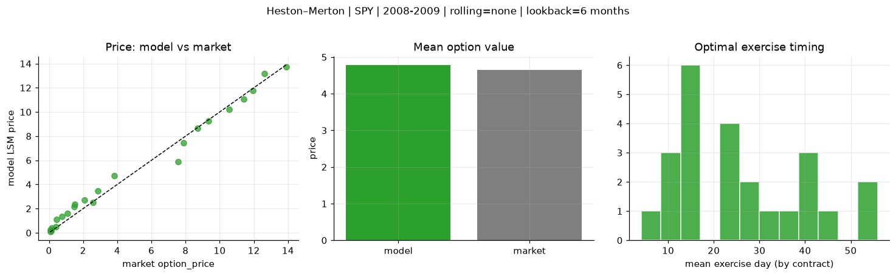
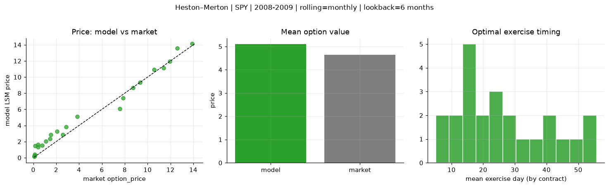
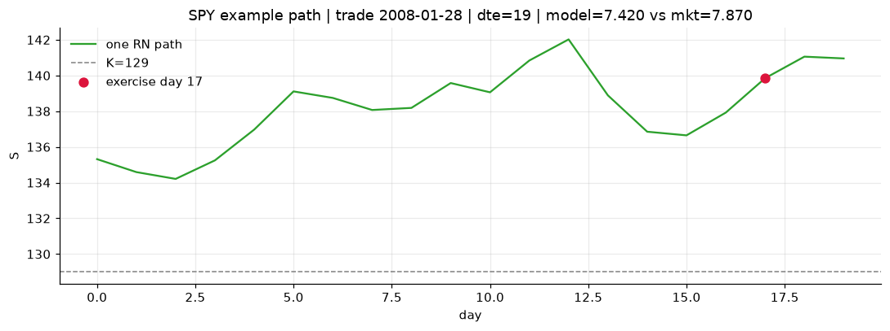
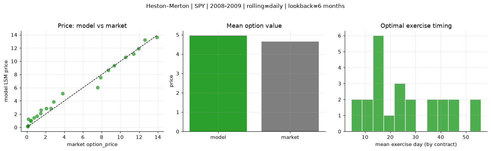

# Optimal stopping — Heston–Merton — 2008-2009 — SPY

**Model:** Heston–Merton  
**Underlying:** SPY  
**Regime / period:** 2008-2009  
**Lookback:** 6 months (fixed)  
**Rolling modes:** none, monthly, daily  
**Pricing:** LSM American calls on SPY | n_paths=2000 | seed=42 | contracts=24

## Comparison (same contracts, same lookback)

| Rolling | RMSE | MAE | Bias (model−mkt) | Mean early-ex frac | Cal updates | Cal s | LSM s |
|---------|-----:|----:|-----------------:|-------------------:|------------:|------:|------:|
| `none` | 0.5686 | 0.4244 | 0.1315 | 0.339 | 1 | 0.0 | 0.2 |
| `monthly` | 0.8097 | 0.6424 | 0.4524 | 0.289 | 25 | 0.1 | 0.3 |
| `daily` | 0.6731 | 0.5142 | 0.3065 | 0.305 | 505 | 1.1 | 0.2 |

**Lowest RMSE (this study):** `none` = 0.5686

## Rolling = `none`

- **RMSE:** 0.5686  
- **MAE:** 0.4244  
- **Bias:** 0.1315  
- **Mean early-exercise fraction:** 0.339  
- **Calibration updates (SPY):** 1

Contract errors (compact)

| date | K | dte | market | model | error | early_ex |
|------|--:|----:|-------:|------:|------:|---------:|
| 2008-01-28 | 129 | 19 | 7.870 | 7.420 | -0.450 | 0.348 |
| 2008-08-01 | 117 | 15 | 9.350 | 9.233 | -0.117 | 0.920 |
| 2008-05-21 | 126 | 31 | 13.910 | 13.743 | -0.167 | 0.704 |
| 2008-05-14 | 129 | 38 | 12.610 | 13.196 | 0.586 | 0.411 |
| 2008-07-25 | 117 | 57 | 10.570 | 10.185 | -0.385 | 0.789 |
| 2008-02-04 | 128 | 47 | 11.960 | 11.761 | -0.199 | 0.462 |
| 2008-07-03 | 126 | 16 | 2.590 | 2.506 | -0.084 | 0.246 |
| 2008-09-08 | 125 | 12 | 2.880 | 3.471 | 0.591 | 0.378 |
| 2009-10-16 | 111 | 36 | 1.520 | 2.370 | 0.850 | 0.230 |
| 2009-10-23 | 111 | 29 | 1.100 | 1.603 | 0.503 | 0.158 |
| 2008-08-08 | 129 | 43 | 3.830 | 4.727 | 0.897 | 0.381 |
| 2009-10-23 | 111 | 57 | 2.080 | 2.720 | 0.640 | 0.229 |
| 2009-12-07 | 117 | 12 | 0.070 | 0.232 | 0.162 | 0.051 |
| 2009-10-02 | 110 | 15 | 0.140 | 0.146 | 0.006 | 0.012 |
| 2009-09-25 | 110 | 22 | 0.410 | 0.509 | 0.099 | 0.083 |
| 2009-08-26 | 111 | 24 | 0.150 | 0.390 | 0.240 | 0.033 |
| 2009-11-06 | 113 | 43 | 0.760 | 1.381 | 0.621 | 0.140 |
| 2009-11-20 | 118 | 57 | 0.430 | 1.106 | 0.676 | 0.096 |
| 2009-11-20 | 111 | 29 | 1.460 | 2.149 | 0.689 | 0.247 |
| 2009-10-30 | 113 | 22 | 0.120 | 0.209 | 0.089 | 0.015 |
| 2008-03-04 | 122 | 18 | 11.410 | 11.066 | -0.344 | 0.982 |
| 2008-09-22 | 116 | 26 | 7.580 | 5.878 | -1.702 | 0.480 |
| 2008-03-04 | 125 | 18 | 8.710 | 8.642 | -0.068 | 0.719 |
| 2009-10-02 | 111 | 15 | 0.080 | 0.103 | 0.023 | 0.015 |

## Rolling = `monthly`

- **RMSE:** 0.8097  
- **MAE:** 0.6424  
- **Bias:** 0.4524  
- **Mean early-exercise fraction:** 0.289  
- **Calibration updates (SPY):** 25

Contract errors (compact)

| date | K | dte | market | model | error | early_ex |
|------|--:|----:|-------:|------:|------:|---------:|
| 2008-01-28 | 129 | 19 | 7.870 | 7.420 | -0.450 | 0.348 |
| 2008-08-01 | 117 | 15 | 9.350 | 9.367 | 0.017 | 0.949 |
| 2008-05-21 | 126 | 31 | 13.910 | 14.120 | 0.210 | 0.442 |
| 2008-05-14 | 129 | 38 | 12.610 | 13.586 | 0.976 | 0.427 |
| 2008-07-25 | 117 | 57 | 10.570 | 10.935 | 0.365 | 0.469 |
| 2008-02-04 | 128 | 47 | 11.960 | 11.949 | -0.011 | 0.454 |
| 2008-07-03 | 126 | 16 | 2.590 | 2.850 | 0.260 | 0.011 |
| 2008-09-08 | 125 | 12 | 2.880 | 3.832 | 0.952 | 0.194 |
| 2009-10-16 | 111 | 36 | 1.520 | 2.841 | 1.321 | 0.172 |
| 2009-10-23 | 111 | 29 | 1.100 | 2.051 | 0.951 | 0.200 |
| 2008-08-08 | 129 | 43 | 3.830 | 5.079 | 1.249 | 0.225 |
| 2009-10-23 | 111 | 57 | 2.080 | 3.265 | 1.185 | 0.234 |
| 2009-12-07 | 117 | 12 | 0.070 | 0.185 | 0.115 | 0.044 |
| 2009-10-02 | 110 | 15 | 0.140 | 0.265 | 0.125 | 0.046 |
| 2009-09-25 | 110 | 22 | 0.410 | 1.605 | 1.195 | 0.085 |
| 2009-08-26 | 111 | 24 | 0.150 | 1.487 | 1.337 | 0.096 |
| 2009-11-06 | 113 | 43 | 0.760 | 1.529 | 0.769 | 0.150 |
| 2009-11-20 | 118 | 57 | 0.430 | 1.303 | 0.873 | 0.093 |
| 2009-11-20 | 111 | 29 | 1.460 | 2.345 | 0.885 | 0.224 |
| 2009-10-30 | 113 | 22 | 0.120 | 0.383 | 0.263 | 0.013 |
| 2008-03-04 | 122 | 18 | 11.410 | 11.140 | -0.270 | 0.961 |
| 2008-09-22 | 116 | 26 | 7.580 | 6.070 | -1.510 | 0.338 |
| 2008-03-04 | 125 | 18 | 8.710 | 8.671 | -0.039 | 0.738 |
| 2009-10-02 | 111 | 15 | 0.080 | 0.168 | 0.088 | 0.013 |

## Rolling = `daily`

- **RMSE:** 0.6731  
- **MAE:** 0.5142  
- **Bias:** 0.3065  
- **Mean early-exercise fraction:** 0.305  
- **Calibration updates (SPY):** 505

Contract errors (compact)

| date | K | dte | market | model | error | early_ex |
|------|--:|----:|-------:|------:|------:|---------:|
| 2008-01-28 | 129 | 19 | 7.870 | 7.550 | -0.320 | 0.365 |
| 2008-08-01 | 117 | 15 | 9.350 | 9.377 | 0.027 | 0.950 |
| 2008-05-21 | 126 | 31 | 13.910 | 13.651 | -0.259 | 0.764 |
| 2008-05-14 | 129 | 38 | 12.610 | 13.229 | 0.619 | 0.408 |
| 2008-07-25 | 117 | 57 | 10.570 | 10.611 | 0.041 | 0.485 |
| 2008-02-04 | 128 | 47 | 11.960 | 11.911 | -0.049 | 0.437 |
| 2008-07-03 | 126 | 16 | 2.590 | 2.855 | 0.265 | 0.011 |
| 2008-09-08 | 125 | 12 | 2.880 | 3.877 | 0.997 | 0.196 |
| 2009-10-16 | 111 | 36 | 1.520 | 2.637 | 1.117 | 0.170 |
| 2009-10-23 | 111 | 29 | 1.100 | 1.709 | 0.609 | 0.154 |
| 2008-08-08 | 129 | 43 | 3.830 | 5.136 | 1.306 | 0.214 |
| 2009-10-23 | 111 | 57 | 2.080 | 2.872 | 0.792 | 0.214 |
| 2009-12-07 | 117 | 12 | 0.070 | 0.170 | 0.100 | 0.042 |
| 2009-10-02 | 110 | 15 | 0.140 | 0.268 | 0.128 | 0.036 |
| 2009-09-25 | 110 | 22 | 0.410 | 0.958 | 0.548 | 0.045 |
| 2009-08-26 | 111 | 24 | 0.150 | 1.257 | 1.107 | 0.093 |
| 2009-11-06 | 113 | 43 | 0.760 | 1.440 | 0.680 | 0.136 |
| 2009-11-20 | 118 | 57 | 0.430 | 1.070 | 0.640 | 0.086 |
| 2009-11-20 | 111 | 29 | 1.460 | 2.115 | 0.655 | 0.210 |
| 2009-10-30 | 113 | 22 | 0.120 | 0.263 | 0.143 | 0.026 |
| 2008-03-04 | 122 | 18 | 11.410 | 11.119 | -0.291 | 0.967 |
| 2008-09-22 | 116 | 26 | 7.580 | 6.052 | -1.528 | 0.533 |
| 2008-03-04 | 125 | 18 | 8.710 | 8.665 | -0.045 | 0.765 |
| 2009-10-02 | 111 | 15 | 0.080 | 0.154 | 0.074 | 0.017 |

