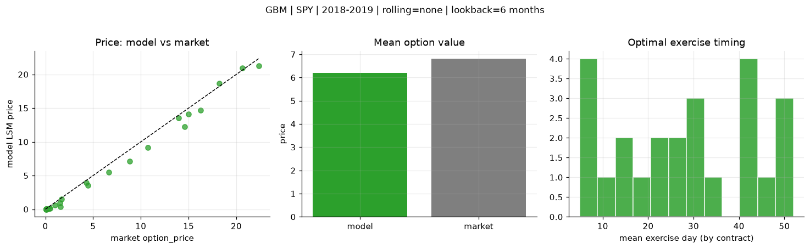
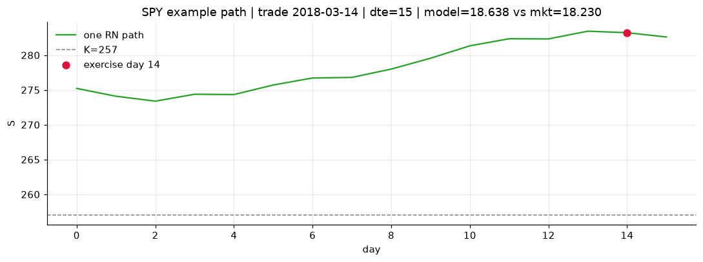
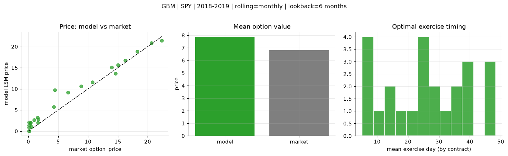
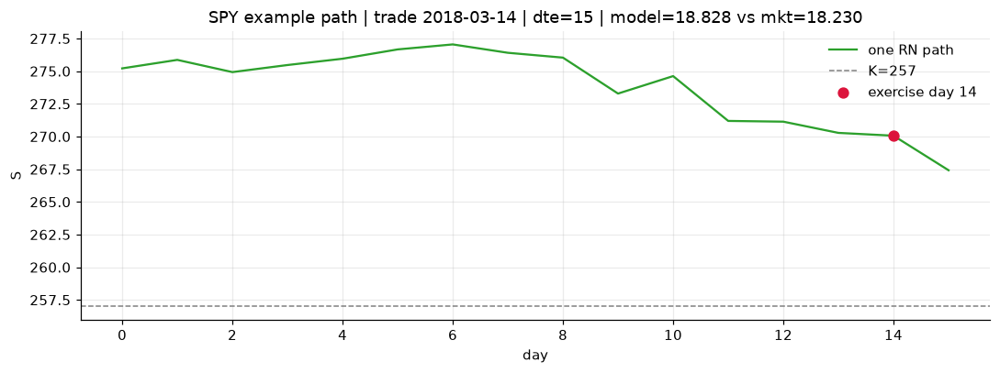
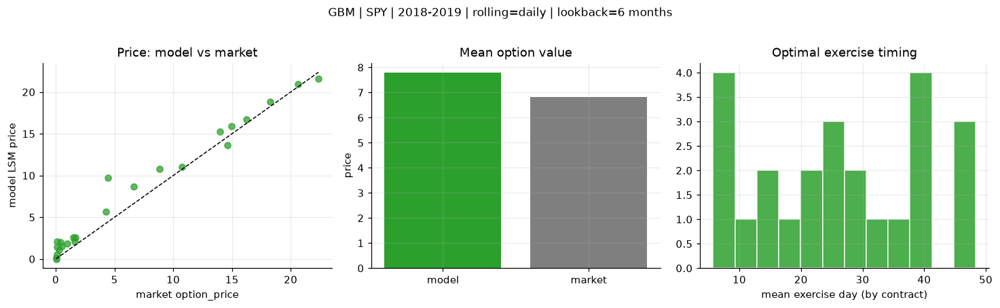

# Optimal stopping — GBM — 2018-2019 — SPY

**Model:** GBM  
**Underlying:** SPY  
**Regime / period:** 2018-2019  
**Lookback:** 6 months (fixed)  
**Rolling modes:** none, monthly, daily  
**Pricing:** LSM American calls on SPY | n_paths=2000 | seed=42 | contracts=24

## Comparison (same contracts, same lookback)

| Rolling | RMSE | MAE | Bias (model−mkt) | Mean early-ex frac | Cal updates | Cal s | LSM s |
|---------|-----:|----:|-----------------:|-------------------:|------------:|------:|------:|
| `none` | 0.9143 | 0.6779 | -0.6169 | 0.184 | 1 | 0.0 | 0.1 |
| `monthly` | 1.6168 | 1.2303 | 1.0662 | 0.262 | 25 | 0.0 | 0.1 |
| `daily` | 1.5356 | 1.1325 | 0.9813 | 0.257 | 503 | 0.1 | 0.1 |

**Lowest RMSE (this study):** `none` = 0.9143

## Rolling = `none`

- **RMSE:** 0.9143  
- **MAE:** 0.6779  
- **Bias:** -0.6169  
- **Mean early-exercise fraction:** 0.184  
- **Calibration updates (SPY):** 1

Contract errors (compact)

| date | K | dte | market | model | error | early_ex |
|------|--:|----:|-------:|------:|------:|---------:|
| 2018-03-14 | 257 | 15 | 18.230 | 18.638 | 0.408 | 0.503 |
| 2019-09-05 | 277 | 8 | 20.620 | 20.943 | 0.323 | 0.260 |
| 2019-01-15 | 247 | 31 | 14.990 | 14.114 | -0.876 | 0.040 |
| 2019-01-15 | 247.5 | 24 | 13.960 | 13.570 | -0.390 | 0.103 |
| 2019-06-03 | 261 | 46 | 16.230 | 14.685 | -1.545 | 0.268 |
| 2018-02-28 | 260 | 51 | 14.600 | 12.282 | -2.318 | 0.632 |
| 2018-04-05 | 269 | 11 | 1.600 | 0.380 | -1.220 | 0.043 |
| 2019-02-06 | 269 | 7 | 4.290 | 3.954 | -0.336 | 0.570 |
| 2019-07-09 | 303 | 31 | 1.520 | 0.921 | -0.599 | 0.042 |
| 2019-07-30 | 307 | 27 | 0.990 | 0.597 | -0.393 | 0.090 |
| 2019-02-21 | 277.5 | 43 | 4.450 | 3.546 | -0.904 | 0.329 |
| 2019-09-05 | 293 | 50 | 8.840 | 7.139 | -1.701 | 0.026 |
| 2019-07-23 | 309 | 15 | 0.110 | 0.066 | -0.044 | 0.020 |
| 2018-11-29 | 291 | 8 | 0.080 | 0.000 | -0.080 | 0.000 |
| 2018-11-21 | 286 | 21 | 0.080 | 0.000 | -0.080 | 0.000 |
| 2018-05-10 | 287.5 | 29 | 0.110 | 0.020 | -0.090 | 0.002 |
| 2019-05-03 | 320 | 49 | 0.100 | 0.005 | -0.095 | 0.002 |
| 2019-08-13 | 308 | 48 | 0.510 | 0.137 | -0.373 | 0.019 |
| 2018-10-02 | 293 | 20 | 1.670 | 1.507 | -0.163 | 0.203 |
| 2018-11-07 | 261 | 54 | 22.370 | 21.258 | -1.112 | 0.795 |
| 2019-11-29 | 311 | 42 | 6.650 | 5.532 | -1.118 | 0.004 |
| 2019-03-07 | 279.5 | 8 | 0.410 | 0.116 | -0.294 | 0.006 |
| 2019-07-09 | 290 | 45 | 10.750 | 9.183 | -1.567 | 0.459 |
| 2019-06-24 | 307.5 | 25 | 0.270 | 0.031 | -0.239 | 0.006 |

## Rolling = `monthly`

- **RMSE:** 1.6168  
- **MAE:** 1.2303  
- **Bias:** 1.0662  
- **Mean early-exercise fraction:** 0.262  
- **Calibration updates (SPY):** 25

Contract errors (compact)

| date | K | dte | market | model | error | early_ex |
|------|--:|----:|-------:|------:|------:|---------:|
| 2018-03-14 | 257 | 15 | 18.230 | 18.828 | 0.598 | 0.730 |
| 2019-09-05 | 277 | 8 | 20.620 | 20.882 | 0.262 | 0.545 |
| 2019-01-15 | 247 | 31 | 14.990 | 15.640 | 0.650 | 0.403 |
| 2019-01-15 | 247.5 | 24 | 13.960 | 15.067 | 1.107 | 0.310 |
| 2019-06-03 | 261 | 46 | 16.230 | 16.755 | 0.525 | 0.535 |
| 2018-02-28 | 260 | 51 | 14.600 | 13.652 | -0.948 | 0.534 |
| 2018-04-05 | 269 | 11 | 1.600 | 1.992 | 0.392 | 0.114 |
| 2019-02-06 | 269 | 7 | 4.290 | 5.710 | 1.420 | 0.398 |
| 2019-07-09 | 303 | 31 | 1.520 | 3.211 | 1.691 | 0.058 |
| 2019-07-30 | 307 | 27 | 0.990 | 2.634 | 1.644 | 0.200 |
| 2019-02-21 | 277.5 | 43 | 4.450 | 9.734 | 5.284 | 0.333 |
| 2019-09-05 | 293 | 50 | 8.840 | 10.621 | 1.781 | 0.195 |
| 2019-07-23 | 309 | 15 | 0.110 | 0.902 | 0.792 | 0.066 |
| 2018-11-29 | 291 | 8 | 0.080 | 0.008 | -0.072 | 0.001 |
| 2018-11-21 | 286 | 21 | 0.080 | 0.082 | 0.002 | 0.002 |
| 2018-05-10 | 287.5 | 29 | 0.110 | 1.367 | 1.257 | 0.019 |
| 2019-05-03 | 320 | 49 | 0.100 | 2.123 | 2.023 | 0.059 |
| 2019-08-13 | 308 | 48 | 0.510 | 1.063 | 0.553 | 0.083 |
| 2018-10-02 | 293 | 20 | 1.670 | 2.730 | 1.060 | 0.228 |
| 2018-11-07 | 261 | 54 | 22.370 | 21.422 | -0.948 | 0.773 |
| 2019-11-29 | 311 | 42 | 6.650 | 9.167 | 2.517 | 0.163 |
| 2019-03-07 | 279.5 | 8 | 0.410 | 2.013 | 1.603 | 0.090 |
| 2019-07-09 | 290 | 45 | 10.750 | 11.595 | 0.845 | 0.413 |
| 2019-06-24 | 307.5 | 25 | 0.270 | 1.822 | 1.552 | 0.045 |

## Rolling = `daily`

- **RMSE:** 1.5356  
- **MAE:** 1.1325  
- **Bias:** 0.9813  
- **Mean early-exercise fraction:** 0.257  
- **Calibration updates (SPY):** 503

Contract errors (compact)

| date | K | dte | market | model | error | early_ex |
|------|--:|----:|-------:|------:|------:|---------:|
| 2018-03-14 | 257 | 15 | 18.230 | 18.845 | 0.615 | 0.760 |
| 2019-09-05 | 277 | 8 | 20.620 | 20.912 | 0.292 | 0.496 |
| 2019-01-15 | 247 | 31 | 14.990 | 15.885 | 0.895 | 0.345 |
| 2019-01-15 | 247.5 | 24 | 13.960 | 15.256 | 1.296 | 0.314 |
| 2019-06-03 | 261 | 46 | 16.230 | 16.738 | 0.508 | 0.534 |
| 2018-02-28 | 260 | 51 | 14.600 | 13.652 | -0.948 | 0.534 |
| 2018-04-05 | 269 | 11 | 1.600 | 2.111 | 0.511 | 0.116 |
| 2019-02-06 | 269 | 7 | 4.290 | 5.711 | 1.421 | 0.398 |
| 2019-07-09 | 303 | 31 | 1.520 | 2.611 | 1.091 | 0.063 |
| 2019-07-30 | 307 | 27 | 0.990 | 1.889 | 0.899 | 0.175 |
| 2019-02-21 | 277.5 | 43 | 4.450 | 9.769 | 5.319 | 0.339 |
| 2019-09-05 | 293 | 50 | 8.840 | 10.779 | 1.939 | 0.233 |
| 2019-07-23 | 309 | 15 | 0.110 | 0.559 | 0.449 | 0.051 |
| 2018-11-29 | 291 | 8 | 0.080 | 0.022 | -0.058 | 0.001 |
| 2018-11-21 | 286 | 21 | 0.080 | 0.127 | 0.047 | 0.003 |
| 2018-05-10 | 287.5 | 29 | 0.110 | 1.452 | 1.342 | 0.029 |
| 2019-05-03 | 320 | 49 | 0.100 | 2.089 | 1.989 | 0.057 |
| 2019-08-13 | 308 | 48 | 0.510 | 1.546 | 1.036 | 0.084 |
| 2018-10-02 | 293 | 20 | 1.670 | 2.546 | 0.876 | 0.228 |
| 2018-11-07 | 261 | 54 | 22.370 | 21.563 | -0.807 | 0.767 |
| 2019-11-29 | 311 | 42 | 6.650 | 8.683 | 2.033 | 0.094 |
| 2019-03-07 | 279.5 | 8 | 0.410 | 2.055 | 1.645 | 0.102 |
| 2019-07-09 | 290 | 45 | 10.750 | 11.024 | 0.274 | 0.436 |
| 2019-06-24 | 307.5 | 25 | 0.270 | 1.157 | 0.887 | 0.009 |

