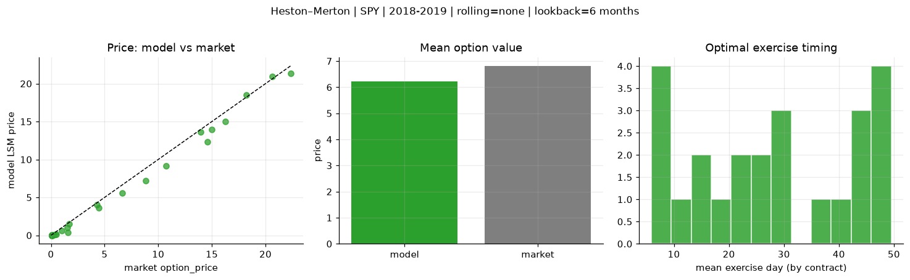
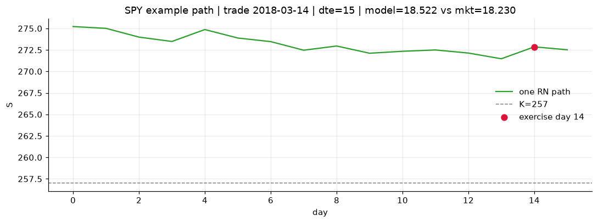
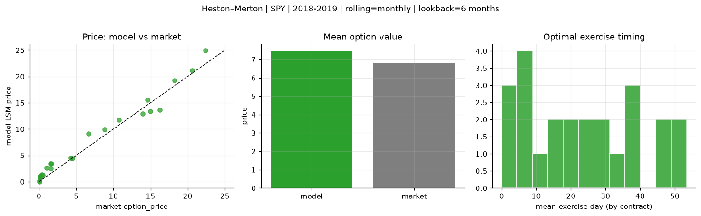
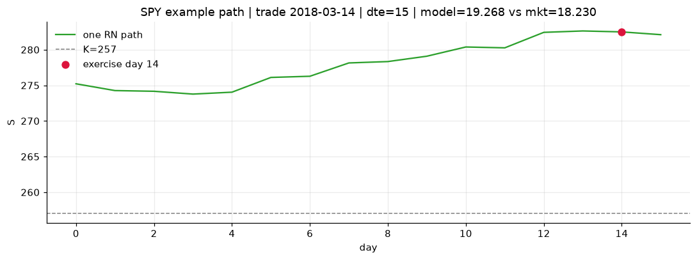
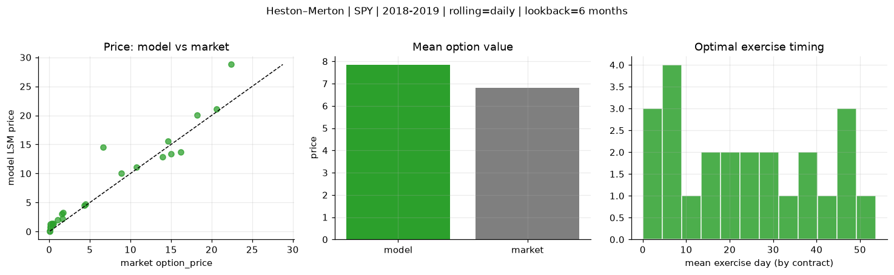
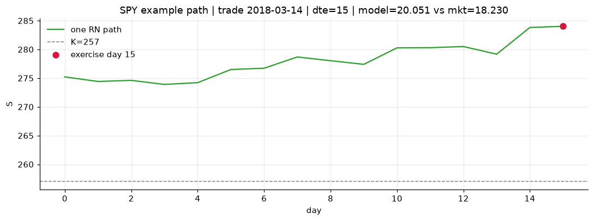

# Optimal stopping — Heston–Merton — 2018-2019 — SPY

**Model:** Heston–Merton  
**Underlying:** SPY  
**Regime / period:** 2018-2019  
**Lookback:** 6 months (fixed)  
**Rolling modes:** none, monthly, daily  
**Pricing:** LSM American calls on SPY | n_paths=2000 | seed=42 | contracts=24

## Comparison (same contracts, same lookback)

| Rolling | RMSE | MAE | Bias (model−mkt) | Mean early-ex frac | Cal updates | Cal s | LSM s |
|---------|-----:|----:|-----------------:|-------------------:|------------:|------:|------:|
| `none` | 0.8801 | 0.6480 | -0.5967 | 0.213 | 1 | 0.0 | 0.1 |
| `monthly` | 1.3155 | 1.0910 | 0.6527 | 0.322 | 25 | 0.0 | 0.1 |
| `daily` | 2.3372 | 1.4655 | 1.0315 | 0.302 | 503 | 1.0 | 0.2 |

**Lowest RMSE (this study):** `none` = 0.8801

## Rolling = `none`

- **RMSE:** 0.8801  
- **MAE:** 0.6480  
- **Bias:** -0.5967  
- **Mean early-exercise fraction:** 0.213  
- **Calibration updates (SPY):** 1

Contract errors (compact)

| date | K | dte | market | model | error | early_ex |
|------|--:|----:|-------:|------:|------:|---------:|
| 2018-03-14 | 257 | 15 | 18.230 | 18.522 | 0.292 | 0.427 |
| 2019-09-05 | 277 | 8 | 20.620 | 20.944 | 0.324 | 0.807 |
| 2019-01-15 | 247 | 31 | 14.990 | 13.926 | -1.064 | 0.465 |
| 2019-01-15 | 247.5 | 24 | 13.960 | 13.593 | -0.367 | 0.002 |
| 2019-06-03 | 261 | 46 | 16.230 | 15.008 | -1.222 | 0.044 |
| 2018-02-28 | 260 | 51 | 14.600 | 12.329 | -2.271 | 0.698 |
| 2018-04-05 | 269 | 11 | 1.600 | 0.364 | -1.236 | 0.025 |
| 2019-02-06 | 269 | 7 | 4.290 | 4.040 | -0.250 | 0.030 |
| 2019-07-09 | 303 | 31 | 1.520 | 1.013 | -0.507 | 0.048 |
| 2019-07-30 | 307 | 27 | 0.990 | 0.635 | -0.355 | 0.066 |
| 2019-02-21 | 277.5 | 43 | 4.450 | 3.600 | -0.850 | 0.216 |
| 2019-09-05 | 293 | 50 | 8.840 | 7.167 | -1.673 | 0.153 |
| 2019-07-23 | 309 | 15 | 0.110 | 0.049 | -0.061 | 0.013 |
| 2018-11-29 | 291 | 8 | 0.080 | 0.000 | -0.080 | 0.000 |
| 2018-11-21 | 286 | 21 | 0.080 | 0.000 | -0.080 | 0.000 |
| 2018-05-10 | 287.5 | 29 | 0.110 | 0.008 | -0.102 | 0.004 |
| 2019-05-03 | 320 | 49 | 0.100 | 0.000 | -0.100 | 0.000 |
| 2019-08-13 | 308 | 48 | 0.510 | 0.164 | -0.346 | 0.028 |
| 2018-10-02 | 293 | 20 | 1.670 | 1.514 | -0.156 | 0.174 |
| 2018-11-07 | 261 | 54 | 22.370 | 21.365 | -1.005 | 1.000 |
| 2019-11-29 | 311 | 42 | 6.650 | 5.576 | -1.074 | 0.392 |
| 2019-03-07 | 279.5 | 8 | 0.410 | 0.088 | -0.322 | 0.017 |
| 2019-07-09 | 290 | 45 | 10.750 | 9.176 | -1.574 | 0.497 |
| 2019-06-24 | 307.5 | 25 | 0.270 | 0.029 | -0.241 | 0.002 |

## Rolling = `monthly`

- **RMSE:** 1.3155  
- **MAE:** 1.0910  
- **Bias:** 0.6527  
- **Mean early-exercise fraction:** 0.322  
- **Calibration updates (SPY):** 25

Contract errors (compact)

| date | K | dte | market | model | error | early_ex |
|------|--:|----:|-------:|------:|------:|---------:|
| 2018-03-14 | 257 | 15 | 18.230 | 19.268 | 1.038 | 0.341 |
| 2019-09-05 | 277 | 8 | 20.620 | 21.122 | 0.502 | 0.789 |
| 2019-01-15 | 247 | 31 | 14.990 | 13.405 | -1.585 | 1.000 |
| 2019-01-15 | 247.5 | 24 | 13.960 | 12.905 | -1.055 | 1.000 |
| 2019-06-03 | 261 | 46 | 16.230 | 13.666 | -2.564 | 1.000 |
| 2018-02-28 | 260 | 51 | 14.600 | 15.569 | 0.969 | 0.285 |
| 2018-04-05 | 269 | 11 | 1.600 | 2.498 | 0.898 | 0.020 |
| 2019-02-06 | 269 | 7 | 4.290 | 4.517 | 0.227 | 0.502 |
| 2019-07-09 | 303 | 31 | 1.520 | 3.426 | 1.906 | 0.192 |
| 2019-07-30 | 307 | 27 | 0.990 | 2.647 | 1.657 | 0.108 |
| 2019-02-21 | 277.5 | 43 | 4.450 | 4.445 | -0.005 | 0.308 |
| 2019-09-05 | 293 | 50 | 8.840 | 9.923 | 1.083 | 0.444 |
| 2019-07-23 | 309 | 15 | 0.110 | 0.913 | 0.803 | 0.051 |
| 2018-11-29 | 291 | 8 | 0.080 | 0.029 | -0.051 | 0.002 |
| 2018-11-21 | 286 | 21 | 0.080 | 0.136 | 0.056 | 0.011 |
| 2018-05-10 | 287.5 | 29 | 0.110 | 1.079 | 0.969 | 0.065 |
| 2019-05-03 | 320 | 49 | 0.100 | 0.803 | 0.703 | 0.070 |
| 2019-08-13 | 308 | 48 | 0.510 | 1.225 | 0.715 | 0.065 |
| 2018-10-02 | 293 | 20 | 1.670 | 3.439 | 1.769 | 0.051 |
| 2018-11-07 | 261 | 54 | 22.370 | 24.898 | 2.528 | 0.606 |
| 2019-11-29 | 311 | 42 | 6.650 | 9.135 | 2.485 | 0.312 |
| 2019-03-07 | 279.5 | 8 | 0.410 | 1.360 | 0.950 | 0.095 |
| 2019-07-09 | 290 | 45 | 10.750 | 11.783 | 1.033 | 0.337 |
| 2019-06-24 | 307.5 | 25 | 0.270 | 0.903 | 0.633 | 0.075 |

## Rolling = `daily`

- **RMSE:** 2.3372  
- **MAE:** 1.4655  
- **Bias:** 1.0315  
- **Mean early-exercise fraction:** 0.302  
- **Calibration updates (SPY):** 503

Contract errors (compact)

| date | K | dte | market | model | error | early_ex |
|------|--:|----:|-------:|------:|------:|---------:|
| 2018-03-14 | 257 | 15 | 18.230 | 20.051 | 1.821 | 0.064 |
| 2019-09-05 | 277 | 8 | 20.620 | 21.130 | 0.510 | 0.795 |
| 2019-01-15 | 247 | 31 | 14.990 | 13.405 | -1.585 | 1.000 |
| 2019-01-15 | 247.5 | 24 | 13.960 | 12.905 | -1.055 | 1.000 |
| 2019-06-03 | 261 | 46 | 16.230 | 13.666 | -2.564 | 1.000 |
| 2018-02-28 | 260 | 51 | 14.600 | 15.569 | 0.969 | 0.285 |
| 2018-04-05 | 269 | 11 | 1.600 | 2.213 | 0.613 | 0.048 |
| 2019-02-06 | 269 | 7 | 4.290 | 4.482 | 0.192 | 0.494 |
| 2019-07-09 | 303 | 31 | 1.520 | 3.029 | 1.509 | 0.210 |
| 2019-07-30 | 307 | 27 | 0.990 | 2.029 | 1.039 | 0.151 |
| 2019-02-21 | 277.5 | 43 | 4.450 | 4.757 | 0.307 | 0.335 |
| 2019-09-05 | 293 | 50 | 8.840 | 10.072 | 1.232 | 0.439 |
| 2019-07-23 | 309 | 15 | 0.110 | 0.702 | 0.592 | 0.059 |
| 2018-11-29 | 291 | 8 | 0.080 | 0.076 | -0.004 | 0.004 |
| 2018-11-21 | 286 | 21 | 0.080 | 0.167 | 0.087 | 0.011 |
| 2018-05-10 | 287.5 | 29 | 0.110 | 1.240 | 1.130 | 0.046 |
| 2019-05-03 | 320 | 49 | 0.100 | 0.814 | 0.714 | 0.069 |
| 2019-08-13 | 308 | 48 | 0.510 | 1.415 | 0.905 | 0.089 |
| 2018-10-02 | 293 | 20 | 1.670 | 3.311 | 1.641 | 0.220 |
| 2018-11-07 | 261 | 54 | 22.370 | 28.771 | 6.401 | 0.390 |
| 2019-11-29 | 311 | 42 | 6.650 | 14.532 | 7.882 | 0.000 |
| 2019-03-07 | 279.5 | 8 | 0.410 | 1.305 | 0.895 | 0.119 |
| 2019-07-09 | 290 | 45 | 10.750 | 11.134 | 0.384 | 0.358 |
| 2019-06-24 | 307.5 | 25 | 0.270 | 1.409 | 1.139 | 0.059 |

