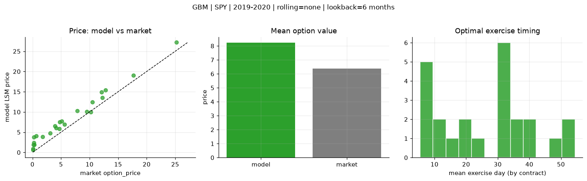
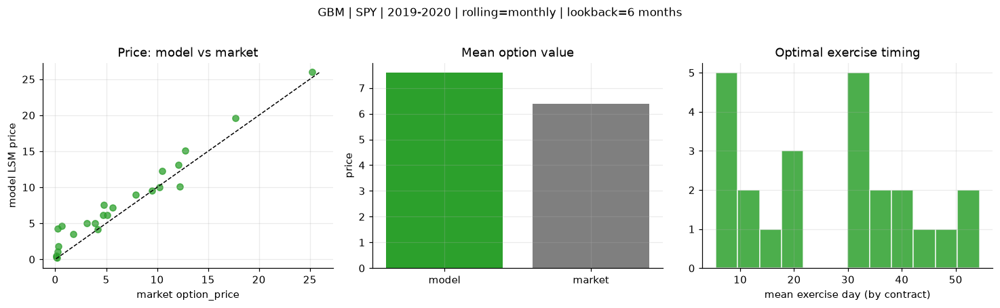
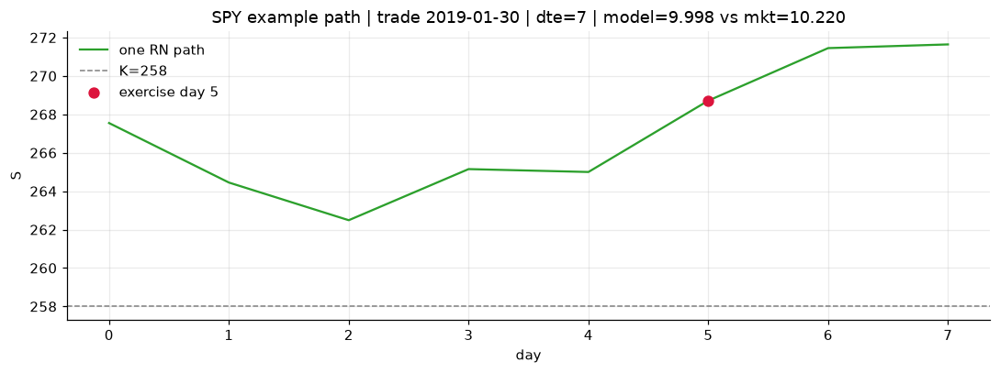
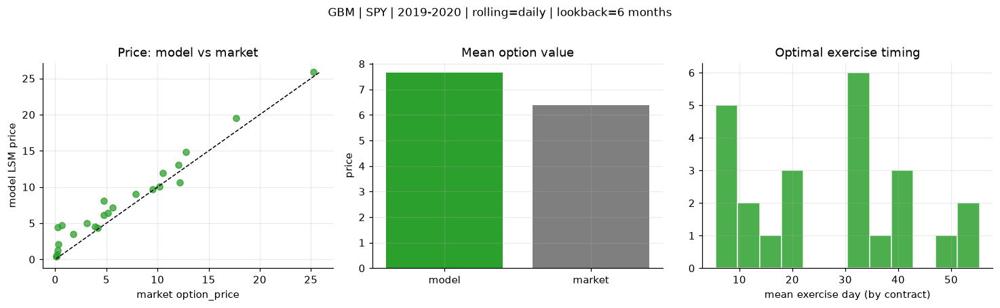
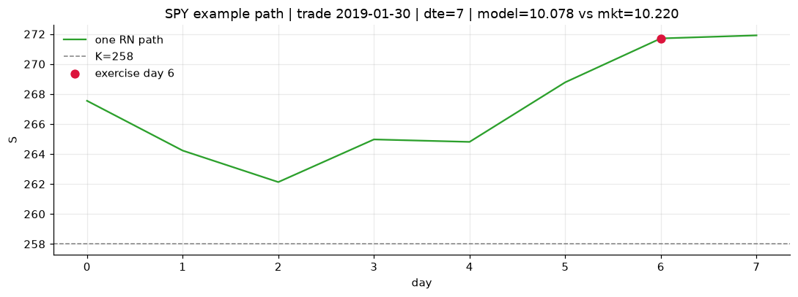

# Optimal stopping — GBM — 2019-2020 — SPY

**Model:** GBM  
**Underlying:** SPY  
**Regime / period:** 2019-2020  
**Lookback:** 6 months (fixed)  
**Rolling modes:** none, monthly, daily  
**Pricing:** LSM American calls on SPY | n_paths=2000 | seed=42 | contracts=24

## Comparison (same contracts, same lookback)

| Rolling | RMSE | MAE | Bias (model−mkt) | Mean early-ex frac | Cal updates | Cal s | LSM s |
|---------|-----:|----:|-----------------:|-------------------:|------------:|------:|------:|
| `none` | 2.0618 | 1.8741 | 1.8556 | 0.285 | 1 | 0.0 | 0.1 |
| `monthly` | 1.7747 | 1.4128 | 1.2189 | 0.286 | 25 | 0.0 | 0.1 |
| `daily` | 1.7976 | 1.4235 | 1.2793 | 0.284 | 505 | 0.1 | 0.1 |

**Lowest RMSE (this study):** `monthly` = 1.7747

## Rolling = `none`

- **RMSE:** 2.0618  
- **MAE:** 1.8741  
- **Bias:** 1.8556  
- **Mean early-exercise fraction:** 0.285  
- **Calibration updates (SPY):** 1

Contract errors (compact)

| date | K | dte | market | model | error | early_ex |
|------|--:|----:|-------:|------:|------:|---------:|
| 2019-01-30 | 258 | 7 | 10.220 | 9.998 | -0.222 | 0.559 |
| 2019-10-17 | 290 | 8 | 9.520 | 10.088 | 0.568 | 0.351 |
| 2019-06-17 | 280 | 25 | 10.520 | 12.456 | 1.936 | 0.480 |
| 2019-06-10 | 278 | 39 | 12.790 | 15.424 | 2.634 | 0.366 |
| 2019-09-19 | 277 | 57 | 25.220 | 27.183 | 1.963 | 0.662 |
| 2019-02-06 | 257 | 51 | 17.690 | 19.085 | 1.395 | 0.520 |
| 2019-02-06 | 271 | 9 | 3.100 | 4.734 | 1.634 | 0.314 |
| 2019-07-09 | 295.5 | 17 | 3.910 | 6.506 | 2.596 | 0.263 |
| 2019-10-03 | 294 | 32 | 4.150 | 6.056 | 1.906 | 0.209 |
| 2019-10-17 | 297 | 22 | 5.130 | 7.717 | 2.587 | 0.281 |
| 2019-08-06 | 281 | 45 | 12.210 | 13.496 | 1.286 | 0.387 |
| 2019-11-07 | 299 | 43 | 12.070 | 14.893 | 2.823 | 0.390 |
| 2019-10-03 | 303 | 13 | 0.080 | 0.895 | 0.815 | 0.004 |
| 2019-06-10 | 303 | 11 | 0.070 | 0.581 | 0.511 | 0.026 |
| 2019-06-03 | 283 | 32 | 1.760 | 3.870 | 2.110 | 0.230 |
| 2019-03-14 | 292 | 34 | 0.260 | 3.729 | 3.469 | 0.013 |
| 2019-08-27 | 315 | 52 | 0.140 | 1.862 | 1.722 | 0.068 |
| 2019-10-10 | 313 | 43 | 0.210 | 2.422 | 2.212 | 0.086 |
| 2019-02-06 | 268.5 | 7 | 4.720 | 5.875 | 1.155 | 0.436 |
| 2019-02-13 | 270 | 9 | 5.640 | 6.901 | 1.261 | 0.355 |
| 2019-01-15 | 275 | 31 | 0.290 | 1.858 | 1.568 | 0.119 |
| 2019-09-12 | 295 | 27 | 7.870 | 10.318 | 2.448 | 0.392 |
| 2019-03-21 | 294 | 32 | 0.640 | 4.036 | 3.396 | 0.097 |
| 2019-01-15 | 264 | 59 | 4.770 | 7.531 | 2.761 | 0.238 |

## Rolling = `monthly`

- **RMSE:** 1.7747  
- **MAE:** 1.4128  
- **Bias:** 1.2189  
- **Mean early-exercise fraction:** 0.286  
- **Calibration updates (SPY):** 25

Contract errors (compact)

| date | K | dte | market | model | error | early_ex |
|------|--:|----:|-------:|------:|------:|---------:|
| 2019-01-30 | 258 | 7 | 10.220 | 9.998 | -0.222 | 0.559 |
| 2019-10-17 | 290 | 8 | 9.520 | 9.578 | 0.058 | 0.500 |
| 2019-06-17 | 280 | 25 | 10.520 | 12.307 | 1.787 | 0.458 |
| 2019-06-10 | 278 | 39 | 12.790 | 15.114 | 2.324 | 0.343 |
| 2019-09-19 | 277 | 57 | 25.220 | 25.967 | 0.747 | 0.624 |
| 2019-02-06 | 257 | 51 | 17.690 | 19.608 | 1.918 | 0.496 |
| 2019-02-06 | 271 | 9 | 3.100 | 4.997 | 1.897 | 0.312 |
| 2019-07-09 | 295.5 | 17 | 3.910 | 4.985 | 1.075 | 0.267 |
| 2019-10-03 | 294 | 32 | 4.150 | 4.208 | 0.058 | 0.205 |
| 2019-10-17 | 297 | 22 | 5.130 | 6.134 | 1.004 | 0.272 |
| 2019-08-06 | 281 | 45 | 12.210 | 10.106 | -2.104 | 0.410 |
| 2019-11-07 | 299 | 43 | 12.070 | 13.113 | 1.043 | 0.410 |
| 2019-10-03 | 303 | 13 | 0.080 | 0.330 | 0.250 | 0.003 |
| 2019-06-10 | 303 | 11 | 0.070 | 0.471 | 0.401 | 0.023 |
| 2019-06-03 | 283 | 32 | 1.760 | 3.546 | 1.786 | 0.212 |
| 2019-03-14 | 292 | 34 | 0.260 | 4.258 | 3.998 | 0.083 |
| 2019-08-27 | 315 | 52 | 0.140 | 0.206 | 0.066 | 0.021 |
| 2019-10-10 | 313 | 43 | 0.210 | 1.075 | 0.865 | 0.037 |
| 2019-02-06 | 268.5 | 7 | 4.720 | 6.101 | 1.381 | 0.421 |
| 2019-02-13 | 270 | 9 | 5.640 | 7.155 | 1.515 | 0.342 |
| 2019-01-15 | 275 | 31 | 0.290 | 1.858 | 1.568 | 0.119 |
| 2019-09-12 | 295 | 27 | 7.870 | 8.979 | 1.109 | 0.418 |
| 2019-03-21 | 294 | 32 | 0.640 | 4.610 | 3.970 | 0.099 |
| 2019-01-15 | 264 | 59 | 4.770 | 7.531 | 2.761 | 0.238 |

## Rolling = `daily`

- **RMSE:** 1.7976  
- **MAE:** 1.4235  
- **Bias:** 1.2793  
- **Mean early-exercise fraction:** 0.284  
- **Calibration updates (SPY):** 505

Contract errors (compact)

| date | K | dte | market | model | error | early_ex |
|------|--:|----:|-------:|------:|------:|---------:|
| 2019-01-30 | 258 | 7 | 10.220 | 10.078 | -0.142 | 0.532 |
| 2019-10-17 | 290 | 8 | 9.520 | 9.646 | 0.126 | 0.478 |
| 2019-06-17 | 280 | 25 | 10.520 | 11.954 | 1.434 | 0.456 |
| 2019-06-10 | 278 | 39 | 12.790 | 14.828 | 2.038 | 0.365 |
| 2019-09-19 | 277 | 57 | 25.220 | 25.864 | 0.644 | 0.622 |
| 2019-02-06 | 257 | 51 | 17.690 | 19.575 | 1.885 | 0.494 |
| 2019-02-06 | 271 | 9 | 3.100 | 4.998 | 1.898 | 0.312 |
| 2019-07-09 | 295.5 | 17 | 3.910 | 4.559 | 0.649 | 0.262 |
| 2019-10-03 | 294 | 32 | 4.150 | 4.341 | 0.191 | 0.206 |
| 2019-10-17 | 297 | 22 | 5.130 | 6.407 | 1.277 | 0.273 |
| 2019-08-06 | 281 | 45 | 12.210 | 10.622 | -1.588 | 0.407 |
| 2019-11-07 | 299 | 43 | 12.070 | 13.082 | 1.012 | 0.407 |
| 2019-10-03 | 303 | 13 | 0.080 | 0.362 | 0.282 | 0.002 |
| 2019-06-10 | 303 | 11 | 0.070 | 0.394 | 0.324 | 0.025 |
| 2019-06-03 | 283 | 32 | 1.760 | 3.476 | 1.716 | 0.205 |
| 2019-03-14 | 292 | 34 | 0.260 | 4.390 | 4.130 | 0.064 |
| 2019-08-27 | 315 | 52 | 0.140 | 0.703 | 0.563 | 0.031 |
| 2019-10-10 | 313 | 43 | 0.210 | 1.236 | 1.026 | 0.055 |
| 2019-02-06 | 268.5 | 7 | 4.720 | 6.102 | 1.382 | 0.421 |
| 2019-02-13 | 270 | 9 | 5.640 | 7.180 | 1.540 | 0.329 |
| 2019-01-15 | 275 | 31 | 0.290 | 2.079 | 1.789 | 0.118 |
| 2019-09-12 | 295 | 27 | 7.870 | 8.989 | 1.119 | 0.418 |
| 2019-03-21 | 294 | 32 | 0.640 | 4.760 | 4.120 | 0.102 |
| 2019-01-15 | 264 | 59 | 4.770 | 8.062 | 3.292 | 0.230 |

