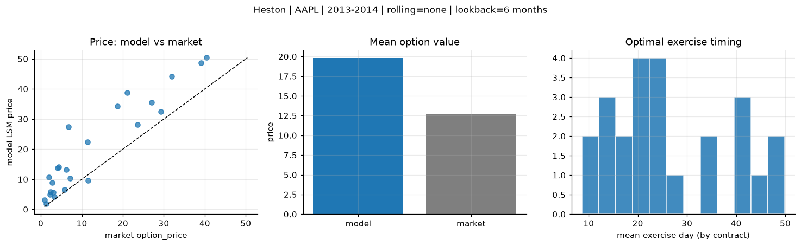
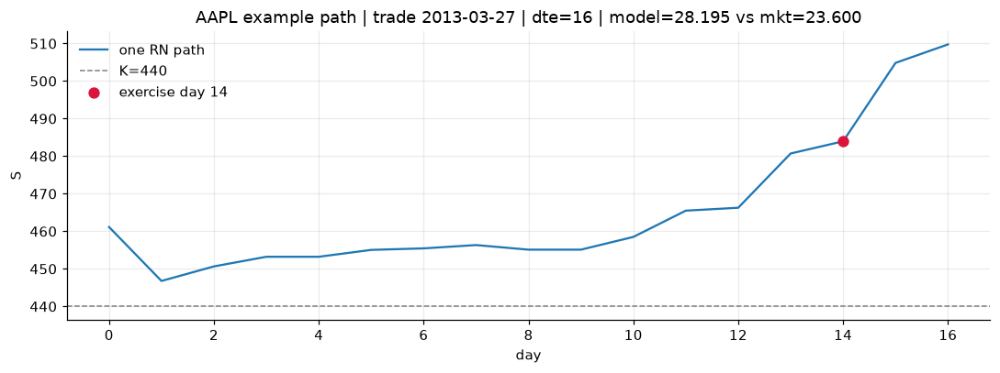
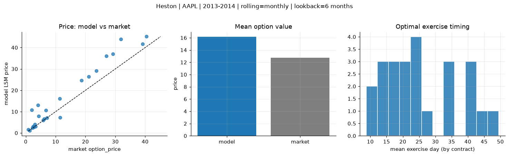
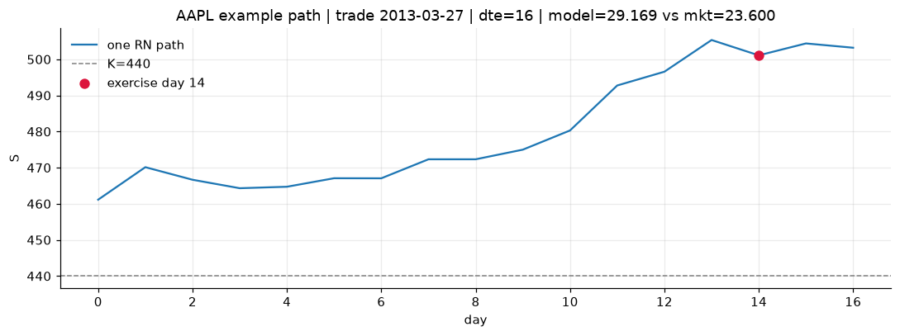
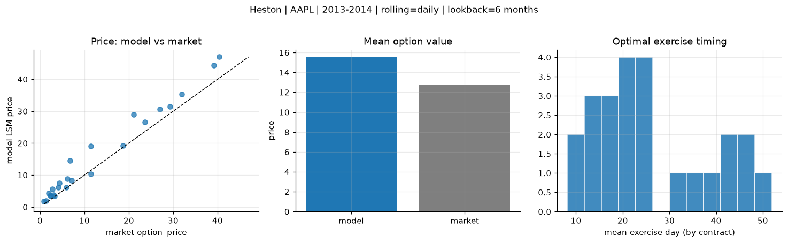
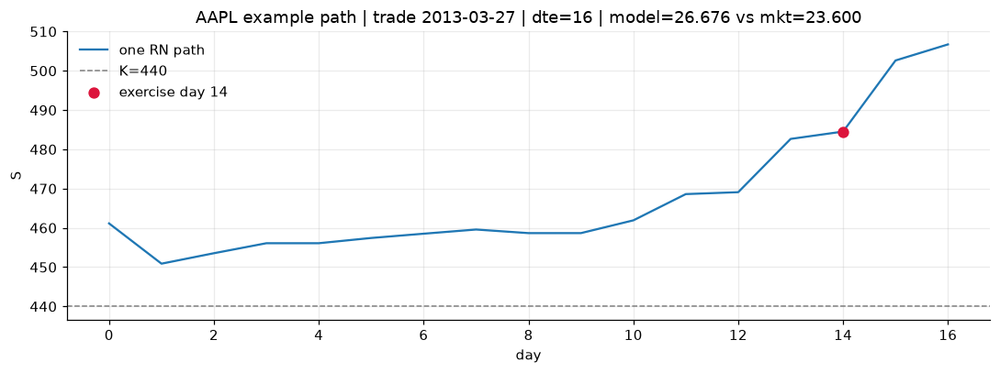

# Optimal stopping — Heston — 2013-2014 — AAPL

**Model:** Heston  
**Underlying:** AAPL  
**Regime / period:** 2013-2014  
**Lookback:** 6 months (fixed)  
**Rolling modes:** none, monthly, daily  
**Pricing:** LSM American calls on AAPL | n_paths=2000 | seed=42 | contracts=24

## Comparison (same contracts, same lookback)

| Rolling | RMSE | MAE | Bias (model−mkt) | Mean early-ex frac | Cal updates | Cal s | LSM s |
|---------|-----:|----:|-----------------:|-------------------:|------------:|------:|------:|
| `none` | 9.0211 | 7.2012 | 7.0427 | 0.277 | 1 | 0.1 | 0.1 |
| `monthly` | 5.1793 | 3.7921 | 3.3986 | 0.303 | 25 | 3.8 | 0.1 |
| `daily` | 3.7261 | 2.8619 | 2.7603 | 0.315 | 505 | 22.2 | 0.2 |

**Lowest RMSE (this study):** `daily` = 3.7261

## Rolling = `none`

- **RMSE:** 9.0211  
- **MAE:** 7.2012  
- **Bias:** 7.0427  
- **Mean early-exercise fraction:** 0.277  
- **Calibration updates (AAPL):** 1

Contract errors (compact)

| date | K | dte | market | model | error | early_ex |
|------|--:|----:|-------:|------:|------:|---------:|
| 2013-03-27 | 440 | 16 | 23.600 | 28.195 | 4.595 | 0.376 |
| 2014-08-01 | 90 | 14 | 5.875 | 6.533 | 0.658 | 0.649 |
| 2014-02-10 | 497.5 | 25 | 27.000 | 35.594 | 8.594 | 0.425 |
| 2014-02-03 | 470 | 31 | 31.900 | 44.137 | 12.237 | 0.568 |
| 2014-06-19 | 86.43 | 57 | 7.100 | 10.251 | 3.151 | 0.572 |
| 2013-03-20 | 425 | 58 | 40.375 | 50.389 | 10.014 | 0.458 |
| 2013-04-11 | 445 | 15 | 11.500 | 9.597 | -1.903 | 0.135 |
| 2014-03-11 | 540 | 17 | 4.300 | 14.069 | 9.769 | 0.134 |
| 2014-07-11 | 94 | 21 | 3.300 | 4.273 | 0.973 | 0.272 |
| 2014-07-25 | 95 | 28 | 3.040 | 5.567 | 2.527 | 0.405 |
| 2014-04-08 | 517.5 | 45 | 21.100 | 38.745 | 17.645 | 0.328 |
| 2014-08-15 | 99 | 42 | 2.420 | 5.874 | 3.454 | 0.138 |
| 2014-09-08 | 103 | 18 | 1.370 | 1.823 | 0.453 | 0.117 |
| 2014-01-03 | 605 | 14 | 0.875 | 3.174 | 2.299 | 0.040 |
| 2013-12-26 | 610 | 22 | 2.720 | 8.978 | 6.258 | 0.086 |
| 2013-06-28 | 420 | 35 | 6.150 | 13.293 | 7.143 | 0.060 |
| 2014-06-05 | 685 | 43 | 6.800 | 27.517 | 20.717 | 0.166 |
| 2014-08-08 | 98 | 49 | 2.295 | 4.917 | 2.622 | 0.270 |
| 2014-02-03 | 522.5 | 25 | 4.050 | 13.726 | 9.676 | 0.145 |
| 2014-02-18 | 580 | 24 | 1.980 | 10.738 | 8.758 | 0.096 |
| 2014-02-18 | 515 | 10 | 29.250 | 32.491 | 3.241 | 0.356 |
| 2014-01-17 | 575 | 35 | 11.400 | 22.347 | 10.947 | 0.174 |
| 2013-12-04 | 530 | 23 | 39.125 | 48.700 | 9.575 | 0.425 |
| 2014-05-21 | 595 | 30 | 18.675 | 34.295 | 15.620 | 0.248 |

## Rolling = `monthly`

- **RMSE:** 5.1793  
- **MAE:** 3.7921  
- **Bias:** 3.3986  
- **Mean early-exercise fraction:** 0.303  
- **Calibration updates (AAPL):** 25

Contract errors (compact)

| date | K | dte | market | model | error | early_ex |
|------|--:|----:|-------:|------:|------:|---------:|
| 2013-03-27 | 440 | 16 | 23.600 | 29.169 | 5.569 | 0.391 |
| 2014-08-01 | 90 | 14 | 5.875 | 5.903 | 0.028 | 0.765 |
| 2014-02-10 | 497.5 | 25 | 27.000 | 36.023 | 9.023 | 0.573 |
| 2014-02-03 | 470 | 31 | 31.900 | 44.010 | 12.110 | 0.568 |
| 2014-06-19 | 86.43 | 57 | 7.100 | 7.024 | -0.076 | 0.718 |
| 2013-03-20 | 425 | 58 | 40.375 | 45.157 | 4.782 | 0.585 |
| 2013-04-11 | 445 | 15 | 11.500 | 7.256 | -4.244 | 0.130 |
| 2014-03-11 | 540 | 17 | 4.300 | 7.848 | 3.548 | 0.133 |
| 2014-07-11 | 94 | 21 | 3.300 | 3.135 | -0.165 | 0.287 |
| 2014-07-25 | 95 | 28 | 3.040 | 4.082 | 1.042 | 0.363 |
| 2014-04-08 | 517.5 | 45 | 21.100 | 26.475 | 5.375 | 0.363 |
| 2014-08-15 | 99 | 42 | 2.420 | 3.089 | 0.669 | 0.196 |
| 2014-09-08 | 103 | 18 | 1.370 | 1.133 | -0.237 | 0.117 |
| 2014-01-03 | 605 | 14 | 0.875 | 1.670 | 0.795 | 0.033 |
| 2013-12-26 | 610 | 22 | 2.720 | 2.795 | 0.075 | 0.042 |
| 2013-06-28 | 420 | 35 | 6.150 | 6.583 | 0.433 | 0.079 |
| 2014-06-05 | 685 | 43 | 6.800 | 10.647 | 3.847 | 0.102 |
| 2014-08-08 | 98 | 49 | 2.295 | 2.343 | 0.048 | 0.189 |
| 2014-02-03 | 522.5 | 25 | 4.050 | 13.095 | 9.045 | 0.152 |
| 2014-02-18 | 580 | 24 | 1.980 | 10.782 | 8.802 | 0.192 |
| 2014-02-18 | 515 | 10 | 29.250 | 37.077 | 7.827 | 0.245 |
| 2014-01-17 | 575 | 35 | 11.400 | 16.147 | 4.747 | 0.159 |
| 2013-12-04 | 530 | 23 | 39.125 | 41.697 | 2.572 | 0.554 |
| 2014-05-21 | 595 | 30 | 18.675 | 24.627 | 5.952 | 0.333 |

## Rolling = `daily`

- **RMSE:** 3.7261  
- **MAE:** 2.8619  
- **Bias:** 2.7603  
- **Mean early-exercise fraction:** 0.315  
- **Calibration updates (AAPL):** 505

Contract errors (compact)

| date | K | dte | market | model | error | early_ex |
|------|--:|----:|-------:|------:|------:|---------:|
| 2013-03-27 | 440 | 16 | 23.600 | 26.676 | 3.076 | 0.417 |
| 2014-08-01 | 90 | 14 | 5.875 | 6.143 | 0.268 | 0.644 |
| 2014-02-10 | 497.5 | 25 | 27.000 | 30.652 | 3.652 | 0.486 |
| 2014-02-03 | 470 | 31 | 31.900 | 35.293 | 3.393 | 0.640 |
| 2014-06-19 | 86.43 | 57 | 7.100 | 8.299 | 1.199 | 0.615 |
| 2013-03-20 | 425 | 58 | 40.375 | 46.978 | 6.603 | 0.518 |
| 2013-04-11 | 445 | 15 | 11.500 | 10.281 | -1.219 | 0.178 |
| 2014-03-11 | 540 | 17 | 4.300 | 7.532 | 3.232 | 0.099 |
| 2014-07-11 | 94 | 21 | 3.300 | 3.534 | 0.234 | 0.320 |
| 2014-07-25 | 95 | 28 | 3.040 | 3.860 | 0.820 | 0.468 |
| 2014-04-08 | 517.5 | 45 | 21.100 | 28.922 | 7.822 | 0.343 |
| 2014-08-15 | 99 | 42 | 2.420 | 3.512 | 1.092 | 0.247 |
| 2014-09-08 | 103 | 18 | 1.370 | 1.936 | 0.566 | 0.195 |
| 2014-01-03 | 605 | 14 | 0.875 | 1.802 | 0.927 | 0.040 |
| 2013-12-26 | 610 | 22 | 2.720 | 5.704 | 2.984 | 0.075 |
| 2013-06-28 | 420 | 35 | 6.150 | 8.775 | 2.625 | 0.068 |
| 2014-06-05 | 685 | 43 | 6.800 | 14.535 | 7.735 | 0.172 |
| 2014-08-08 | 98 | 49 | 2.295 | 3.566 | 1.271 | 0.225 |
| 2014-02-03 | 522.5 | 25 | 4.050 | 6.226 | 2.176 | 0.104 |
| 2014-02-18 | 580 | 24 | 1.980 | 4.257 | 2.277 | 0.088 |
| 2014-02-18 | 515 | 10 | 29.250 | 31.404 | 2.154 | 0.429 |
| 2014-01-17 | 575 | 35 | 11.400 | 19.067 | 7.667 | 0.225 |
| 2013-12-04 | 530 | 23 | 39.125 | 44.295 | 5.170 | 0.643 |
| 2014-05-21 | 595 | 30 | 18.675 | 19.200 | 0.525 | 0.327 |

