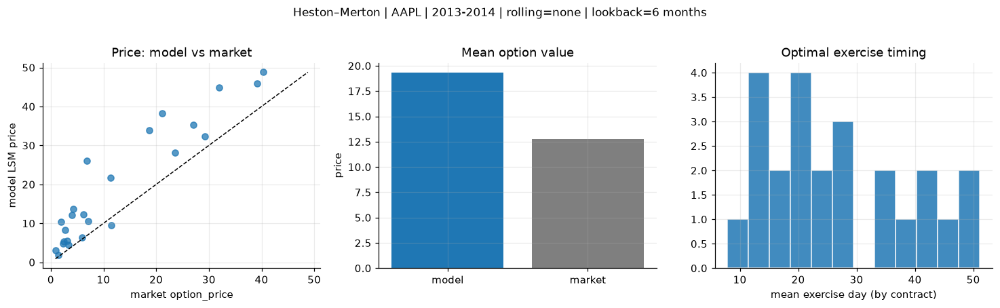
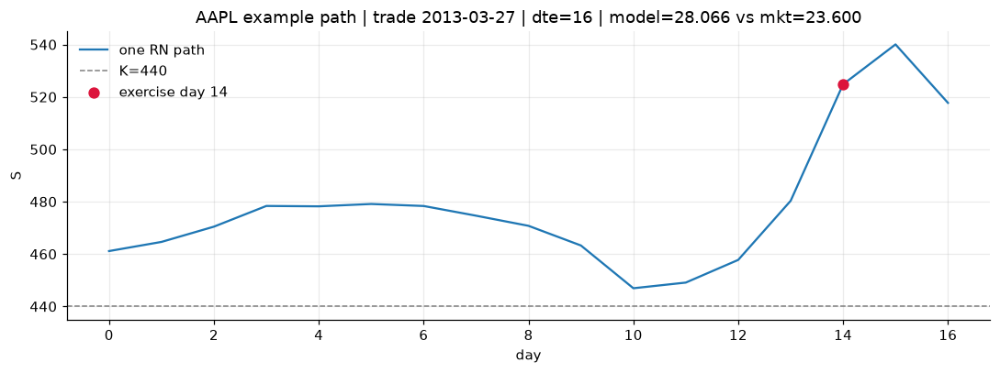
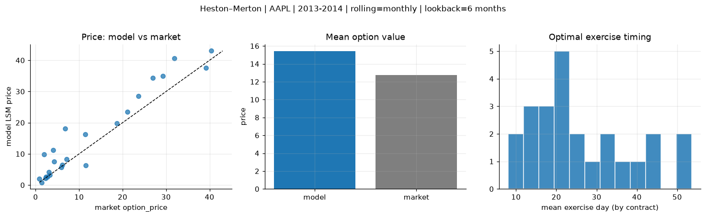
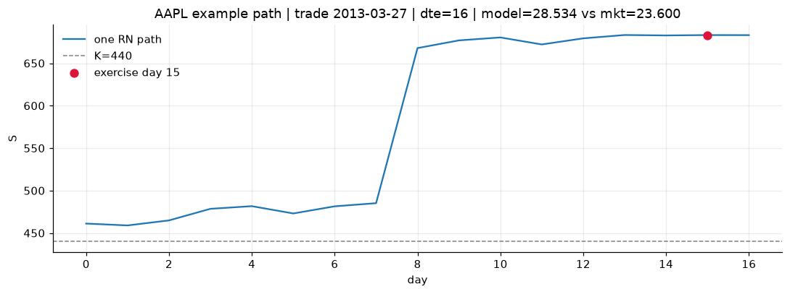
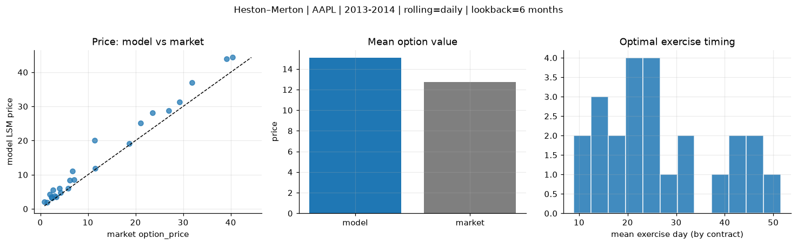
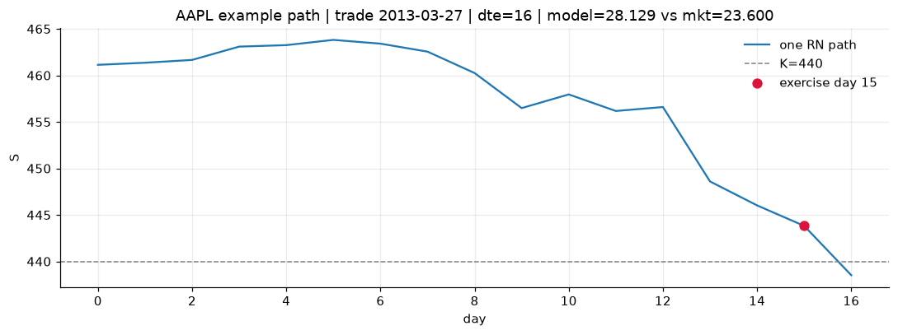

# Optimal stopping — Heston–Merton — 2013-2014 — AAPL

**Model:** Heston–Merton  
**Underlying:** AAPL  
**Regime / period:** 2013-2014  
**Lookback:** 6 months (fixed)  
**Rolling modes:** none, monthly, daily  
**Pricing:** LSM American calls on AAPL | n_paths=2000 | seed=42 | contracts=24

## Comparison (same contracts, same lookback)

| Rolling | RMSE | MAE | Bias (model−mkt) | Mean early-ex frac | Cal updates | Cal s | LSM s |
|---------|-----:|----:|-----------------:|-------------------:|------------:|------:|------:|
| `none` | 8.4855 | 6.7266 | 6.5633 | 0.221 | 1 | 0.1 | 0.6 |
| `monthly` | 4.6153 | 3.3077 | 2.6565 | 0.232 | 25 | 3.6 | 0.1 |
| `daily` | 3.0865 | 2.3252 | 2.3252 | 0.232 | 505 | 21.9 | 0.2 |

**Lowest RMSE (this study):** `daily` = 3.0865

## Rolling = `none`

- **RMSE:** 8.4855  
- **MAE:** 6.7266  
- **Bias:** 6.5633  
- **Mean early-exercise fraction:** 0.221  
- **Calibration updates (AAPL):** 1

Contract errors (compact)

| date | K | dte | market | model | error | early_ex |
|------|--:|----:|-------:|------:|------:|---------:|
| 2013-03-27 | 440 | 16 | 23.600 | 28.066 | 4.466 | 0.371 |
| 2014-08-01 | 90 | 14 | 5.875 | 6.451 | 0.576 | 0.079 |
| 2014-02-10 | 497.5 | 25 | 27.000 | 35.297 | 8.297 | 0.341 |
| 2014-02-03 | 470 | 31 | 31.900 | 44.835 | 12.935 | 0.271 |
| 2014-06-19 | 86.43 | 57 | 7.100 | 10.485 | 3.385 | 0.397 |
| 2013-03-20 | 425 | 58 | 40.375 | 48.797 | 8.422 | 0.375 |
| 2013-04-11 | 445 | 15 | 11.500 | 9.541 | -1.959 | 0.047 |
| 2014-03-11 | 540 | 17 | 4.300 | 13.609 | 9.309 | 0.130 |
| 2014-07-11 | 94 | 21 | 3.300 | 4.416 | 1.116 | 0.228 |
| 2014-07-25 | 95 | 28 | 3.040 | 5.443 | 2.403 | 0.291 |
| 2014-04-08 | 517.5 | 45 | 21.100 | 38.262 | 17.162 | 0.262 |
| 2014-08-15 | 99 | 42 | 2.420 | 5.274 | 2.854 | 0.265 |
| 2014-09-08 | 103 | 18 | 1.370 | 1.844 | 0.474 | 0.125 |
| 2014-01-03 | 605 | 14 | 0.875 | 3.121 | 2.246 | 0.021 |
| 2013-12-26 | 610 | 22 | 2.720 | 8.327 | 5.607 | 0.070 |
| 2013-06-28 | 420 | 35 | 6.150 | 12.368 | 6.218 | 0.140 |
| 2014-06-05 | 685 | 43 | 6.800 | 26.126 | 19.326 | 0.082 |
| 2014-08-08 | 98 | 49 | 2.295 | 4.866 | 2.571 | 0.242 |
| 2014-02-03 | 522.5 | 25 | 4.050 | 12.187 | 8.137 | 0.145 |
| 2014-02-18 | 580 | 24 | 1.980 | 10.425 | 8.445 | 0.092 |
| 2014-02-18 | 515 | 10 | 29.250 | 32.378 | 3.128 | 0.544 |
| 2014-01-17 | 575 | 35 | 11.400 | 21.781 | 10.381 | 0.142 |
| 2013-12-04 | 530 | 23 | 39.125 | 45.887 | 6.762 | 0.379 |
| 2014-05-21 | 595 | 30 | 18.675 | 33.934 | 15.259 | 0.275 |

## Rolling = `monthly`

- **RMSE:** 4.6153  
- **MAE:** 3.3077  
- **Bias:** 2.6565  
- **Mean early-exercise fraction:** 0.232  
- **Calibration updates (AAPL):** 25

Contract errors (compact)

| date | K | dte | market | model | error | early_ex |
|------|--:|----:|-------:|------:|------:|---------:|
| 2013-03-27 | 440 | 16 | 23.600 | 28.534 | 4.934 | 0.212 |
| 2014-08-01 | 90 | 14 | 5.875 | 5.698 | -0.177 | 0.530 |
| 2014-02-10 | 497.5 | 25 | 27.000 | 34.397 | 7.397 | 0.464 |
| 2014-02-03 | 470 | 31 | 31.900 | 40.622 | 8.722 | 0.418 |
| 2014-06-19 | 86.43 | 57 | 7.100 | 8.283 | 1.183 | 0.337 |
| 2013-03-20 | 425 | 58 | 40.375 | 43.012 | 2.637 | 0.255 |
| 2013-04-11 | 445 | 15 | 11.500 | 6.320 | -5.180 | 0.046 |
| 2014-03-11 | 540 | 17 | 4.300 | 7.493 | 3.193 | 0.063 |
| 2014-07-11 | 94 | 21 | 3.300 | 3.238 | -0.062 | 0.418 |
| 2014-07-25 | 95 | 28 | 3.040 | 4.224 | 1.184 | 0.237 |
| 2014-04-08 | 517.5 | 45 | 21.100 | 23.524 | 2.424 | 0.248 |
| 2014-08-15 | 99 | 42 | 2.420 | 2.693 | 0.273 | 0.226 |
| 2014-09-08 | 103 | 18 | 1.370 | 0.867 | -0.503 | 0.089 |
| 2014-01-03 | 605 | 14 | 0.875 | 1.983 | 1.108 | 0.013 |
| 2013-12-26 | 610 | 22 | 2.720 | 2.563 | -0.157 | 0.055 |
| 2013-06-28 | 420 | 35 | 6.150 | 6.515 | 0.365 | 0.059 |
| 2014-06-05 | 685 | 43 | 6.800 | 18.073 | 11.273 | 0.049 |
| 2014-08-08 | 98 | 49 | 2.295 | 2.172 | -0.123 | 0.197 |
| 2014-02-03 | 522.5 | 25 | 4.050 | 11.285 | 7.235 | 0.146 |
| 2014-02-18 | 580 | 24 | 1.980 | 9.764 | 7.784 | 0.105 |
| 2014-02-18 | 515 | 10 | 29.250 | 35.027 | 5.777 | 0.405 |
| 2014-01-17 | 575 | 35 | 11.400 | 16.336 | 4.936 | 0.184 |
| 2013-12-04 | 530 | 23 | 39.125 | 37.511 | -1.614 | 0.637 |
| 2014-05-21 | 595 | 30 | 18.675 | 19.818 | 1.143 | 0.180 |

## Rolling = `daily`

- **RMSE:** 3.0865  
- **MAE:** 2.3252  
- **Bias:** 2.3252  
- **Mean early-exercise fraction:** 0.232  
- **Calibration updates (AAPL):** 505

Contract errors (compact)

| date | K | dte | market | model | error | early_ex |
|------|--:|----:|-------:|------:|------:|---------:|
| 2013-03-27 | 440 | 16 | 23.600 | 28.129 | 4.529 | 0.072 |
| 2014-08-01 | 90 | 14 | 5.875 | 6.027 | 0.152 | 0.491 |
| 2014-02-10 | 497.5 | 25 | 27.000 | 28.795 | 1.795 | 0.441 |
| 2014-02-03 | 470 | 31 | 31.900 | 36.901 | 5.001 | 0.476 |
| 2014-06-19 | 86.43 | 57 | 7.100 | 8.478 | 1.378 | 0.218 |
| 2013-03-20 | 425 | 58 | 40.375 | 44.328 | 3.953 | 0.503 |
| 2013-04-11 | 445 | 15 | 11.500 | 11.896 | 0.396 | 0.117 |
| 2014-03-11 | 540 | 17 | 4.300 | 4.818 | 0.518 | 0.062 |
| 2014-07-11 | 94 | 21 | 3.300 | 3.495 | 0.195 | 0.273 |
| 2014-07-25 | 95 | 28 | 3.040 | 3.749 | 0.709 | 0.102 |
| 2014-04-08 | 517.5 | 45 | 21.100 | 25.118 | 4.018 | 0.349 |
| 2014-08-15 | 99 | 42 | 2.420 | 3.119 | 0.699 | 0.286 |
| 2014-09-08 | 103 | 18 | 1.370 | 1.889 | 0.519 | 0.135 |
| 2014-01-03 | 605 | 14 | 0.875 | 2.141 | 1.266 | 0.013 |
| 2013-12-26 | 610 | 22 | 2.720 | 5.511 | 2.791 | 0.075 |
| 2013-06-28 | 420 | 35 | 6.150 | 8.351 | 2.201 | 0.080 |
| 2014-06-05 | 685 | 43 | 6.800 | 11.020 | 4.220 | 0.086 |
| 2014-08-08 | 98 | 49 | 2.295 | 3.498 | 1.203 | 0.402 |
| 2014-02-03 | 522.5 | 25 | 4.050 | 6.087 | 2.037 | 0.096 |
| 2014-02-18 | 580 | 24 | 1.980 | 4.254 | 2.274 | 0.055 |
| 2014-02-18 | 515 | 10 | 29.250 | 31.309 | 2.059 | 0.451 |
| 2014-01-17 | 575 | 35 | 11.400 | 20.002 | 8.602 | 0.224 |
| 2013-12-04 | 530 | 23 | 39.125 | 43.944 | 4.819 | 0.452 |
| 2014-05-21 | 595 | 30 | 18.675 | 19.147 | 0.472 | 0.105 |

