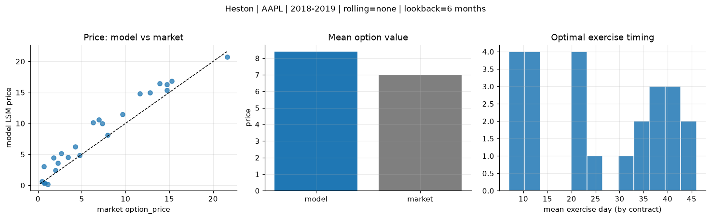
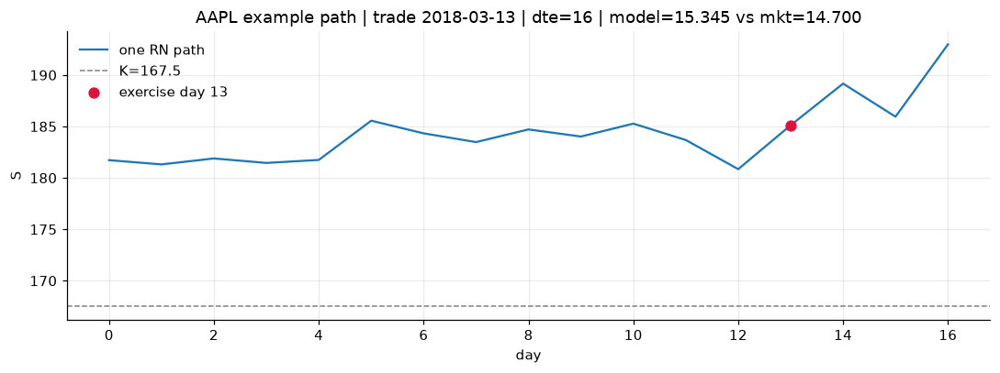
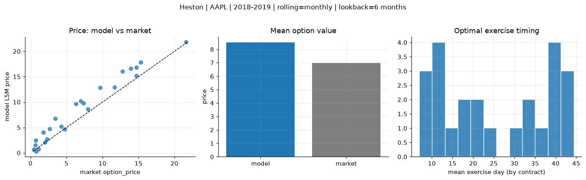
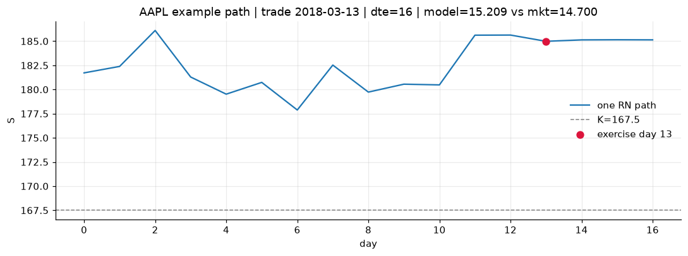
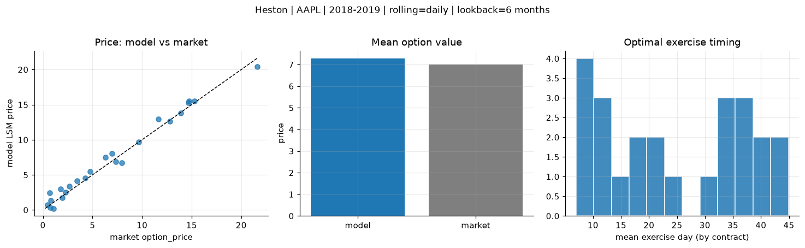
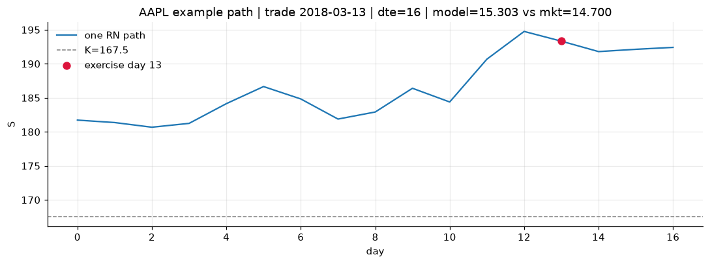

# Optimal stopping — Heston — 2018-2019 — AAPL

**Model:** Heston  
**Underlying:** AAPL  
**Regime / period:** 2018-2019  
**Lookback:** 6 months (fixed)  
**Rolling modes:** none, monthly, daily  
**Pricing:** LSM American calls on AAPL | n_paths=2000 | seed=42 | contracts=24

## Comparison (same contracts, same lookback)

| Rolling | RMSE | MAE | Bias (model−mkt) | Mean early-ex frac | Cal updates | Cal s | LSM s |
|---------|-----:|----:|-----------------:|-------------------:|------------:|------:|------:|
| `none` | 1.9530 | 1.6165 | 1.4002 | 0.291 | 1 | 0.1 | 0.1 |
| `monthly` | 1.9860 | 1.5933 | 1.5187 | 0.308 | 25 | 3.5 | 0.1 |
| `daily` | 0.8220 | 0.6793 | 0.2840 | 0.292 | 503 | 10.9 | 0.1 |

**Lowest RMSE (this study):** `daily` = 0.8220

## Rolling = `none`

- **RMSE:** 1.9530  
- **MAE:** 1.6165  
- **Bias:** 1.4002  
- **Mean early-exercise fraction:** 0.291  
- **Calibration updates (AAPL):** 1

Contract errors (compact)

| date | K | dte | market | model | error | early_ex |
|------|--:|----:|-------:|------:|------:|---------:|
| 2018-03-13 | 167.5 | 16 | 14.700 | 15.345 | 0.645 | 0.573 |
| 2019-08-15 | 182.5 | 15 | 21.625 | 20.739 | -0.886 | 0.822 |
| 2018-12-04 | 175 | 38 | 12.800 | 14.968 | 2.168 | 0.554 |
| 2018-12-04 | 177.5 | 24 | 9.675 | 11.457 | 1.782 | 0.454 |
| 2019-07-18 | 192.5 | 43 | 13.925 | 16.468 | 2.543 | 0.472 |
| 2018-03-13 | 172.5 | 45 | 11.650 | 14.795 | 3.145 | 0.409 |
| 2018-03-27 | 170 | 10 | 4.750 | 4.868 | 0.118 | 0.314 |
| 2019-02-15 | 170 | 14 | 3.425 | 4.551 | 1.126 | 0.277 |
| 2019-07-25 | 207.5 | 36 | 6.975 | 10.567 | 3.592 | 0.293 |
| 2019-08-15 | 200 | 22 | 7.975 | 8.147 | 0.172 | 0.186 |
| 2019-02-08 | 170 | 49 | 6.300 | 10.148 | 3.848 | 0.515 |
| 2019-09-27 | 222.5 | 42 | 7.350 | 9.958 | 2.608 | 0.284 |
| 2019-10-04 | 230 | 7 | 0.465 | 0.668 | 0.203 | 0.016 |
| 2018-12-26 | 157.5 | 9 | 1.095 | 0.208 | -0.887 | 0.012 |
| 2018-10-15 | 232.5 | 39 | 4.250 | 6.210 | 1.960 | 0.201 |
| 2018-06-07 | 202.5 | 22 | 0.695 | 3.021 | 2.326 | 0.103 |
| 2019-06-19 | 212.5 | 44 | 2.670 | 5.155 | 2.485 | 0.101 |
| 2019-09-20 | 237.5 | 42 | 1.790 | 4.444 | 2.654 | 0.154 |
| 2018-10-22 | 235 | 32 | 2.285 | 3.577 | 1.292 | 0.114 |
| 2018-01-29 | 185 | 11 | 0.775 | 0.317 | -0.458 | 0.025 |
| 2018-10-22 | 235 | 25 | 1.975 | 2.418 | 0.443 | 0.025 |
| 2018-11-05 | 222.5 | 11 | 0.730 | 0.366 | -0.364 | 0.035 |
| 2018-02-27 | 165 | 24 | 14.725 | 16.269 | 1.544 | 0.483 |
| 2018-04-25 | 150 | 51 | 15.300 | 16.846 | 1.546 | 0.553 |

## Rolling = `monthly`

- **RMSE:** 1.9860  
- **MAE:** 1.5933  
- **Bias:** 1.5187  
- **Mean early-exercise fraction:** 0.308  
- **Calibration updates (AAPL):** 25

Contract errors (compact)

| date | K | dte | market | model | error | early_ex |
|------|--:|----:|-------:|------:|------:|---------:|
| 2018-03-13 | 167.5 | 16 | 14.700 | 15.209 | 0.509 | 0.581 |
| 2019-08-15 | 182.5 | 15 | 21.625 | 21.793 | 0.168 | 0.740 |
| 2018-12-04 | 175 | 38 | 12.800 | 16.064 | 3.264 | 0.526 |
| 2018-12-04 | 177.5 | 24 | 9.675 | 12.884 | 3.209 | 0.449 |
| 2019-07-18 | 192.5 | 43 | 13.925 | 16.610 | 2.685 | 0.503 |
| 2018-03-13 | 172.5 | 45 | 11.650 | 12.945 | 1.295 | 0.501 |
| 2018-03-27 | 170 | 10 | 4.750 | 4.649 | -0.101 | 0.293 |
| 2019-02-15 | 170 | 14 | 3.425 | 6.776 | 3.351 | 0.368 |
| 2019-07-25 | 207.5 | 36 | 6.975 | 10.183 | 3.208 | 0.209 |
| 2019-08-15 | 200 | 22 | 7.975 | 8.623 | 0.648 | 0.398 |
| 2019-02-08 | 170 | 49 | 6.300 | 9.670 | 3.370 | 0.447 |
| 2019-09-27 | 222.5 | 42 | 7.350 | 9.779 | 2.429 | 0.348 |
| 2019-10-04 | 230 | 7 | 0.465 | 0.699 | 0.234 | 0.033 |
| 2018-12-26 | 157.5 | 9 | 1.095 | 0.760 | -0.335 | 0.011 |
| 2018-10-15 | 232.5 | 39 | 4.250 | 5.169 | 0.919 | 0.196 |
| 2018-06-07 | 202.5 | 22 | 0.695 | 1.500 | 0.805 | 0.092 |
| 2019-06-19 | 212.5 | 44 | 2.670 | 4.699 | 2.029 | 0.145 |
| 2019-09-20 | 237.5 | 42 | 1.790 | 4.056 | 2.266 | 0.088 |
| 2018-10-22 | 235 | 32 | 2.285 | 2.709 | 0.424 | 0.119 |
| 2018-01-29 | 185 | 11 | 0.775 | 0.317 | -0.458 | 0.025 |
| 2018-10-22 | 235 | 25 | 1.975 | 2.108 | 0.133 | 0.027 |
| 2018-11-05 | 222.5 | 11 | 0.730 | 2.441 | 1.711 | 0.113 |
| 2018-02-27 | 165 | 24 | 14.725 | 16.846 | 2.121 | 0.631 |
| 2018-04-25 | 150 | 51 | 15.300 | 17.867 | 2.567 | 0.540 |

## Rolling = `daily`

- **RMSE:** 0.8220  
- **MAE:** 0.6793  
- **Bias:** 0.2840  
- **Mean early-exercise fraction:** 0.292  
- **Calibration updates (AAPL):** 503

Contract errors (compact)

| date | K | dte | market | model | error | early_ex |
|------|--:|----:|-------:|------:|------:|---------:|
| 2018-03-13 | 167.5 | 16 | 14.700 | 15.303 | 0.603 | 0.576 |
| 2019-08-15 | 182.5 | 15 | 21.625 | 20.406 | -1.219 | 0.989 |
| 2018-12-04 | 175 | 38 | 12.800 | 12.615 | -0.185 | 0.657 |
| 2018-12-04 | 177.5 | 24 | 9.675 | 9.667 | -0.008 | 0.348 |
| 2019-07-18 | 192.5 | 43 | 13.925 | 13.805 | -0.120 | 0.456 |
| 2018-03-13 | 172.5 | 45 | 11.650 | 12.948 | 1.298 | 0.447 |
| 2018-03-27 | 170 | 10 | 4.750 | 5.479 | 0.729 | 0.338 |
| 2019-02-15 | 170 | 14 | 3.425 | 4.129 | 0.704 | 0.251 |
| 2019-07-25 | 207.5 | 36 | 6.975 | 8.064 | 1.089 | 0.302 |
| 2019-08-15 | 200 | 22 | 7.975 | 6.694 | -1.281 | 0.269 |
| 2019-02-08 | 170 | 49 | 6.300 | 7.512 | 1.212 | 0.270 |
| 2019-09-27 | 222.5 | 42 | 7.350 | 6.886 | -0.464 | 0.221 |
| 2019-10-04 | 230 | 7 | 0.465 | 0.687 | 0.222 | 0.005 |
| 2018-12-26 | 157.5 | 9 | 1.095 | 0.216 | -0.879 | 0.009 |
| 2018-10-15 | 232.5 | 39 | 4.250 | 4.520 | 0.270 | 0.147 |
| 2018-06-07 | 202.5 | 22 | 0.695 | 2.441 | 1.746 | 0.082 |
| 2019-06-19 | 212.5 | 44 | 2.670 | 3.410 | 0.740 | 0.125 |
| 2019-09-20 | 237.5 | 42 | 1.790 | 2.969 | 1.179 | 0.098 |
| 2018-10-22 | 235 | 32 | 2.285 | 2.533 | 0.248 | 0.096 |
| 2018-01-29 | 185 | 11 | 0.775 | 1.316 | 0.541 | 0.033 |
| 2018-10-22 | 235 | 25 | 1.975 | 1.765 | -0.210 | 0.084 |
| 2018-11-05 | 222.5 | 11 | 0.730 | 0.351 | -0.379 | 0.018 |
| 2018-02-27 | 165 | 24 | 14.725 | 15.527 | 0.802 | 0.614 |
| 2018-04-25 | 150 | 51 | 15.300 | 15.475 | 0.175 | 0.576 |

