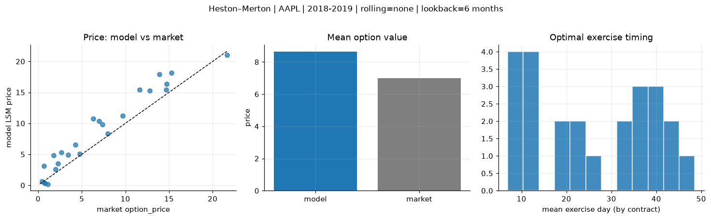
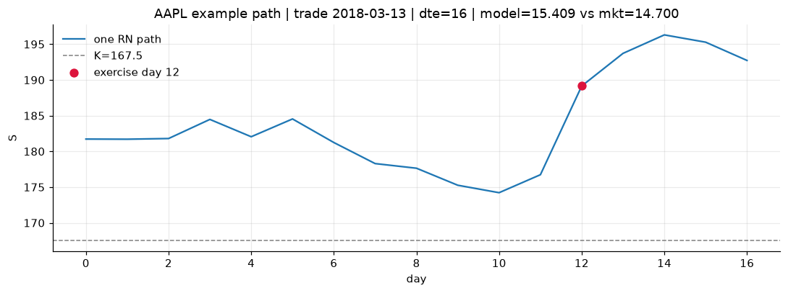
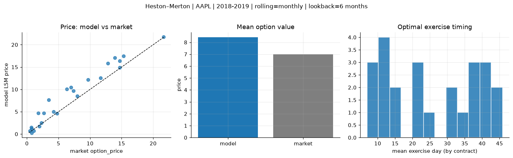
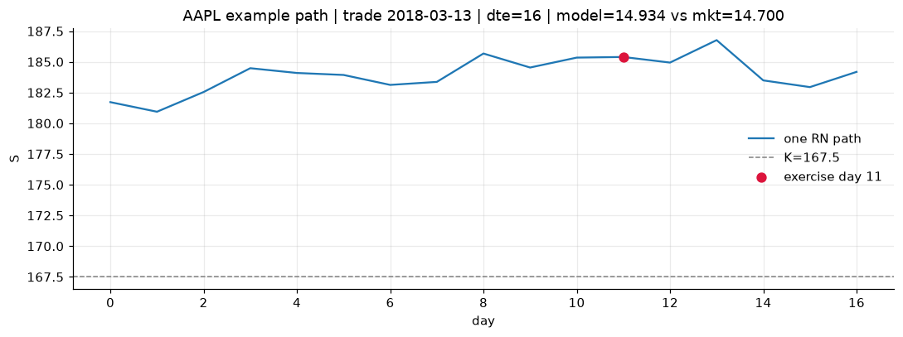
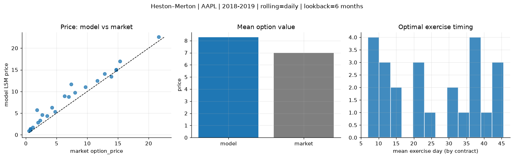
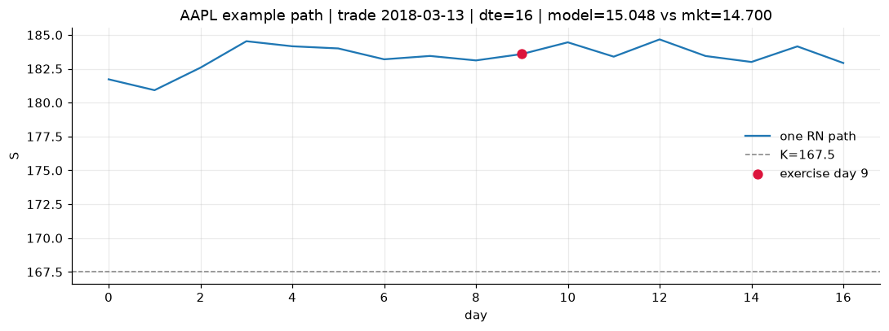

# Optimal stopping — Heston–Merton — 2018-2019 — AAPL

**Model:** Heston–Merton  
**Underlying:** AAPL  
**Regime / period:** 2018-2019  
**Lookback:** 6 months (fixed)  
**Rolling modes:** none, monthly, daily  
**Pricing:** LSM American calls on AAPL | n_paths=2000 | seed=42 | contracts=24

## Comparison (same contracts, same lookback)

| Rolling | RMSE | MAE | Bias (model−mkt) | Mean early-ex frac | Cal updates | Cal s | LSM s |
|---------|-----:|----:|-----------------:|-------------------:|------------:|------:|------:|
| `none` | 2.2353 | 1.8328 | 1.6432 | 0.283 | 1 | 0.2 | 0.1 |
| `monthly` | 2.0269 | 1.5306 | 1.4258 | 0.244 | 25 | 4.2 | 0.1 |
| `daily` | 1.6834 | 1.3173 | 1.2789 | 0.268 | 503 | 23.6 | 0.2 |

**Lowest RMSE (this study):** `daily` = 1.6834

## Rolling = `none`

- **RMSE:** 2.2353  
- **MAE:** 1.8328  
- **Bias:** 1.6432  
- **Mean early-exercise fraction:** 0.283  
- **Calibration updates (AAPL):** 1

Contract errors (compact)

| date | K | dte | market | model | error | early_ex |
|------|--:|----:|-------:|------:|------:|---------:|
| 2018-03-13 | 167.5 | 16 | 14.700 | 15.409 | 0.709 | 0.646 |
| 2019-08-15 | 182.5 | 15 | 21.625 | 21.049 | -0.576 | 0.762 |
| 2018-12-04 | 175 | 38 | 12.800 | 15.237 | 2.437 | 0.472 |
| 2018-12-04 | 177.5 | 24 | 9.675 | 11.198 | 1.523 | 0.437 |
| 2019-07-18 | 192.5 | 43 | 13.925 | 17.926 | 4.001 | 0.425 |
| 2018-03-13 | 172.5 | 45 | 11.650 | 15.420 | 3.770 | 0.452 |
| 2018-03-27 | 170 | 10 | 4.750 | 5.088 | 0.338 | 0.216 |
| 2019-02-15 | 170 | 14 | 3.425 | 4.924 | 1.499 | 0.164 |
| 2019-07-25 | 207.5 | 36 | 6.975 | 10.328 | 3.353 | 0.420 |
| 2019-08-15 | 200 | 22 | 7.975 | 8.361 | 0.386 | 0.331 |
| 2019-02-08 | 170 | 49 | 6.300 | 10.763 | 4.463 | 0.153 |
| 2019-09-27 | 222.5 | 42 | 7.350 | 9.796 | 2.446 | 0.336 |
| 2019-10-04 | 230 | 7 | 0.465 | 0.593 | 0.128 | 0.013 |
| 2018-12-26 | 157.5 | 9 | 1.095 | 0.195 | -0.900 | 0.004 |
| 2018-10-15 | 232.5 | 39 | 4.250 | 6.527 | 2.277 | 0.140 |
| 2018-06-07 | 202.5 | 22 | 0.695 | 3.085 | 2.390 | 0.131 |
| 2019-06-19 | 212.5 | 44 | 2.670 | 5.319 | 2.649 | 0.205 |
| 2019-09-20 | 237.5 | 42 | 1.790 | 4.810 | 3.020 | 0.161 |
| 2018-10-22 | 235 | 32 | 2.285 | 3.491 | 1.206 | 0.135 |
| 2018-01-29 | 185 | 11 | 0.775 | 0.282 | -0.493 | 0.018 |
| 2018-10-22 | 235 | 25 | 1.975 | 2.561 | 0.586 | 0.103 |
| 2018-11-05 | 222.5 | 11 | 0.730 | 0.424 | -0.306 | 0.011 |
| 2018-02-27 | 165 | 24 | 14.725 | 16.402 | 1.677 | 0.555 |
| 2018-04-25 | 150 | 51 | 15.300 | 18.151 | 2.851 | 0.511 |

## Rolling = `monthly`

- **RMSE:** 2.0269  
- **MAE:** 1.5306  
- **Bias:** 1.4258  
- **Mean early-exercise fraction:** 0.244  
- **Calibration updates (AAPL):** 25

Contract errors (compact)

| date | K | dte | market | model | error | early_ex |
|------|--:|----:|-------:|------:|------:|---------:|
| 2018-03-13 | 167.5 | 16 | 14.700 | 14.934 | 0.234 | 0.511 |
| 2019-08-15 | 182.5 | 15 | 21.625 | 21.717 | 0.092 | 0.426 |
| 2018-12-04 | 175 | 38 | 12.800 | 15.833 | 3.033 | 0.565 |
| 2018-12-04 | 177.5 | 24 | 9.675 | 12.186 | 2.511 | 0.325 |
| 2019-07-18 | 192.5 | 43 | 13.925 | 17.103 | 3.178 | 0.244 |
| 2018-03-13 | 172.5 | 45 | 11.650 | 12.531 | 0.881 | 0.399 |
| 2018-03-27 | 170 | 10 | 4.750 | 4.628 | -0.122 | 0.235 |
| 2019-02-15 | 170 | 14 | 3.425 | 7.686 | 4.261 | 0.043 |
| 2019-07-25 | 207.5 | 36 | 6.975 | 10.435 | 3.460 | 0.093 |
| 2019-08-15 | 200 | 22 | 7.975 | 8.506 | 0.531 | 0.461 |
| 2019-02-08 | 170 | 49 | 6.300 | 10.062 | 3.762 | 0.286 |
| 2019-09-27 | 222.5 | 42 | 7.350 | 9.680 | 2.330 | 0.326 |
| 2019-10-04 | 230 | 7 | 0.465 | 0.680 | 0.215 | 0.024 |
| 2018-12-26 | 157.5 | 9 | 1.095 | 0.710 | -0.385 | 0.040 |
| 2018-10-15 | 232.5 | 39 | 4.250 | 4.991 | 0.741 | 0.160 |
| 2018-06-07 | 202.5 | 22 | 0.695 | 1.487 | 0.792 | 0.024 |
| 2019-06-19 | 212.5 | 44 | 2.670 | 4.718 | 2.048 | 0.145 |
| 2019-09-20 | 237.5 | 42 | 1.790 | 4.712 | 2.922 | 0.105 |
| 2018-10-22 | 235 | 32 | 2.285 | 2.479 | 0.194 | 0.076 |
| 2018-01-29 | 185 | 11 | 0.775 | 0.282 | -0.493 | 0.018 |
| 2018-10-22 | 235 | 25 | 1.975 | 1.717 | -0.258 | 0.099 |
| 2018-11-05 | 222.5 | 11 | 0.730 | 1.189 | 0.459 | 0.060 |
| 2018-02-27 | 165 | 24 | 14.725 | 16.375 | 1.650 | 0.663 |
| 2018-04-25 | 150 | 51 | 15.300 | 17.482 | 2.182 | 0.526 |

## Rolling = `daily`

- **RMSE:** 1.6834  
- **MAE:** 1.3173  
- **Bias:** 1.2789  
- **Mean early-exercise fraction:** 0.268  
- **Calibration updates (AAPL):** 503

Contract errors (compact)

| date | K | dte | market | model | error | early_ex |
|------|--:|----:|-------:|------:|------:|---------:|
| 2018-03-13 | 167.5 | 16 | 14.700 | 15.048 | 0.348 | 0.659 |
| 2019-08-15 | 182.5 | 15 | 21.625 | 22.554 | 0.929 | 0.521 |
| 2018-12-04 | 175 | 38 | 12.800 | 14.056 | 1.256 | 0.518 |
| 2018-12-04 | 177.5 | 24 | 9.675 | 11.033 | 1.358 | 0.346 |
| 2019-07-18 | 192.5 | 43 | 13.925 | 13.464 | -0.461 | 0.255 |
| 2018-03-13 | 172.5 | 45 | 11.650 | 12.494 | 0.844 | 0.524 |
| 2018-03-27 | 170 | 10 | 4.750 | 5.305 | 0.555 | 0.256 |
| 2019-02-15 | 170 | 14 | 3.425 | 4.330 | 0.905 | 0.042 |
| 2019-07-25 | 207.5 | 36 | 6.975 | 8.752 | 1.777 | 0.200 |
| 2019-08-15 | 200 | 22 | 7.975 | 9.726 | 1.751 | 0.283 |
| 2019-02-08 | 170 | 49 | 6.300 | 8.975 | 2.675 | 0.304 |
| 2019-09-27 | 222.5 | 42 | 7.350 | 11.652 | 4.302 | 0.334 |
| 2019-10-04 | 230 | 7 | 0.465 | 0.951 | 0.486 | 0.051 |
| 2018-12-26 | 157.5 | 9 | 1.095 | 1.711 | 0.616 | 0.048 |
| 2018-10-15 | 232.5 | 39 | 4.250 | 6.326 | 2.076 | 0.168 |
| 2018-06-07 | 202.5 | 22 | 0.695 | 1.388 | 0.693 | 0.019 |
| 2019-06-19 | 212.5 | 44 | 2.670 | 4.601 | 1.931 | 0.125 |
| 2019-09-20 | 237.5 | 42 | 1.790 | 5.708 | 3.918 | 0.185 |
| 2018-10-22 | 235 | 32 | 2.285 | 3.335 | 1.050 | 0.070 |
| 2018-01-29 | 185 | 11 | 0.775 | 1.296 | 0.521 | 0.070 |
| 2018-10-22 | 235 | 25 | 1.975 | 2.874 | 0.899 | 0.033 |
| 2018-11-05 | 222.5 | 11 | 0.730 | 1.079 | 0.349 | 0.021 |
| 2018-02-27 | 165 | 24 | 14.725 | 14.960 | 0.235 | 0.689 |
| 2018-04-25 | 150 | 51 | 15.300 | 16.978 | 1.678 | 0.714 |

