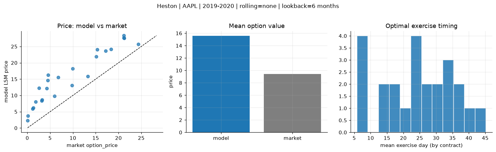
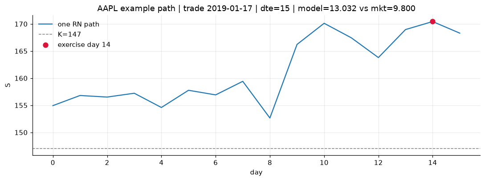
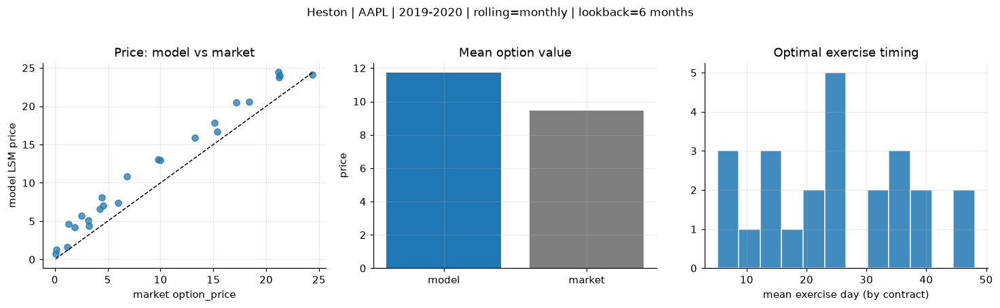
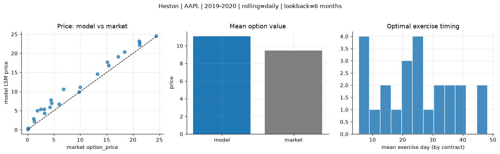
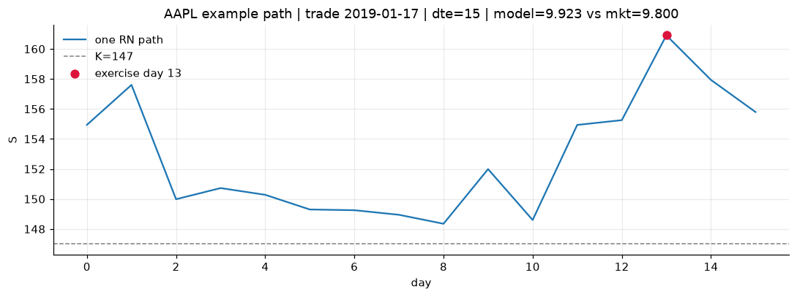

# Optimal stopping — Heston — 2019-2020 — AAPL

**Model:** Heston  
**Underlying:** AAPL  
**Regime / period:** 2019-2020  
**Lookback:** 6 months (fixed)  
**Rolling modes:** none, monthly, daily  
**Pricing:** LSM American calls on AAPL | n_paths=2000 | seed=42 | contracts=24

## Comparison (same contracts, same lookback)

| Rolling | RMSE | MAE | Bias (model−mkt) | Mean early-ex frac | Cal updates | Cal s | LSM s |
|---------|-----:|----:|-----------------:|-------------------:|------------:|------:|------:|
| `none` | 6.6526 | 6.1334 | 6.1334 | 0.343 | 1 | 0.1 | 0.1 |
| `monthly` | 2.5283 | 2.3116 | 2.2867 | 0.317 | 25 | 2.1 | 0.1 |
| `daily` | 1.9124 | 1.6257 | 1.6257 | 0.332 | 505 | 15.1 | 0.2 |

**Lowest RMSE (this study):** `daily` = 1.9124

## Rolling = `none`

- **RMSE:** 6.6526  
- **MAE:** 6.1334  
- **Bias:** 6.1334  
- **Mean early-exercise fraction:** 0.343  
- **Calibration updates (AAPL):** 1

Contract errors (compact)

| date | K | dte | market | model | error | early_ex |
|------|--:|----:|-------:|------:|------:|---------:|
| 2019-01-17 | 147 | 15 | 9.800 | 13.032 | 3.232 | 0.331 |
| 2019-10-25 | 220 | 7 | 24.375 | 25.702 | 1.327 | 0.465 |
| 2019-06-26 | 180 | 37 | 18.375 | 24.172 | 5.797 | 0.495 |
| 2019-06-26 | 182.5 | 30 | 15.125 | 21.945 | 6.820 | 0.501 |
| 2019-10-11 | 212.5 | 42 | 21.200 | 27.651 | 6.451 | 0.467 |
| 2019-02-01 | 150 | 42 | 17.175 | 23.614 | 6.439 | 0.548 |
| 2019-02-08 | 175 | 14 | 1.305 | 6.207 | 4.902 | 0.167 |
| 2019-08-08 | 195 | 8 | 5.975 | 9.771 | 3.796 | 0.307 |
| 2019-10-18 | 230 | 28 | 9.950 | 18.156 | 8.206 | 0.368 |
| 2019-10-25 | 250 | 28 | 4.250 | 12.115 | 7.865 | 0.297 |
| 2019-09-06 | 215 | 49 | 6.800 | 15.573 | 8.773 | 0.409 |
| 2019-11-01 | 255 | 42 | 4.475 | 14.596 | 10.121 | 0.342 |
| 2019-11-15 | 282.5 | 7 | 0.080 | 2.290 | 2.210 | 0.074 |
| 2019-07-03 | 212.5 | 9 | 0.140 | 3.738 | 3.598 | 0.101 |
| 2019-06-05 | 187.5 | 37 | 3.175 | 8.302 | 5.127 | 0.248 |
| 2019-03-25 | 207.5 | 32 | 1.145 | 5.855 | 4.710 | 0.201 |
| 2019-09-27 | 240 | 49 | 1.865 | 8.073 | 6.208 | 0.222 |
| 2019-11-01 | 260 | 42 | 2.545 | 12.275 | 9.730 | 0.217 |
| 2019-08-08 | 205 | 22 | 3.225 | 8.640 | 5.415 | 0.244 |
| 2019-01-03 | 147 | 22 | 13.250 | 15.845 | 2.595 | 0.484 |
| 2019-11-01 | 227.5 | 21 | 21.250 | 27.516 | 6.266 | 0.531 |
| 2019-12-16 | 277.5 | 25 | 4.575 | 16.298 | 11.723 | 0.294 |
| 2019-10-18 | 215 | 28 | 21.150 | 28.320 | 7.170 | 0.522 |
| 2019-12-16 | 262.5 | 25 | 15.350 | 24.073 | 8.723 | 0.393 |

## Rolling = `monthly`

- **RMSE:** 2.5283  
- **MAE:** 2.3116  
- **Bias:** 2.2867  
- **Mean early-exercise fraction:** 0.317  
- **Calibration updates (AAPL):** 25

Contract errors (compact)

| date | K | dte | market | model | error | early_ex |
|------|--:|----:|-------:|------:|------:|---------:|
| 2019-01-17 | 147 | 15 | 9.800 | 13.032 | 3.232 | 0.331 |
| 2019-10-25 | 220 | 7 | 24.375 | 24.076 | -0.299 | 0.744 |
| 2019-06-26 | 180 | 37 | 18.375 | 20.540 | 2.165 | 0.658 |
| 2019-06-26 | 182.5 | 30 | 15.125 | 17.865 | 2.740 | 0.585 |
| 2019-10-11 | 212.5 | 42 | 21.200 | 23.729 | 2.529 | 0.406 |
| 2019-02-01 | 150 | 42 | 17.175 | 20.488 | 3.313 | 0.567 |
| 2019-02-08 | 175 | 14 | 1.305 | 4.648 | 3.343 | 0.162 |
| 2019-08-08 | 195 | 8 | 5.975 | 7.430 | 1.455 | 0.194 |
| 2019-10-18 | 230 | 28 | 9.950 | 12.974 | 3.024 | 0.267 |
| 2019-10-25 | 250 | 28 | 4.250 | 6.562 | 2.312 | 0.243 |
| 2019-09-06 | 215 | 49 | 6.800 | 10.855 | 4.055 | 0.287 |
| 2019-11-01 | 255 | 42 | 4.475 | 8.099 | 3.624 | 0.336 |
| 2019-11-15 | 282.5 | 7 | 0.080 | 0.790 | 0.710 | 0.026 |
| 2019-07-03 | 212.5 | 9 | 0.140 | 1.255 | 1.115 | 0.034 |
| 2019-06-05 | 187.5 | 37 | 3.175 | 5.103 | 1.928 | 0.141 |
| 2019-03-25 | 207.5 | 32 | 1.145 | 1.606 | 0.461 | 0.077 |
| 2019-09-27 | 240 | 49 | 1.865 | 4.212 | 2.347 | 0.126 |
| 2019-11-01 | 260 | 42 | 2.545 | 5.748 | 3.203 | 0.176 |
| 2019-08-08 | 205 | 22 | 3.225 | 4.379 | 1.154 | 0.074 |
| 2019-01-03 | 147 | 22 | 13.250 | 15.845 | 2.595 | 0.484 |
| 2019-11-01 | 227.5 | 21 | 21.250 | 24.056 | 2.806 | 0.652 |
| 2019-12-16 | 277.5 | 25 | 4.575 | 7.029 | 2.454 | 0.145 |
| 2019-10-18 | 215 | 28 | 21.150 | 24.434 | 3.284 | 0.578 |
| 2019-12-16 | 262.5 | 25 | 15.350 | 16.683 | 1.333 | 0.317 |

## Rolling = `daily`

- **RMSE:** 1.9124  
- **MAE:** 1.6257  
- **Bias:** 1.6257  
- **Mean early-exercise fraction:** 0.332  
- **Calibration updates (AAPL):** 505

Contract errors (compact)

| date | K | dte | market | model | error | early_ex |
|------|--:|----:|-------:|------:|------:|---------:|
| 2019-01-17 | 147 | 15 | 9.800 | 9.923 | 0.123 | 0.368 |
| 2019-10-25 | 220 | 7 | 24.375 | 24.503 | 0.128 | 0.657 |
| 2019-06-26 | 180 | 37 | 18.375 | 20.365 | 1.990 | 0.669 |
| 2019-06-26 | 182.5 | 30 | 15.125 | 17.691 | 2.566 | 0.635 |
| 2019-10-11 | 212.5 | 42 | 21.200 | 22.164 | 0.964 | 0.659 |
| 2019-02-01 | 150 | 42 | 17.175 | 19.118 | 1.943 | 0.582 |
| 2019-02-08 | 175 | 14 | 1.305 | 2.194 | 0.889 | 0.073 |
| 2019-08-08 | 195 | 8 | 5.975 | 6.665 | 0.690 | 0.245 |
| 2019-10-18 | 230 | 28 | 9.950 | 11.095 | 1.145 | 0.361 |
| 2019-10-25 | 250 | 28 | 4.250 | 5.869 | 1.619 | 0.239 |
| 2019-09-06 | 215 | 49 | 6.800 | 10.563 | 3.763 | 0.353 |
| 2019-11-01 | 255 | 42 | 4.475 | 7.754 | 3.279 | 0.171 |
| 2019-11-15 | 282.5 | 7 | 0.080 | 0.169 | 0.089 | 0.009 |
| 2019-07-03 | 212.5 | 9 | 0.140 | 0.394 | 0.254 | 0.018 |
| 2019-06-05 | 187.5 | 37 | 3.175 | 5.337 | 2.162 | 0.079 |
| 2019-03-25 | 207.5 | 32 | 1.145 | 2.849 | 1.704 | 0.090 |
| 2019-09-27 | 240 | 49 | 1.865 | 4.998 | 3.133 | 0.129 |
| 2019-11-01 | 260 | 42 | 2.545 | 5.339 | 2.794 | 0.214 |
| 2019-08-08 | 205 | 22 | 3.225 | 4.287 | 1.062 | 0.070 |
| 2019-01-03 | 147 | 22 | 13.250 | 14.574 | 1.324 | 0.475 |
| 2019-11-01 | 227.5 | 21 | 21.250 | 22.737 | 1.487 | 0.821 |
| 2019-12-16 | 277.5 | 25 | 4.575 | 6.937 | 2.362 | 0.140 |
| 2019-10-18 | 215 | 28 | 21.150 | 23.202 | 2.052 | 0.566 |
| 2019-12-16 | 262.5 | 25 | 15.350 | 16.843 | 1.493 | 0.348 |

