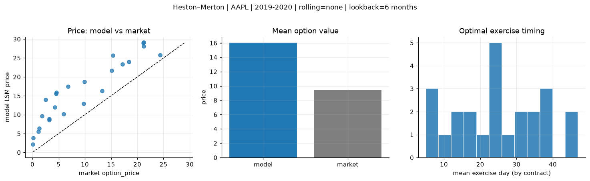
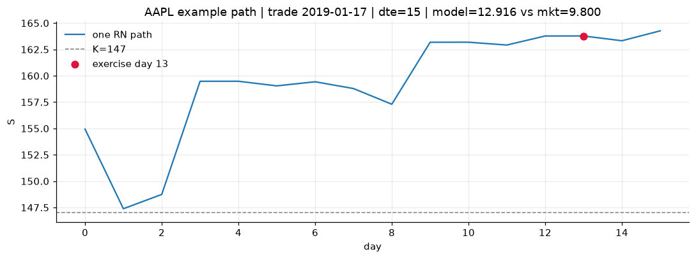
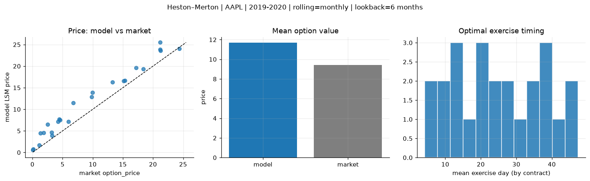
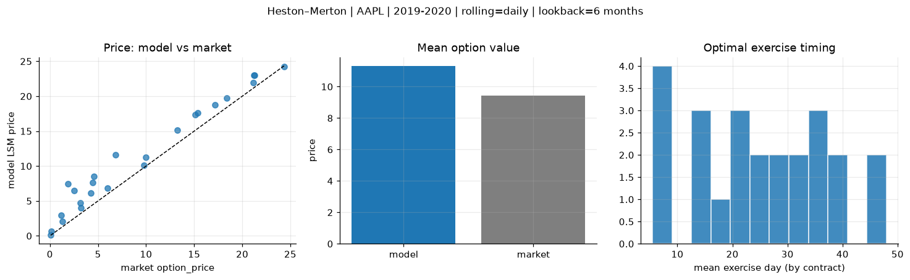
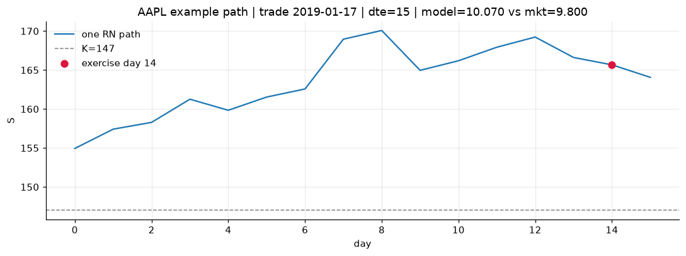

# Optimal stopping — Heston–Merton — 2019-2020 — AAPL

**Model:** Heston–Merton  
**Underlying:** AAPL  
**Regime / period:** 2019-2020  
**Lookback:** 6 months (fixed)  
**Rolling modes:** none, monthly, daily  
**Pricing:** LSM American calls on AAPL | n_paths=2000 | seed=42 | contracts=24

## Comparison (same contracts, same lookback)

| Rolling | RMSE | MAE | Bias (model−mkt) | Mean early-ex frac | Cal updates | Cal s | LSM s |
|---------|-----:|----:|-----------------:|-------------------:|------------:|------:|------:|
| `none` | 7.2074 | 6.5932 | 6.5932 | 0.295 | 1 | 0.2 | 0.2 |
| `monthly` | 2.6207 | 2.2798 | 2.2506 | 0.307 | 25 | 2.5 | 0.1 |
| `daily` | 2.3699 | 1.8825 | 1.8698 | 0.280 | 505 | 17.9 | 0.2 |

**Lowest RMSE (this study):** `daily` = 2.3699

## Rolling = `none`

- **RMSE:** 7.2074  
- **MAE:** 6.5932  
- **Bias:** 6.5932  
- **Mean early-exercise fraction:** 0.295  
- **Calibration updates (AAPL):** 1

Contract errors (compact)

| date | K | dte | market | model | error | early_ex |
|------|--:|----:|-------:|------:|------:|---------:|
| 2019-01-17 | 147 | 15 | 9.800 | 12.916 | 3.116 | 0.395 |
| 2019-10-25 | 220 | 7 | 24.375 | 25.788 | 1.413 | 0.524 |
| 2019-06-26 | 180 | 37 | 18.375 | 24.036 | 5.661 | 0.477 |
| 2019-06-26 | 182.5 | 30 | 15.125 | 21.665 | 6.540 | 0.354 |
| 2019-10-11 | 212.5 | 42 | 21.200 | 29.107 | 7.907 | 0.573 |
| 2019-02-01 | 150 | 42 | 17.175 | 23.359 | 6.184 | 0.612 |
| 2019-02-08 | 175 | 14 | 1.305 | 6.335 | 5.030 | 0.111 |
| 2019-08-08 | 195 | 8 | 5.975 | 10.150 | 4.175 | 0.216 |
| 2019-10-18 | 230 | 28 | 9.950 | 18.741 | 8.791 | 0.306 |
| 2019-10-25 | 250 | 28 | 4.250 | 12.002 | 7.752 | 0.129 |
| 2019-09-06 | 215 | 49 | 6.800 | 17.487 | 10.687 | 0.280 |
| 2019-11-01 | 255 | 42 | 4.475 | 15.565 | 11.090 | 0.332 |
| 2019-11-15 | 282.5 | 7 | 0.080 | 2.163 | 2.083 | 0.031 |
| 2019-07-03 | 212.5 | 9 | 0.140 | 3.854 | 3.714 | 0.075 |
| 2019-06-05 | 187.5 | 37 | 3.175 | 8.887 | 5.712 | 0.215 |
| 2019-03-25 | 207.5 | 32 | 1.145 | 5.572 | 4.427 | 0.068 |
| 2019-09-27 | 240 | 49 | 1.865 | 9.629 | 7.764 | 0.156 |
| 2019-11-01 | 260 | 42 | 2.545 | 13.966 | 11.421 | 0.184 |
| 2019-08-08 | 205 | 22 | 3.225 | 8.606 | 5.381 | 0.162 |
| 2019-01-03 | 147 | 22 | 13.250 | 16.335 | 3.085 | 0.363 |
| 2019-11-01 | 227.5 | 21 | 21.250 | 28.127 | 6.877 | 0.536 |
| 2019-12-16 | 277.5 | 25 | 4.575 | 15.913 | 11.338 | 0.281 |
| 2019-10-18 | 215 | 28 | 21.150 | 28.939 | 7.789 | 0.355 |
| 2019-12-16 | 262.5 | 25 | 15.350 | 25.649 | 10.299 | 0.345 |

## Rolling = `monthly`

- **RMSE:** 2.6207  
- **MAE:** 2.2798  
- **Bias:** 2.2506  
- **Mean early-exercise fraction:** 0.307  
- **Calibration updates (AAPL):** 25

Contract errors (compact)

| date | K | dte | market | model | error | early_ex |
|------|--:|----:|-------:|------:|------:|---------:|
| 2019-01-17 | 147 | 15 | 9.800 | 12.916 | 3.116 | 0.395 |
| 2019-10-25 | 220 | 7 | 24.375 | 24.025 | -0.350 | 0.761 |
| 2019-06-26 | 180 | 37 | 18.375 | 19.299 | 0.924 | 0.214 |
| 2019-06-26 | 182.5 | 30 | 15.125 | 16.588 | 1.463 | 0.803 |
| 2019-10-11 | 212.5 | 42 | 21.200 | 25.488 | 4.288 | 0.525 |
| 2019-02-01 | 150 | 42 | 17.175 | 19.619 | 2.444 | 0.243 |
| 2019-02-08 | 175 | 14 | 1.305 | 4.476 | 3.171 | 0.214 |
| 2019-08-08 | 195 | 8 | 5.975 | 7.191 | 1.216 | 0.032 |
| 2019-10-18 | 230 | 28 | 9.950 | 13.870 | 3.920 | 0.317 |
| 2019-10-25 | 250 | 28 | 4.250 | 7.189 | 2.939 | 0.130 |
| 2019-09-06 | 215 | 49 | 6.800 | 11.485 | 4.685 | 0.392 |
| 2019-11-01 | 255 | 42 | 4.475 | 7.660 | 3.185 | 0.193 |
| 2019-11-15 | 282.5 | 7 | 0.080 | 0.567 | 0.487 | 0.019 |
| 2019-07-03 | 212.5 | 9 | 0.140 | 0.761 | 0.621 | 0.017 |
| 2019-06-05 | 187.5 | 37 | 3.175 | 4.660 | 1.485 | 0.217 |
| 2019-03-25 | 207.5 | 32 | 1.145 | 1.692 | 0.547 | 0.062 |
| 2019-09-27 | 240 | 49 | 1.865 | 4.580 | 2.715 | 0.112 |
| 2019-11-01 | 260 | 42 | 2.545 | 6.545 | 4.000 | 0.279 |
| 2019-08-08 | 205 | 22 | 3.225 | 3.908 | 0.683 | 0.161 |
| 2019-01-03 | 147 | 22 | 13.250 | 16.335 | 3.085 | 0.363 |
| 2019-11-01 | 227.5 | 21 | 21.250 | 23.615 | 2.365 | 0.572 |
| 2019-12-16 | 277.5 | 25 | 4.575 | 7.499 | 2.924 | 0.141 |
| 2019-10-18 | 215 | 28 | 21.150 | 23.905 | 2.755 | 0.691 |
| 2019-12-16 | 262.5 | 25 | 15.350 | 16.699 | 1.349 | 0.515 |

## Rolling = `daily`

- **RMSE:** 2.3699  
- **MAE:** 1.8825  
- **Bias:** 1.8698  
- **Mean early-exercise fraction:** 0.280  
- **Calibration updates (AAPL):** 505

Contract errors (compact)

| date | K | dte | market | model | error | early_ex |
|------|--:|----:|-------:|------:|------:|---------:|
| 2019-01-17 | 147 | 15 | 9.800 | 10.070 | 0.270 | 0.178 |
| 2019-10-25 | 220 | 7 | 24.375 | 24.223 | -0.152 | 0.473 |
| 2019-06-26 | 180 | 37 | 18.375 | 19.735 | 1.360 | 0.412 |
| 2019-06-26 | 182.5 | 30 | 15.125 | 17.355 | 2.230 | 0.288 |
| 2019-10-11 | 212.5 | 42 | 21.200 | 22.968 | 1.768 | 0.585 |
| 2019-02-01 | 150 | 42 | 17.175 | 18.745 | 1.570 | 0.617 |
| 2019-02-08 | 175 | 14 | 1.305 | 2.074 | 0.769 | 0.102 |
| 2019-08-08 | 195 | 8 | 5.975 | 6.860 | 0.885 | 0.323 |
| 2019-10-18 | 230 | 28 | 9.950 | 11.274 | 1.324 | 0.366 |
| 2019-10-25 | 250 | 28 | 4.250 | 6.112 | 1.862 | 0.138 |
| 2019-09-06 | 215 | 49 | 6.800 | 11.630 | 4.830 | 0.229 |
| 2019-11-01 | 255 | 42 | 4.475 | 7.659 | 3.184 | 0.165 |
| 2019-11-15 | 282.5 | 7 | 0.080 | 0.133 | 0.053 | 0.010 |
| 2019-07-03 | 212.5 | 9 | 0.140 | 0.683 | 0.543 | 0.029 |
| 2019-06-05 | 187.5 | 37 | 3.175 | 4.711 | 1.536 | 0.102 |
| 2019-03-25 | 207.5 | 32 | 1.145 | 2.998 | 1.853 | 0.135 |
| 2019-09-27 | 240 | 49 | 1.865 | 7.497 | 5.632 | 0.080 |
| 2019-11-01 | 260 | 42 | 2.545 | 6.518 | 3.973 | 0.158 |
| 2019-08-08 | 205 | 22 | 3.225 | 3.995 | 0.770 | 0.155 |
| 2019-01-03 | 147 | 22 | 13.250 | 15.106 | 1.856 | 0.135 |
| 2019-11-01 | 227.5 | 21 | 21.250 | 23.015 | 1.765 | 0.609 |
| 2019-12-16 | 277.5 | 25 | 4.575 | 8.560 | 3.985 | 0.157 |
| 2019-10-18 | 215 | 28 | 21.150 | 21.926 | 0.776 | 0.817 |
| 2019-12-16 | 262.5 | 25 | 15.350 | 17.582 | 2.232 | 0.459 |

