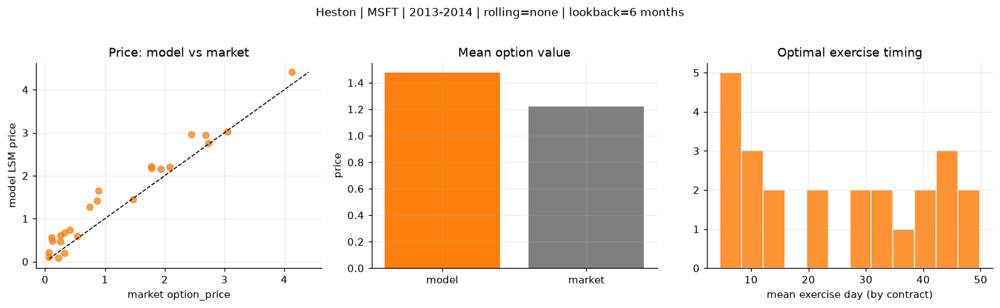
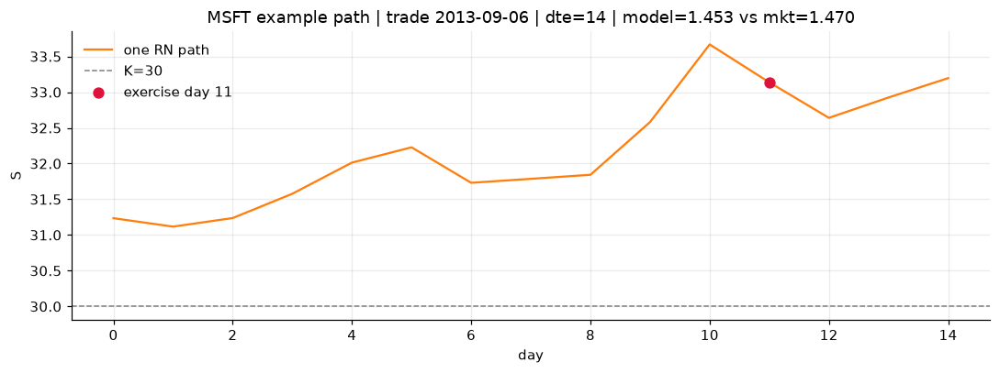
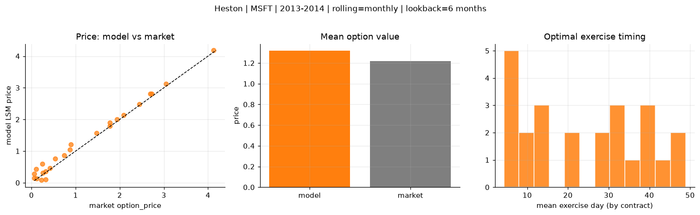
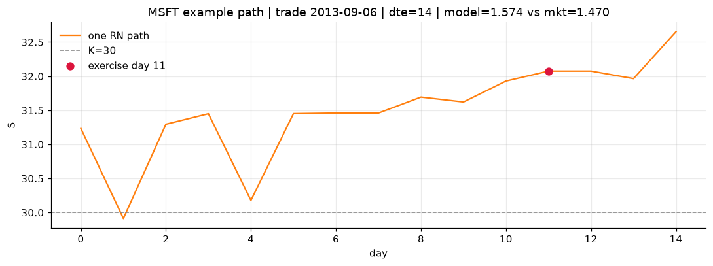
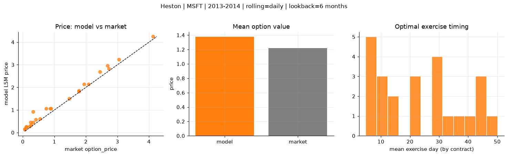
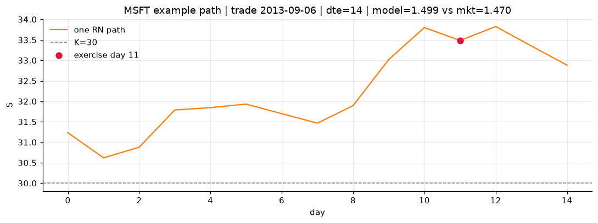

# Optimal stopping — Heston — 2013-2014 — MSFT

**Model:** Heston  
**Underlying:** MSFT  
**Regime / period:** 2013-2014  
**Lookback:** 6 months (fixed)  
**Rolling modes:** none, monthly, daily  
**Pricing:** LSM American calls on MSFT | n_paths=2000 | seed=42 | contracts=24

## Comparison (same contracts, same lookback)

| Rolling | RMSE | MAE | Bias (model−mkt) | Mean early-ex frac | Cal updates | Cal s | LSM s |
|---------|-----:|----:|-----------------:|-------------------:|------------:|------:|------:|
| `none` | 0.3412 | 0.2805 | 0.2558 | 0.319 | 1 | 0.1 | 0.1 |
| `monthly` | 0.1601 | 0.1272 | 0.0984 | 0.343 | 25 | 3.4 | 0.1 |
| `daily` | 0.1965 | 0.1562 | 0.1562 | 0.347 | 505 | 14.8 | 0.2 |

**Lowest RMSE (this study):** `monthly` = 0.1601

## Rolling = `none`

- **RMSE:** 0.3412  
- **MAE:** 0.2805  
- **Bias:** 0.2558  
- **Mean early-exercise fraction:** 0.319  
- **Calibration updates (MSFT):** 1

Contract errors (compact)

| date | K | dte | market | model | error | early_ex |
|------|--:|----:|-------:|------:|------:|---------:|
| 2013-09-06 | 30 | 14 | 1.470 | 1.453 | -0.017 | 0.537 |
| 2014-09-25 | 45 | 8 | 2.085 | 2.207 | 0.122 | 0.637 |
| 2014-03-21 | 39 | 35 | 1.940 | 2.163 | 0.223 | 0.436 |
| 2014-03-21 | 38 | 35 | 2.690 | 2.941 | 0.251 | 0.540 |
| 2014-07-23 | 41 | 58 | 4.125 | 4.408 | 0.283 | 0.643 |
| 2013-04-02 | 27 | 45 | 1.775 | 2.167 | 0.392 | 0.409 |
| 2013-09-27 | 32.5 | 7 | 0.540 | 0.601 | 0.061 | 0.297 |
| 2014-06-17 | 42 | 10 | 0.260 | 0.475 | 0.215 | 0.170 |
| 2014-09-18 | 46.5 | 22 | 0.745 | 1.275 | 0.530 | 0.191 |
| 2014-09-25 | 46 | 36 | 1.780 | 2.223 | 0.443 | 0.352 |
| 2014-05-12 | 39.5 | 46 | 0.895 | 1.645 | 0.750 | 0.346 |
| 2014-10-02 | 47 | 50 | 0.870 | 1.417 | 0.547 | 0.197 |
| 2014-10-16 | 45.5 | 15 | 0.325 | 0.194 | -0.131 | 0.075 |
| 2014-04-04 | 42.5 | 7 | 0.065 | 0.113 | 0.048 | 0.013 |
| 2014-02-21 | 40 | 21 | 0.065 | 0.209 | 0.144 | 0.097 |
| 2013-11-15 | 40 | 35 | 0.250 | 0.616 | 0.366 | 0.103 |
| 2014-06-10 | 45 | 45 | 0.120 | 0.488 | 0.368 | 0.102 |
| 2014-08-27 | 49 | 51 | 0.110 | 0.568 | 0.458 | 0.070 |
| 2014-07-09 | 44 | 37 | 0.320 | 0.672 | 0.352 | 0.110 |
| 2013-12-09 | 35.5 | 18 | 3.050 | 3.029 | -0.021 | 0.750 |
| 2013-01-25 | 28.5 | 7 | 0.220 | 0.093 | -0.127 | 0.009 |
| 2014-06-24 | 40 | 52 | 2.445 | 2.970 | 0.525 | 0.415 |
| 2013-07-11 | 32 | 8 | 2.725 | 2.755 | 0.030 | 0.938 |
| 2014-09-18 | 47 | 15 | 0.415 | 0.743 | 0.328 | 0.218 |

## Rolling = `monthly`

- **RMSE:** 0.1601  
- **MAE:** 0.1272  
- **Bias:** 0.0984  
- **Mean early-exercise fraction:** 0.343  
- **Calibration updates (MSFT):** 25

Contract errors (compact)

| date | K | dte | market | model | error | early_ex |
|------|--:|----:|-------:|------:|------:|---------:|
| 2013-09-06 | 30 | 14 | 1.470 | 1.574 | 0.104 | 0.671 |
| 2014-09-25 | 45 | 8 | 2.085 | 2.134 | 0.049 | 0.732 |
| 2014-03-21 | 39 | 35 | 1.940 | 2.009 | 0.069 | 0.489 |
| 2014-03-21 | 38 | 35 | 2.690 | 2.807 | 0.117 | 0.696 |
| 2014-07-23 | 41 | 58 | 4.125 | 4.180 | 0.055 | 0.729 |
| 2013-04-02 | 27 | 45 | 1.775 | 1.899 | 0.124 | 0.669 |
| 2013-09-27 | 32.5 | 7 | 0.540 | 0.764 | 0.224 | 0.256 |
| 2014-06-17 | 42 | 10 | 0.260 | 0.309 | 0.049 | 0.140 |
| 2014-09-18 | 46.5 | 22 | 0.745 | 0.867 | 0.122 | 0.155 |
| 2014-09-25 | 46 | 36 | 1.780 | 1.796 | 0.016 | 0.370 |
| 2014-05-12 | 39.5 | 46 | 0.895 | 1.212 | 0.317 | 0.407 |
| 2014-10-02 | 47 | 50 | 0.870 | 1.038 | 0.168 | 0.155 |
| 2014-10-16 | 45.5 | 15 | 0.325 | 0.106 | -0.219 | 0.059 |
| 2014-04-04 | 42.5 | 7 | 0.065 | 0.150 | 0.085 | 0.041 |
| 2014-02-21 | 40 | 21 | 0.065 | 0.287 | 0.222 | 0.064 |
| 2013-11-15 | 40 | 35 | 0.250 | 0.602 | 0.352 | 0.111 |
| 2014-06-10 | 45 | 45 | 0.120 | 0.136 | 0.016 | 0.048 |
| 2014-08-27 | 49 | 51 | 0.110 | 0.434 | 0.324 | 0.151 |
| 2014-07-09 | 44 | 37 | 0.320 | 0.362 | 0.042 | 0.083 |
| 2013-12-09 | 35.5 | 18 | 3.050 | 3.130 | 0.080 | 0.622 |
| 2013-01-25 | 28.5 | 7 | 0.220 | 0.093 | -0.127 | 0.009 |
| 2014-06-24 | 40 | 52 | 2.445 | 2.488 | 0.043 | 0.522 |
| 2013-07-11 | 32 | 8 | 2.725 | 2.804 | 0.079 | 0.898 |
| 2014-09-18 | 47 | 15 | 0.415 | 0.463 | 0.048 | 0.148 |

## Rolling = `daily`

- **RMSE:** 0.1965  
- **MAE:** 0.1562  
- **Bias:** 0.1562  
- **Mean early-exercise fraction:** 0.347  
- **Calibration updates (MSFT):** 505

Contract errors (compact)

| date | K | dte | market | model | error | early_ex |
|------|--:|----:|-------:|------:|------:|---------:|
| 2013-09-06 | 30 | 14 | 1.470 | 1.499 | 0.029 | 0.695 |
| 2014-09-25 | 45 | 8 | 2.085 | 2.147 | 0.062 | 0.727 |
| 2014-03-21 | 39 | 35 | 1.940 | 2.147 | 0.207 | 0.414 |
| 2014-03-21 | 38 | 35 | 2.690 | 2.954 | 0.264 | 0.578 |
| 2014-07-23 | 41 | 58 | 4.125 | 4.247 | 0.122 | 0.892 |
| 2013-04-02 | 27 | 45 | 1.775 | 1.846 | 0.071 | 0.782 |
| 2013-09-27 | 32.5 | 7 | 0.540 | 0.608 | 0.068 | 0.274 |
| 2014-06-17 | 42 | 10 | 0.260 | 0.335 | 0.075 | 0.113 |
| 2014-09-18 | 46.5 | 22 | 0.745 | 1.067 | 0.322 | 0.197 |
| 2014-09-25 | 46 | 36 | 1.780 | 1.821 | 0.041 | 0.384 |
| 2014-05-12 | 39.5 | 46 | 0.895 | 1.069 | 0.174 | 0.233 |
| 2014-10-02 | 47 | 50 | 0.870 | 1.067 | 0.197 | 0.208 |
| 2014-10-16 | 45.5 | 15 | 0.325 | 0.454 | 0.129 | 0.131 |
| 2014-04-04 | 42.5 | 7 | 0.065 | 0.159 | 0.094 | 0.036 |
| 2014-02-21 | 40 | 21 | 0.065 | 0.128 | 0.063 | 0.059 |
| 2013-11-15 | 40 | 35 | 0.250 | 0.454 | 0.204 | 0.043 |
| 2014-06-10 | 45 | 45 | 0.120 | 0.258 | 0.138 | 0.046 |
| 2014-08-27 | 49 | 51 | 0.110 | 0.262 | 0.152 | 0.062 |
| 2014-07-09 | 44 | 37 | 0.320 | 0.921 | 0.601 | 0.108 |
| 2013-12-09 | 35.5 | 18 | 3.050 | 3.243 | 0.193 | 0.654 |
| 2013-01-25 | 28.5 | 7 | 0.220 | 0.268 | 0.048 | 0.104 |
| 2014-06-24 | 40 | 52 | 2.445 | 2.683 | 0.238 | 0.519 |
| 2013-07-11 | 32 | 8 | 2.725 | 2.819 | 0.094 | 0.864 |
| 2014-09-18 | 47 | 15 | 0.415 | 0.578 | 0.163 | 0.194 |

