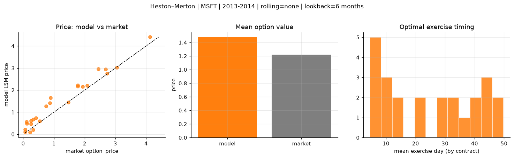
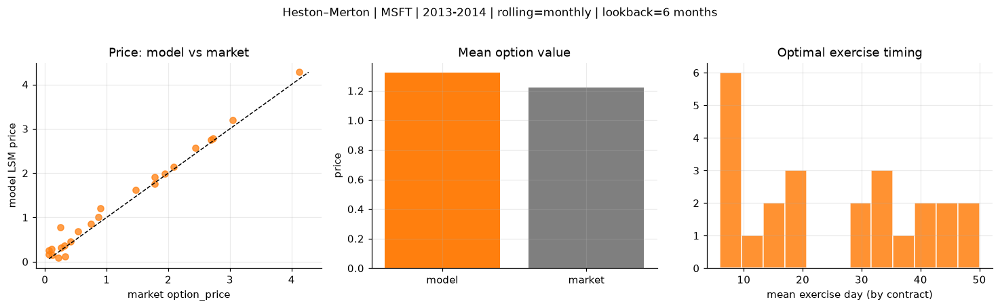
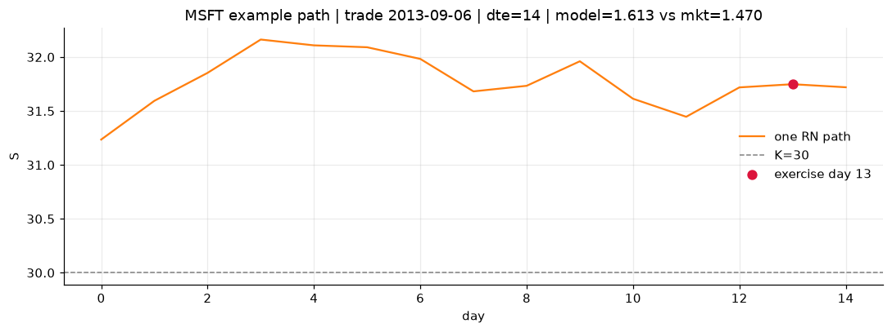
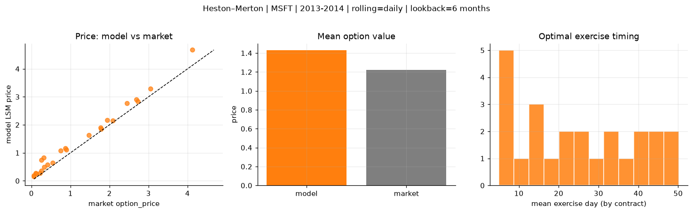
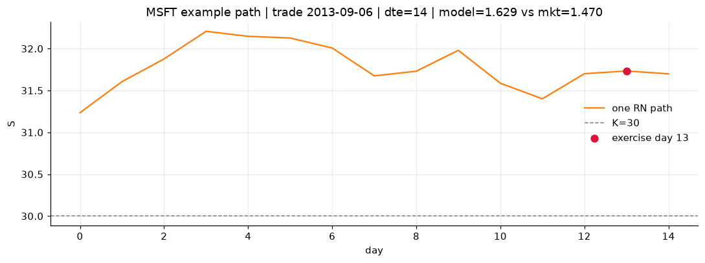

# Optimal stopping — Heston–Merton — 2013-2014 — MSFT

**Model:** Heston–Merton  
**Underlying:** MSFT  
**Regime / period:** 2013-2014  
**Lookback:** 6 months (fixed)  
**Rolling modes:** none, monthly, daily  
**Pricing:** LSM American calls on MSFT | n_paths=2000 | seed=42 | contracts=24

## Comparison (same contracts, same lookback)

| Rolling | RMSE | MAE | Bias (model−mkt) | Mean early-ex frac | Cal updates | Cal s | LSM s |
|---------|-----:|----:|-----------------:|-------------------:|------------:|------:|------:|
| `none` | 0.3412 | 0.2805 | 0.2558 | 0.319 | 1 | 0.1 | 0.2 |
| `monthly` | 0.1684 | 0.1317 | 0.1023 | 0.258 | 25 | 3.0 | 0.1 |
| `daily` | 0.2517 | 0.2097 | 0.2097 | 0.286 | 505 | 16.0 | 0.2 |

**Lowest RMSE (this study):** `monthly` = 0.1684

## Rolling = `none`

- **RMSE:** 0.3412  
- **MAE:** 0.2805  
- **Bias:** 0.2558  
- **Mean early-exercise fraction:** 0.319  
- **Calibration updates (MSFT):** 1

Contract errors (compact)

| date | K | dte | market | model | error | early_ex |
|------|--:|----:|-------:|------:|------:|---------:|
| 2013-09-06 | 30 | 14 | 1.470 | 1.453 | -0.017 | 0.537 |
| 2014-09-25 | 45 | 8 | 2.085 | 2.207 | 0.122 | 0.637 |
| 2014-03-21 | 39 | 35 | 1.940 | 2.163 | 0.223 | 0.436 |
| 2014-03-21 | 38 | 35 | 2.690 | 2.941 | 0.251 | 0.540 |
| 2014-07-23 | 41 | 58 | 4.125 | 4.408 | 0.283 | 0.643 |
| 2013-04-02 | 27 | 45 | 1.775 | 2.167 | 0.392 | 0.409 |
| 2013-09-27 | 32.5 | 7 | 0.540 | 0.601 | 0.061 | 0.297 |
| 2014-06-17 | 42 | 10 | 0.260 | 0.475 | 0.215 | 0.170 |
| 2014-09-18 | 46.5 | 22 | 0.745 | 1.275 | 0.530 | 0.191 |
| 2014-09-25 | 46 | 36 | 1.780 | 2.223 | 0.443 | 0.352 |
| 2014-05-12 | 39.5 | 46 | 0.895 | 1.645 | 0.750 | 0.346 |
| 2014-10-02 | 47 | 50 | 0.870 | 1.417 | 0.547 | 0.197 |
| 2014-10-16 | 45.5 | 15 | 0.325 | 0.194 | -0.131 | 0.075 |
| 2014-04-04 | 42.5 | 7 | 0.065 | 0.113 | 0.048 | 0.013 |
| 2014-02-21 | 40 | 21 | 0.065 | 0.209 | 0.144 | 0.097 |
| 2013-11-15 | 40 | 35 | 0.250 | 0.616 | 0.366 | 0.103 |
| 2014-06-10 | 45 | 45 | 0.120 | 0.488 | 0.368 | 0.102 |
| 2014-08-27 | 49 | 51 | 0.110 | 0.568 | 0.458 | 0.070 |
| 2014-07-09 | 44 | 37 | 0.320 | 0.672 | 0.352 | 0.110 |
| 2013-12-09 | 35.5 | 18 | 3.050 | 3.029 | -0.021 | 0.750 |
| 2013-01-25 | 28.5 | 7 | 0.220 | 0.093 | -0.127 | 0.009 |
| 2014-06-24 | 40 | 52 | 2.445 | 2.970 | 0.525 | 0.415 |
| 2013-07-11 | 32 | 8 | 2.725 | 2.755 | 0.030 | 0.938 |
| 2014-09-18 | 47 | 15 | 0.415 | 0.743 | 0.328 | 0.218 |

## Rolling = `monthly`

- **RMSE:** 0.1684  
- **MAE:** 0.1317  
- **Bias:** 0.1023  
- **Mean early-exercise fraction:** 0.258  
- **Calibration updates (MSFT):** 25

Contract errors (compact)

| date | K | dte | market | model | error | early_ex |
|------|--:|----:|-------:|------:|------:|---------:|
| 2013-09-06 | 30 | 14 | 1.470 | 1.613 | 0.143 | 0.298 |
| 2014-09-25 | 45 | 8 | 2.085 | 2.146 | 0.061 | 0.510 |
| 2014-03-21 | 39 | 35 | 1.940 | 1.995 | 0.055 | 0.230 |
| 2014-03-21 | 38 | 35 | 2.690 | 2.759 | 0.069 | 0.329 |
| 2014-07-23 | 41 | 58 | 4.125 | 4.277 | 0.152 | 0.645 |
| 2013-04-02 | 27 | 45 | 1.775 | 1.915 | 0.140 | 0.671 |
| 2013-09-27 | 32.5 | 7 | 0.540 | 0.689 | 0.149 | 0.104 |
| 2014-06-17 | 42 | 10 | 0.260 | 0.325 | 0.065 | 0.148 |
| 2014-09-18 | 46.5 | 22 | 0.745 | 0.847 | 0.102 | 0.314 |
| 2014-09-25 | 46 | 36 | 1.780 | 1.762 | -0.018 | 0.535 |
| 2014-05-12 | 39.5 | 46 | 0.895 | 1.207 | 0.312 | 0.315 |
| 2014-10-02 | 47 | 50 | 0.870 | 1.011 | 0.141 | 0.220 |
| 2014-10-16 | 45.5 | 15 | 0.325 | 0.117 | -0.208 | 0.046 |
| 2014-04-04 | 42.5 | 7 | 0.065 | 0.161 | 0.096 | 0.024 |
| 2014-02-21 | 40 | 21 | 0.065 | 0.253 | 0.188 | 0.048 |
| 2013-11-15 | 40 | 35 | 0.250 | 0.771 | 0.521 | 0.157 |
| 2014-06-10 | 45 | 45 | 0.120 | 0.145 | 0.025 | 0.061 |
| 2014-08-27 | 49 | 51 | 0.110 | 0.295 | 0.185 | 0.067 |
| 2014-07-09 | 44 | 37 | 0.320 | 0.360 | 0.040 | 0.141 |
| 2013-12-09 | 35.5 | 18 | 3.050 | 3.195 | 0.145 | 0.114 |
| 2013-01-25 | 28.5 | 7 | 0.220 | 0.093 | -0.127 | 0.009 |
| 2014-06-24 | 40 | 52 | 2.445 | 2.562 | 0.117 | 0.522 |
| 2013-07-11 | 32 | 8 | 2.725 | 2.786 | 0.061 | 0.571 |
| 2014-09-18 | 47 | 15 | 0.415 | 0.456 | 0.041 | 0.111 |

## Rolling = `daily`

- **RMSE:** 0.2517  
- **MAE:** 0.2097  
- **Bias:** 0.2097  
- **Mean early-exercise fraction:** 0.286  
- **Calibration updates (MSFT):** 505

Contract errors (compact)

| date | K | dte | market | model | error | early_ex |
|------|--:|----:|-------:|------:|------:|---------:|
| 2013-09-06 | 30 | 14 | 1.470 | 1.629 | 0.159 | 0.302 |
| 2014-09-25 | 45 | 8 | 2.085 | 2.145 | 0.060 | 0.731 |
| 2014-03-21 | 39 | 35 | 1.940 | 2.164 | 0.224 | 0.469 |
| 2014-03-21 | 38 | 35 | 2.690 | 2.908 | 0.218 | 0.406 |
| 2014-07-23 | 41 | 58 | 4.125 | 4.675 | 0.550 | 0.579 |
| 2013-04-02 | 27 | 45 | 1.775 | 1.897 | 0.122 | 0.680 |
| 2013-09-27 | 32.5 | 7 | 0.540 | 0.648 | 0.108 | 0.057 |
| 2014-06-17 | 42 | 10 | 0.260 | 0.354 | 0.094 | 0.102 |
| 2014-09-18 | 46.5 | 22 | 0.745 | 1.077 | 0.332 | 0.287 |
| 2014-09-25 | 46 | 36 | 1.780 | 1.846 | 0.066 | 0.442 |
| 2014-05-12 | 39.5 | 46 | 0.895 | 1.114 | 0.219 | 0.289 |
| 2014-10-02 | 47 | 50 | 0.870 | 1.161 | 0.291 | 0.289 |
| 2014-10-16 | 45.5 | 15 | 0.325 | 0.498 | 0.173 | 0.034 |
| 2014-04-04 | 42.5 | 7 | 0.065 | 0.153 | 0.088 | 0.028 |
| 2014-02-21 | 40 | 21 | 0.065 | 0.191 | 0.126 | 0.121 |
| 2013-11-15 | 40 | 35 | 0.250 | 0.739 | 0.489 | 0.137 |
| 2014-06-10 | 45 | 45 | 0.120 | 0.262 | 0.142 | 0.081 |
| 2014-08-27 | 49 | 51 | 0.110 | 0.281 | 0.171 | 0.095 |
| 2014-07-09 | 44 | 37 | 0.320 | 0.829 | 0.509 | 0.136 |
| 2013-12-09 | 35.5 | 18 | 3.050 | 3.294 | 0.244 | 0.201 |
| 2013-01-25 | 28.5 | 7 | 0.220 | 0.268 | 0.048 | 0.104 |
| 2014-06-24 | 40 | 52 | 2.445 | 2.773 | 0.328 | 0.488 |
| 2013-07-11 | 32 | 8 | 2.725 | 2.835 | 0.110 | 0.656 |
| 2014-09-18 | 47 | 15 | 0.415 | 0.576 | 0.161 | 0.159 |

