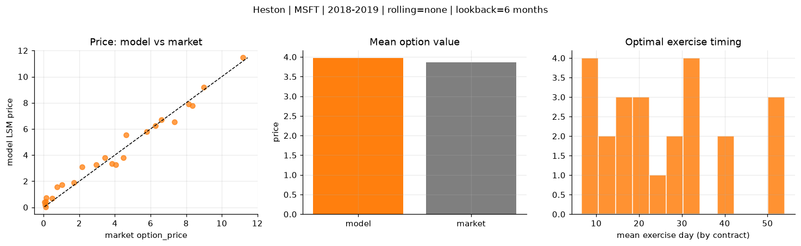
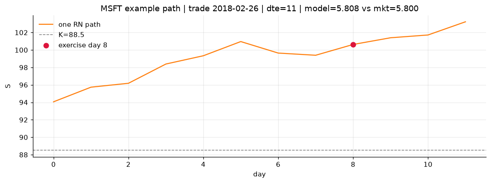
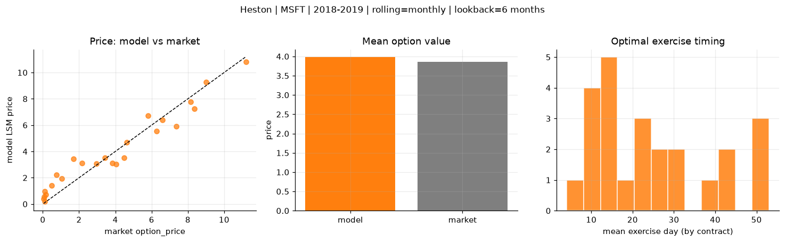
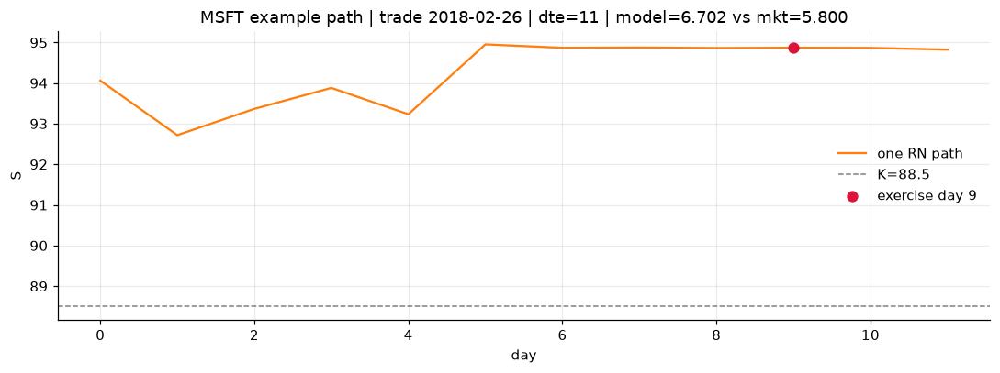
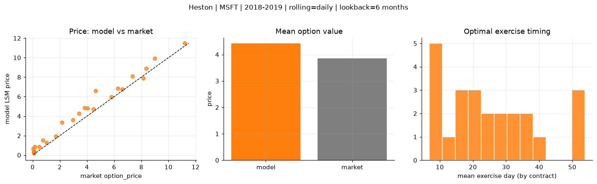
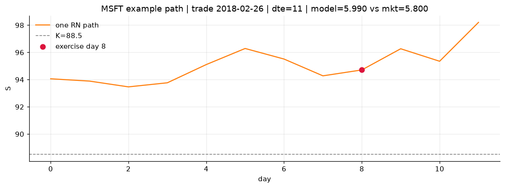

# Optimal stopping — Heston — 2018-2019 — MSFT

**Model:** Heston  
**Underlying:** MSFT  
**Regime / period:** 2018-2019  
**Lookback:** 6 months (fixed)  
**Rolling modes:** none, monthly, daily  
**Pricing:** LSM American calls on MSFT | n_paths=2000 | seed=42 | contracts=24

## Comparison (same contracts, same lookback)

| Rolling | RMSE | MAE | Bias (model−mkt) | Mean early-ex frac | Cal updates | Cal s | LSM s |
|---------|-----:|----:|-----------------:|-------------------:|------------:|------:|------:|
| `none` | 0.5027 | 0.4110 | 0.1097 | 0.309 | 1 | 0.1 | 0.1 |
| `monthly` | 0.8329 | 0.6957 | 0.1189 | 0.318 | 25 | 2.1 | 0.1 |
| `daily` | 0.7160 | 0.5790 | 0.5583 | 0.301 | 503 | 18.9 | 0.1 |

**Lowest RMSE (this study):** `none` = 0.5027

## Rolling = `none`

- **RMSE:** 0.5027  
- **MAE:** 0.4110  
- **Bias:** 0.1097  
- **Mean early-exercise fraction:** 0.309  
- **Calibration updates (MSFT):** 1

Contract errors (compact)

| date | K | dte | market | model | error | early_ex |
|------|--:|----:|-------:|------:|------:|---------:|
| 2018-02-26 | 88.5 | 11 | 5.800 | 5.808 | 0.008 | 0.495 |
| 2019-07-24 | 133 | 9 | 6.600 | 6.722 | 0.122 | 0.557 |
| 2018-10-19 | 102 | 35 | 8.350 | 7.798 | -0.552 | 0.456 |
| 2018-10-19 | 103 | 21 | 7.350 | 6.555 | -0.795 | 0.501 |
| 2019-05-13 | 117 | 46 | 11.200 | 11.454 | 0.254 | 0.625 |
| 2018-03-05 | 85 | 46 | 9.000 | 9.182 | 0.182 | 0.834 |
| 2018-02-26 | 93.5 | 11 | 1.705 | 1.881 | 0.176 | 0.189 |
| 2018-12-17 | 103 | 11 | 4.475 | 3.784 | -0.691 | 0.385 |
| 2019-06-25 | 134 | 31 | 6.275 | 6.262 | -0.013 | 0.336 |
| 2019-07-10 | 137 | 30 | 3.425 | 3.819 | 0.394 | 0.316 |
| 2018-11-26 | 105 | 53 | 3.825 | 3.360 | -0.465 | 0.279 |
| 2019-07-02 | 135 | 45 | 4.625 | 5.534 | 0.909 | 0.260 |
| 2019-08-14 | 150 | 16 | 0.080 | 0.169 | 0.089 | 0.014 |
| 2018-11-16 | 118 | 14 | 0.110 | 0.042 | -0.068 | 0.006 |
| 2018-09-28 | 122 | 21 | 0.115 | 0.458 | 0.343 | 0.059 |
| 2018-05-01 | 98.5 | 24 | 0.480 | 0.670 | 0.190 | 0.106 |
| 2019-03-22 | 125 | 56 | 2.155 | 3.076 | 0.921 | 0.173 |
| 2019-06-25 | 150 | 52 | 0.745 | 1.559 | 0.814 | 0.143 |
| 2018-07-05 | 91.5 | 15 | 8.150 | 7.908 | -0.242 | 0.746 |
| 2018-01-04 | 89 | 15 | 0.155 | 0.711 | 0.556 | 0.118 |
| 2018-06-06 | 104 | 23 | 1.040 | 1.706 | 0.666 | 0.244 |
| 2018-10-12 | 107 | 42 | 4.050 | 3.260 | -0.790 | 0.243 |
| 2018-01-04 | 90.5 | 15 | 0.050 | 0.391 | 0.341 | 0.058 |
| 2018-03-05 | 92.5 | 32 | 2.955 | 3.240 | 0.285 | 0.280 |

## Rolling = `monthly`

- **RMSE:** 0.8329  
- **MAE:** 0.6957  
- **Bias:** 0.1189  
- **Mean early-exercise fraction:** 0.318  
- **Calibration updates (MSFT):** 25

Contract errors (compact)

| date | K | dte | market | model | error | early_ex |
|------|--:|----:|-------:|------:|------:|---------:|
| 2018-02-26 | 88.5 | 11 | 5.800 | 6.702 | 0.902 | 0.419 |
| 2019-07-24 | 133 | 9 | 6.600 | 6.378 | -0.222 | 0.930 |
| 2018-10-19 | 102 | 35 | 8.350 | 7.240 | -1.110 | 0.832 |
| 2018-10-19 | 103 | 21 | 7.350 | 5.916 | -1.434 | 0.681 |
| 2019-05-13 | 117 | 46 | 11.200 | 10.828 | -0.372 | 0.994 |
| 2018-03-05 | 85 | 46 | 9.000 | 9.276 | 0.276 | 0.501 |
| 2018-02-26 | 93.5 | 11 | 1.705 | 3.431 | 1.726 | 0.020 |
| 2018-12-17 | 103 | 11 | 4.475 | 3.509 | -0.966 | 0.226 |
| 2019-06-25 | 134 | 31 | 6.275 | 5.544 | -0.731 | 0.178 |
| 2019-07-10 | 137 | 30 | 3.425 | 3.504 | 0.079 | 0.189 |
| 2018-11-26 | 105 | 53 | 3.825 | 3.123 | -0.702 | 0.179 |
| 2019-07-02 | 135 | 45 | 4.625 | 4.712 | 0.087 | 0.364 |
| 2019-08-14 | 150 | 16 | 0.080 | 0.544 | 0.464 | 0.025 |
| 2018-11-16 | 118 | 14 | 0.110 | 0.200 | 0.090 | 0.013 |
| 2018-09-28 | 122 | 21 | 0.115 | 0.982 | 0.867 | 0.040 |
| 2018-05-01 | 98.5 | 24 | 0.480 | 1.406 | 0.926 | 0.130 |
| 2019-03-22 | 125 | 56 | 2.155 | 3.116 | 0.961 | 0.206 |
| 2019-06-25 | 150 | 52 | 0.745 | 2.219 | 1.474 | 0.147 |
| 2018-07-05 | 91.5 | 15 | 8.150 | 7.773 | -0.377 | 0.789 |
| 2018-01-04 | 89 | 15 | 0.155 | 0.711 | 0.556 | 0.118 |
| 2018-06-06 | 104 | 23 | 1.040 | 1.937 | 0.897 | 0.183 |
| 2018-10-12 | 107 | 42 | 4.050 | 3.043 | -1.007 | 0.151 |
| 2018-01-04 | 90.5 | 15 | 0.050 | 0.391 | 0.341 | 0.058 |
| 2018-03-05 | 92.5 | 32 | 2.955 | 3.086 | 0.131 | 0.245 |

## Rolling = `daily`

- **RMSE:** 0.7160  
- **MAE:** 0.5790  
- **Bias:** 0.5583  
- **Mean early-exercise fraction:** 0.301  
- **Calibration updates (MSFT):** 503

Contract errors (compact)

| date | K | dte | market | model | error | early_ex |
|------|--:|----:|-------:|------:|------:|---------:|
| 2018-02-26 | 88.5 | 11 | 5.800 | 5.990 | 0.190 | 0.610 |
| 2019-07-24 | 133 | 9 | 6.600 | 6.752 | 0.152 | 0.608 |
| 2018-10-19 | 102 | 35 | 8.350 | 8.870 | 0.520 | 0.344 |
| 2018-10-19 | 103 | 21 | 7.350 | 8.091 | 0.741 | 0.444 |
| 2019-05-13 | 117 | 46 | 11.200 | 11.489 | 0.289 | 0.682 |
| 2018-03-05 | 85 | 46 | 9.000 | 9.925 | 0.925 | 0.484 |
| 2018-02-26 | 93.5 | 11 | 1.705 | 1.940 | 0.235 | 0.229 |
| 2018-12-17 | 103 | 11 | 4.475 | 4.727 | 0.252 | 0.367 |
| 2019-06-25 | 134 | 31 | 6.275 | 6.867 | 0.592 | 0.360 |
| 2019-07-10 | 137 | 30 | 3.425 | 4.256 | 0.831 | 0.303 |
| 2018-11-26 | 105 | 53 | 3.825 | 4.870 | 1.045 | 0.305 |
| 2019-07-02 | 135 | 45 | 4.625 | 6.608 | 1.983 | 0.344 |
| 2019-08-14 | 150 | 16 | 0.080 | 0.319 | 0.239 | 0.038 |
| 2018-11-16 | 118 | 14 | 0.110 | 0.188 | 0.078 | 0.033 |
| 2018-09-28 | 122 | 21 | 0.115 | 0.399 | 0.284 | 0.057 |
| 2018-05-01 | 98.5 | 24 | 0.480 | 0.859 | 0.379 | 0.105 |
| 2019-03-22 | 125 | 56 | 2.155 | 3.367 | 1.212 | 0.249 |
| 2019-06-25 | 150 | 52 | 0.745 | 1.525 | 0.780 | 0.102 |
| 2018-07-05 | 91.5 | 15 | 8.150 | 7.902 | -0.248 | 0.672 |
| 2018-01-04 | 89 | 15 | 0.155 | 0.869 | 0.714 | 0.024 |
| 2018-06-06 | 104 | 23 | 1.040 | 1.276 | 0.236 | 0.198 |
| 2018-10-12 | 107 | 42 | 4.050 | 4.794 | 0.744 | 0.313 |
| 2018-01-04 | 90.5 | 15 | 0.050 | 0.637 | 0.587 | 0.056 |
| 2018-03-05 | 92.5 | 32 | 2.955 | 3.596 | 0.641 | 0.294 |

