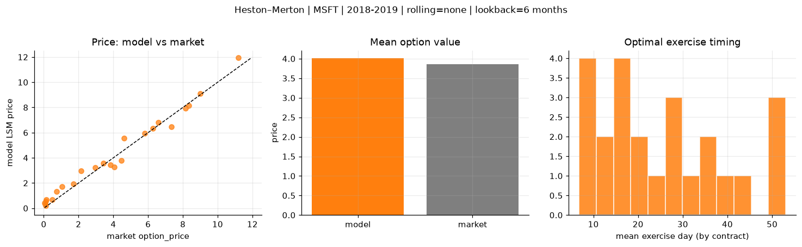
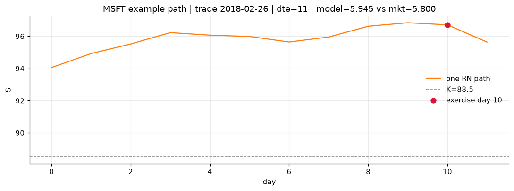
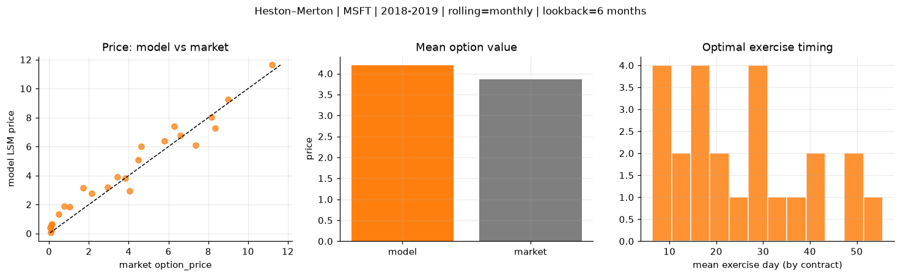
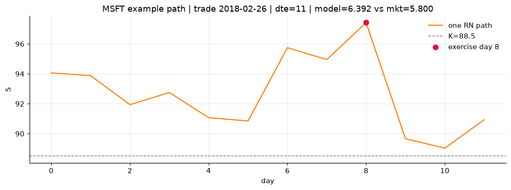
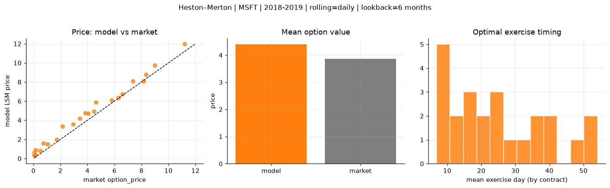
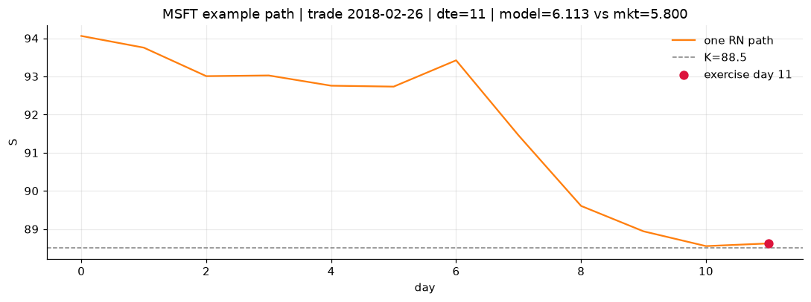

# Optimal stopping — Heston–Merton — 2018-2019 — MSFT

**Model:** Heston–Merton  
**Underlying:** MSFT  
**Regime / period:** 2018-2019  
**Lookback:** 6 months (fixed)  
**Rolling modes:** none, monthly, daily  
**Pricing:** LSM American calls on MSFT | n_paths=2000 | seed=42 | contracts=24

## Comparison (same contracts, same lookback)

| Rolling | RMSE | MAE | Bias (model−mkt) | Mean early-ex frac | Cal updates | Cal s | LSM s |
|---------|-----:|----:|-----------------:|-------------------:|------------:|------:|------:|
| `none` | 0.4981 | 0.4148 | 0.1474 | 0.257 | 1 | 0.2 | 0.1 |
| `monthly` | 0.7660 | 0.6293 | 0.3325 | 0.280 | 25 | 3.6 | 0.1 |
| `daily` | 0.6319 | 0.5411 | 0.5355 | 0.270 | 503 | 20.4 | 0.1 |

**Lowest RMSE (this study):** `none` = 0.4981

## Rolling = `none`

- **RMSE:** 0.4981  
- **MAE:** 0.4148  
- **Bias:** 0.1474  
- **Mean early-exercise fraction:** 0.257  
- **Calibration updates (MSFT):** 1

Contract errors (compact)

| date | K | dte | market | model | error | early_ex |
|------|--:|----:|-------:|------:|------:|---------:|
| 2018-02-26 | 88.5 | 11 | 5.800 | 5.945 | 0.145 | 0.273 |
| 2019-07-24 | 133 | 9 | 6.600 | 6.805 | 0.205 | 0.498 |
| 2018-10-19 | 102 | 35 | 8.350 | 8.134 | -0.216 | 0.274 |
| 2018-10-19 | 103 | 21 | 7.350 | 6.446 | -0.904 | 0.489 |
| 2019-05-13 | 117 | 46 | 11.200 | 11.930 | 0.730 | 0.554 |
| 2018-03-05 | 85 | 46 | 9.000 | 9.080 | 0.080 | 0.855 |
| 2018-02-26 | 93.5 | 11 | 1.705 | 1.935 | 0.230 | 0.116 |
| 2018-12-17 | 103 | 11 | 4.475 | 3.783 | -0.692 | 0.420 |
| 2019-06-25 | 134 | 31 | 6.275 | 6.343 | 0.068 | 0.347 |
| 2019-07-10 | 137 | 30 | 3.425 | 3.573 | 0.148 | 0.251 |
| 2018-11-26 | 105 | 53 | 3.825 | 3.432 | -0.393 | 0.242 |
| 2019-07-02 | 135 | 45 | 4.625 | 5.545 | 0.920 | 0.170 |
| 2019-08-14 | 150 | 16 | 0.080 | 0.322 | 0.242 | 0.036 |
| 2018-11-16 | 118 | 14 | 0.110 | 0.185 | 0.075 | 0.021 |
| 2018-09-28 | 122 | 21 | 0.115 | 0.552 | 0.437 | 0.021 |
| 2018-05-01 | 98.5 | 24 | 0.480 | 0.692 | 0.212 | 0.070 |
| 2019-03-22 | 125 | 56 | 2.155 | 2.965 | 0.810 | 0.236 |
| 2019-06-25 | 150 | 52 | 0.745 | 1.338 | 0.593 | 0.070 |
| 2018-07-05 | 91.5 | 15 | 8.150 | 7.936 | -0.214 | 0.645 |
| 2018-01-04 | 89 | 15 | 0.155 | 0.669 | 0.514 | 0.052 |
| 2018-06-06 | 104 | 23 | 1.040 | 1.727 | 0.687 | 0.159 |
| 2018-10-12 | 107 | 42 | 4.050 | 3.261 | -0.789 | 0.167 |
| 2018-01-04 | 90.5 | 15 | 0.050 | 0.420 | 0.370 | 0.023 |
| 2018-03-05 | 92.5 | 32 | 2.955 | 3.238 | 0.283 | 0.178 |

## Rolling = `monthly`

- **RMSE:** 0.7660  
- **MAE:** 0.6293  
- **Bias:** 0.3325  
- **Mean early-exercise fraction:** 0.280  
- **Calibration updates (MSFT):** 25

Contract errors (compact)

| date | K | dte | market | model | error | early_ex |
|------|--:|----:|-------:|------:|------:|---------:|
| 2018-02-26 | 88.5 | 11 | 5.800 | 6.392 | 0.592 | 0.464 |
| 2019-07-24 | 133 | 9 | 6.600 | 6.764 | 0.164 | 0.617 |
| 2018-10-19 | 102 | 35 | 8.350 | 7.260 | -1.090 | 0.648 |
| 2018-10-19 | 103 | 21 | 7.350 | 6.108 | -1.242 | 0.407 |
| 2019-05-13 | 117 | 46 | 11.200 | 11.632 | 0.432 | 0.705 |
| 2018-03-05 | 85 | 46 | 9.000 | 9.248 | 0.248 | 0.743 |
| 2018-02-26 | 93.5 | 11 | 1.705 | 3.128 | 1.423 | 0.097 |
| 2018-12-17 | 103 | 11 | 4.475 | 5.082 | 0.607 | 0.402 |
| 2019-06-25 | 134 | 31 | 6.275 | 7.405 | 1.130 | 0.422 |
| 2019-07-10 | 137 | 30 | 3.425 | 3.886 | 0.461 | 0.292 |
| 2018-11-26 | 105 | 53 | 3.825 | 3.823 | -0.002 | 0.194 |
| 2019-07-02 | 135 | 45 | 4.625 | 5.999 | 1.374 | 0.298 |
| 2019-08-14 | 150 | 16 | 0.080 | 0.077 | -0.003 | 0.021 |
| 2018-11-16 | 118 | 14 | 0.110 | 0.247 | 0.137 | 0.021 |
| 2018-09-28 | 122 | 21 | 0.115 | 0.563 | 0.448 | 0.073 |
| 2018-05-01 | 98.5 | 24 | 0.480 | 1.326 | 0.846 | 0.074 |
| 2019-03-22 | 125 | 56 | 2.155 | 2.775 | 0.620 | 0.104 |
| 2019-06-25 | 150 | 52 | 0.745 | 1.877 | 1.132 | 0.093 |
| 2018-07-05 | 91.5 | 15 | 8.150 | 8.041 | -0.109 | 0.631 |
| 2018-01-04 | 89 | 15 | 0.155 | 0.669 | 0.514 | 0.052 |
| 2018-06-06 | 104 | 23 | 1.040 | 1.835 | 0.795 | 0.035 |
| 2018-10-12 | 107 | 42 | 4.050 | 2.934 | -1.116 | 0.169 |
| 2018-01-04 | 90.5 | 15 | 0.050 | 0.420 | 0.370 | 0.023 |
| 2018-03-05 | 92.5 | 32 | 2.955 | 3.204 | 0.249 | 0.133 |

## Rolling = `daily`

- **RMSE:** 0.6319  
- **MAE:** 0.5411  
- **Bias:** 0.5355  
- **Mean early-exercise fraction:** 0.270  
- **Calibration updates (MSFT):** 503

Contract errors (compact)

| date | K | dte | market | model | error | early_ex |
|------|--:|----:|-------:|------:|------:|---------:|
| 2018-02-26 | 88.5 | 11 | 5.800 | 6.113 | 0.313 | 0.049 |
| 2019-07-24 | 133 | 9 | 6.600 | 6.752 | 0.152 | 0.608 |
| 2018-10-19 | 102 | 35 | 8.350 | 8.767 | 0.417 | 0.572 |
| 2018-10-19 | 103 | 21 | 7.350 | 8.079 | 0.729 | 0.409 |
| 2019-05-13 | 117 | 46 | 11.200 | 11.966 | 0.766 | 0.566 |
| 2018-03-05 | 85 | 46 | 9.000 | 9.740 | 0.740 | 0.569 |
| 2018-02-26 | 93.5 | 11 | 1.705 | 1.994 | 0.289 | 0.150 |
| 2018-12-17 | 103 | 11 | 4.475 | 4.914 | 0.439 | 0.348 |
| 2019-06-25 | 134 | 31 | 6.275 | 6.335 | 0.060 | 0.466 |
| 2019-07-10 | 137 | 30 | 3.425 | 4.184 | 0.759 | 0.281 |
| 2018-11-26 | 105 | 53 | 3.825 | 4.743 | 0.918 | 0.281 |
| 2019-07-02 | 135 | 45 | 4.625 | 5.879 | 1.254 | 0.371 |
| 2019-08-14 | 150 | 16 | 0.080 | 0.319 | 0.239 | 0.038 |
| 2018-11-16 | 118 | 14 | 0.110 | 0.281 | 0.171 | 0.016 |
| 2018-09-28 | 122 | 21 | 0.115 | 0.357 | 0.242 | 0.067 |
| 2018-05-01 | 98.5 | 24 | 0.480 | 0.793 | 0.313 | 0.095 |
| 2019-03-22 | 125 | 56 | 2.155 | 3.381 | 1.226 | 0.217 |
| 2019-06-25 | 150 | 52 | 0.745 | 1.581 | 0.836 | 0.132 |
| 2018-07-05 | 91.5 | 15 | 8.150 | 8.083 | -0.067 | 0.568 |
| 2018-01-04 | 89 | 15 | 0.155 | 0.878 | 0.723 | 0.080 |
| 2018-06-06 | 104 | 23 | 1.040 | 1.524 | 0.484 | 0.114 |
| 2018-10-12 | 107 | 42 | 4.050 | 4.707 | 0.657 | 0.327 |
| 2018-01-04 | 90.5 | 15 | 0.050 | 0.618 | 0.568 | 0.066 |
| 2018-03-05 | 92.5 | 32 | 2.955 | 3.579 | 0.624 | 0.099 |

