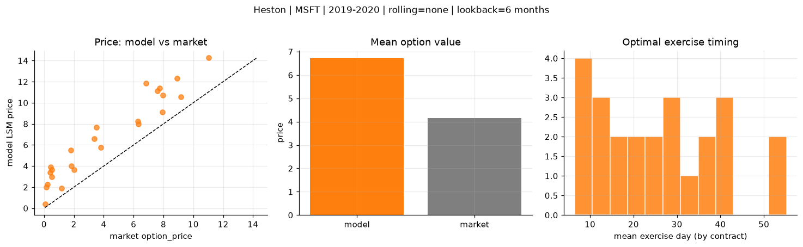
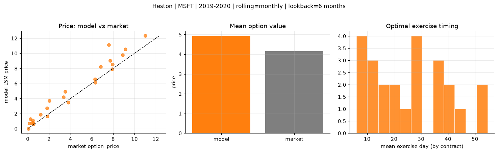
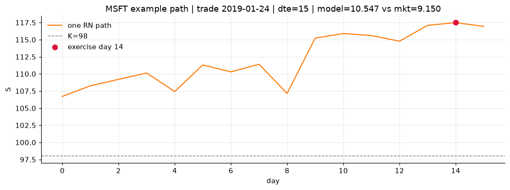
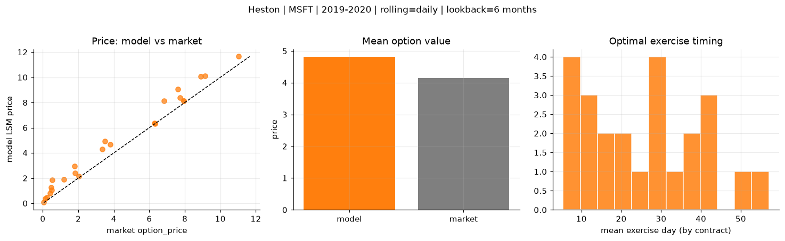
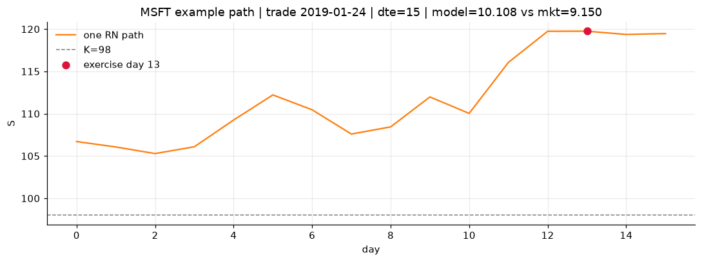

# Optimal stopping — Heston — 2019-2020 — MSFT

**Model:** Heston  
**Underlying:** MSFT  
**Regime / period:** 2019-2020  
**Lookback:** 6 months (fixed)  
**Rolling modes:** none, monthly, daily  
**Pricing:** LSM American calls on MSFT | n_paths=2000 | seed=42 | contracts=24

## Comparison (same contracts, same lookback)

| Rolling | RMSE | MAE | Bias (model−mkt) | Mean early-ex frac | Cal updates | Cal s | LSM s |
|---------|-----:|----:|-----------------:|-------------------:|------------:|------:|------:|
| `none` | 2.8037 | 2.5701 | 2.5701 | 0.263 | 1 | 0.2 | 0.1 |
| `monthly` | 1.1264 | 0.8405 | 0.7737 | 0.278 | 25 | 2.2 | 0.1 |
| `daily` | 0.8138 | 0.6681 | 0.6661 | 0.273 | 505 | 14.4 | 0.1 |

**Lowest RMSE (this study):** `daily` = 0.8138

## Rolling = `none`

- **RMSE:** 2.8037  
- **MAE:** 2.5701  
- **Bias:** 2.5701  
- **Mean early-exercise fraction:** 0.263  
- **Calibration updates (MSFT):** 1

Contract errors (compact)

| date | K | dte | market | model | error | early_ex |
|------|--:|----:|-------:|------:|------:|---------:|
| 2019-01-24 | 98 | 15 | 9.150 | 10.547 | 1.397 | 0.259 |
| 2019-10-10 | 134 | 15 | 6.325 | 7.972 | 1.647 | 0.420 |
| 2019-06-25 | 132 | 31 | 7.725 | 11.406 | 3.681 | 0.287 |
| 2019-06-25 | 128 | 31 | 11.025 | 14.249 | 3.224 | 0.525 |
| 2019-09-12 | 130 | 43 | 8.900 | 12.307 | 3.407 | 0.416 |
| 2019-01-16 | 100 | 58 | 7.600 | 11.151 | 3.551 | 0.417 |
| 2019-02-07 | 105 | 8 | 2.020 | 3.642 | 1.622 | 0.341 |
| 2019-07-17 | 140 | 16 | 1.820 | 3.990 | 2.170 | 0.148 |
| 2019-09-26 | 141 | 29 | 3.350 | 6.586 | 3.236 | 0.226 |
| 2019-10-03 | 137 | 29 | 3.800 | 5.755 | 1.955 | 0.243 |
| 2019-06-18 | 130 | 59 | 6.825 | 11.832 | 5.007 | 0.270 |
| 2019-10-10 | 141 | 43 | 3.500 | 7.652 | 4.152 | 0.259 |
| 2019-10-03 | 147 | 8 | 0.060 | 0.403 | 0.343 | 0.017 |
| 2019-06-18 | 142 | 17 | 0.140 | 2.017 | 1.877 | 0.086 |
| 2019-05-20 | 138 | 38 | 0.530 | 3.640 | 3.110 | 0.188 |
| 2019-03-08 | 115 | 21 | 0.500 | 2.975 | 2.475 | 0.179 |
| 2019-07-17 | 150 | 44 | 0.455 | 3.930 | 3.475 | 0.132 |
| 2019-09-19 | 146 | 43 | 1.795 | 5.525 | 3.730 | 0.179 |
| 2019-01-02 | 111 | 30 | 1.180 | 1.880 | 0.700 | 0.190 |
| 2019-11-07 | 138 | 8 | 6.300 | 8.255 | 1.955 | 0.394 |
| 2019-04-22 | 116 | 10 | 7.925 | 9.096 | 1.171 | 0.345 |
| 2019-02-14 | 113 | 22 | 0.230 | 2.264 | 2.034 | 0.163 |
| 2019-03-01 | 120 | 35 | 0.400 | 3.411 | 3.011 | 0.149 |
| 2019-12-20 | 148 | 14 | 7.950 | 10.702 | 2.752 | 0.490 |

## Rolling = `monthly`

- **RMSE:** 1.1264  
- **MAE:** 0.8405  
- **Bias:** 0.7737  
- **Mean early-exercise fraction:** 0.278  
- **Calibration updates (MSFT):** 25

Contract errors (compact)

| date | K | dte | market | model | error | early_ex |
|------|--:|----:|-------:|------:|------:|---------:|
| 2019-01-24 | 98 | 15 | 9.150 | 10.547 | 1.397 | 0.259 |
| 2019-10-10 | 134 | 15 | 6.325 | 6.106 | -0.219 | 0.432 |
| 2019-06-25 | 132 | 31 | 7.725 | 9.023 | 1.298 | 0.352 |
| 2019-06-25 | 128 | 31 | 11.025 | 12.319 | 1.294 | 0.640 |
| 2019-09-12 | 130 | 43 | 8.900 | 9.795 | 0.895 | 0.528 |
| 2019-01-16 | 100 | 58 | 7.600 | 11.151 | 3.551 | 0.417 |
| 2019-02-07 | 105 | 8 | 2.020 | 3.715 | 1.695 | 0.320 |
| 2019-07-17 | 140 | 16 | 1.820 | 1.630 | -0.190 | 0.130 |
| 2019-09-26 | 141 | 29 | 3.350 | 4.215 | 0.865 | 0.298 |
| 2019-10-03 | 137 | 29 | 3.800 | 3.481 | -0.319 | 0.226 |
| 2019-06-18 | 130 | 59 | 6.825 | 8.244 | 1.419 | 0.316 |
| 2019-10-10 | 141 | 43 | 3.500 | 4.917 | 1.417 | 0.249 |
| 2019-10-03 | 147 | 8 | 0.060 | 0.009 | -0.051 | 0.002 |
| 2019-06-18 | 142 | 17 | 0.140 | 0.715 | 0.575 | 0.062 |
| 2019-05-20 | 138 | 38 | 0.530 | 0.607 | 0.077 | 0.059 |
| 2019-03-08 | 115 | 21 | 0.500 | 0.816 | 0.316 | 0.102 |
| 2019-07-17 | 150 | 44 | 0.455 | 1.099 | 0.644 | 0.067 |
| 2019-09-19 | 146 | 43 | 1.795 | 2.727 | 0.932 | 0.125 |
| 2019-01-02 | 111 | 30 | 1.180 | 1.880 | 0.700 | 0.190 |
| 2019-11-07 | 138 | 8 | 6.300 | 6.586 | 0.286 | 0.567 |
| 2019-04-22 | 116 | 10 | 7.925 | 7.903 | -0.022 | 0.415 |
| 2019-02-14 | 113 | 22 | 0.230 | 1.295 | 1.065 | 0.162 |
| 2019-03-01 | 120 | 35 | 0.400 | 0.751 | 0.351 | 0.078 |
| 2019-12-20 | 148 | 14 | 7.950 | 8.544 | 0.594 | 0.675 |

## Rolling = `daily`

- **RMSE:** 0.8138  
- **MAE:** 0.6681  
- **Bias:** 0.6661  
- **Mean early-exercise fraction:** 0.273  
- **Calibration updates (MSFT):** 505

Contract errors (compact)

| date | K | dte | market | model | error | early_ex |
|------|--:|----:|-------:|------:|------:|---------:|
| 2019-01-24 | 98 | 15 | 9.150 | 10.108 | 0.958 | 0.398 |
| 2019-10-10 | 134 | 15 | 6.325 | 6.301 | -0.024 | 0.451 |
| 2019-06-25 | 132 | 31 | 7.725 | 8.398 | 0.673 | 0.343 |
| 2019-06-25 | 128 | 31 | 11.025 | 11.650 | 0.625 | 0.663 |
| 2019-09-12 | 130 | 43 | 8.900 | 10.080 | 1.180 | 0.418 |
| 2019-01-16 | 100 | 58 | 7.600 | 9.062 | 1.462 | 0.342 |
| 2019-02-07 | 105 | 8 | 2.020 | 2.158 | 0.138 | 0.326 |
| 2019-07-17 | 140 | 16 | 1.820 | 2.405 | 0.585 | 0.139 |
| 2019-09-26 | 141 | 29 | 3.350 | 4.288 | 0.938 | 0.240 |
| 2019-10-03 | 137 | 29 | 3.800 | 4.664 | 0.864 | 0.244 |
| 2019-06-18 | 130 | 59 | 6.825 | 8.132 | 1.307 | 0.234 |
| 2019-10-10 | 141 | 43 | 3.500 | 4.913 | 1.413 | 0.176 |
| 2019-10-03 | 147 | 8 | 0.060 | 0.063 | 0.003 | 0.011 |
| 2019-06-18 | 142 | 17 | 0.140 | 0.390 | 0.250 | 0.052 |
| 2019-05-20 | 138 | 38 | 0.530 | 1.849 | 1.319 | 0.141 |
| 2019-03-08 | 115 | 21 | 0.500 | 1.068 | 0.568 | 0.115 |
| 2019-07-17 | 150 | 44 | 0.455 | 1.278 | 0.823 | 0.102 |
| 2019-09-19 | 146 | 43 | 1.795 | 2.951 | 1.156 | 0.144 |
| 2019-01-02 | 111 | 30 | 1.180 | 1.880 | 0.700 | 0.190 |
| 2019-11-07 | 138 | 8 | 6.300 | 6.352 | 0.052 | 0.640 |
| 2019-04-22 | 116 | 10 | 7.925 | 8.144 | 0.219 | 0.257 |
| 2019-02-14 | 113 | 22 | 0.230 | 0.447 | 0.217 | 0.049 |
| 2019-03-01 | 120 | 35 | 0.400 | 0.798 | 0.398 | 0.089 |
| 2019-12-20 | 148 | 14 | 7.950 | 8.114 | 0.164 | 0.787 |

