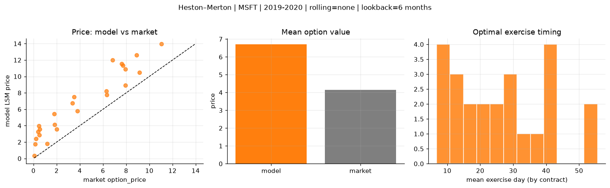
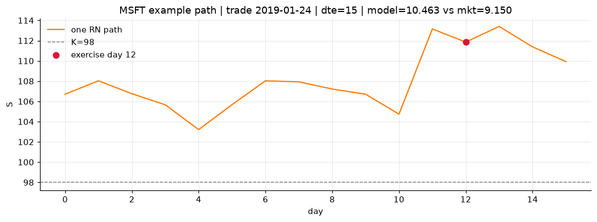
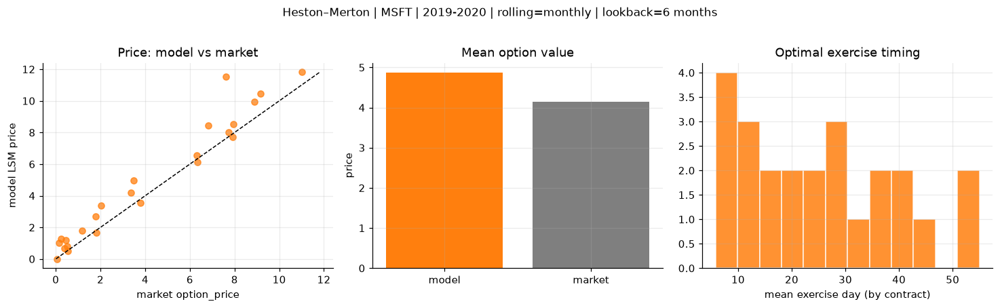
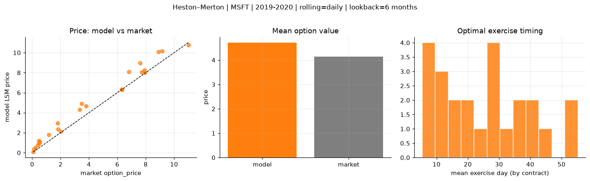
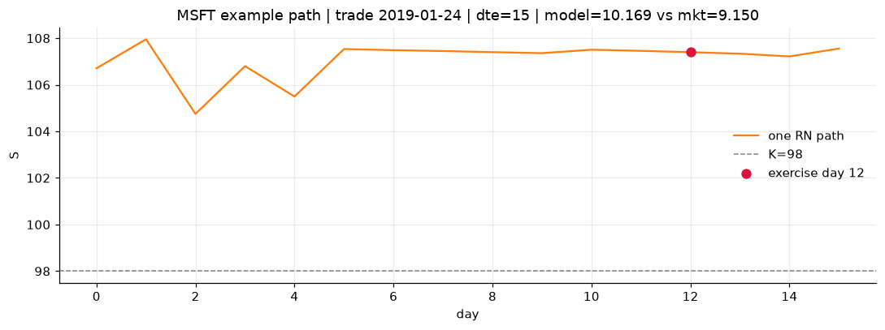

# Optimal stopping — Heston–Merton — 2019-2020 — MSFT

**Model:** Heston–Merton  
**Underlying:** MSFT  
**Regime / period:** 2019-2020  
**Lookback:** 6 months (fixed)  
**Rolling modes:** none, monthly, daily  
**Pricing:** LSM American calls on MSFT | n_paths=2000 | seed=42 | contracts=24

## Comparison (same contracts, same lookback)

| Rolling | RMSE | MAE | Bias (model−mkt) | Mean early-ex frac | Cal updates | Cal s | LSM s |
|---------|-----:|----:|-----------------:|-------------------:|------------:|------:|------:|
| `none` | 2.8202 | 2.5587 | 2.5587 | 0.270 | 1 | 0.2 | 0.1 |
| `monthly` | 1.1295 | 0.7972 | 0.7242 | 0.310 | 25 | 2.1 | 0.1 |
| `daily` | 0.7433 | 0.5928 | 0.5686 | 0.310 | 505 | 13.8 | 0.1 |

**Lowest RMSE (this study):** `daily` = 0.7433

## Rolling = `none`

- **RMSE:** 2.8202  
- **MAE:** 2.5587  
- **Bias:** 2.5587  
- **Mean early-exercise fraction:** 0.270  
- **Calibration updates (MSFT):** 1

Contract errors (compact)

| date | K | dte | market | model | error | early_ex |
|------|--:|----:|-------:|------:|------:|---------:|
| 2019-01-24 | 98 | 15 | 9.150 | 10.463 | 1.313 | 0.508 |
| 2019-10-10 | 134 | 15 | 6.325 | 7.761 | 1.436 | 0.404 |
| 2019-06-25 | 132 | 31 | 7.725 | 11.319 | 3.594 | 0.419 |
| 2019-06-25 | 128 | 31 | 11.025 | 13.944 | 2.919 | 0.533 |
| 2019-09-12 | 130 | 43 | 8.900 | 12.629 | 3.729 | 0.431 |
| 2019-01-16 | 100 | 58 | 7.600 | 11.528 | 3.928 | 0.337 |
| 2019-02-07 | 105 | 8 | 2.020 | 3.576 | 1.556 | 0.249 |
| 2019-07-17 | 140 | 16 | 1.820 | 4.147 | 2.327 | 0.196 |
| 2019-09-26 | 141 | 29 | 3.350 | 6.727 | 3.377 | 0.277 |
| 2019-10-03 | 137 | 29 | 3.800 | 5.785 | 1.985 | 0.255 |
| 2019-06-18 | 130 | 59 | 6.825 | 12.022 | 5.197 | 0.334 |
| 2019-10-10 | 141 | 43 | 3.500 | 7.483 | 3.983 | 0.177 |
| 2019-10-03 | 147 | 8 | 0.060 | 0.355 | 0.295 | 0.029 |
| 2019-06-18 | 142 | 17 | 0.140 | 1.766 | 1.626 | 0.097 |
| 2019-05-20 | 138 | 38 | 0.530 | 3.590 | 3.060 | 0.173 |
| 2019-03-08 | 115 | 21 | 0.500 | 2.862 | 2.362 | 0.176 |
| 2019-07-17 | 150 | 44 | 0.455 | 3.984 | 3.529 | 0.161 |
| 2019-09-19 | 146 | 43 | 1.795 | 5.459 | 3.664 | 0.141 |
| 2019-01-02 | 111 | 30 | 1.180 | 1.810 | 0.630 | 0.147 |
| 2019-11-07 | 138 | 8 | 6.300 | 8.199 | 1.899 | 0.336 |
| 2019-04-22 | 116 | 10 | 7.925 | 8.914 | 0.989 | 0.386 |
| 2019-02-14 | 113 | 22 | 0.230 | 2.418 | 2.188 | 0.156 |
| 2019-03-01 | 120 | 35 | 0.400 | 3.289 | 2.889 | 0.147 |
| 2019-12-20 | 148 | 14 | 7.950 | 10.884 | 2.934 | 0.412 |

## Rolling = `monthly`

- **RMSE:** 1.1295  
- **MAE:** 0.7972  
- **Bias:** 0.7242  
- **Mean early-exercise fraction:** 0.310  
- **Calibration updates (MSFT):** 25

Contract errors (compact)

| date | K | dte | market | model | error | early_ex |
|------|--:|----:|-------:|------:|------:|---------:|
| 2019-01-24 | 98 | 15 | 9.150 | 10.463 | 1.313 | 0.508 |
| 2019-10-10 | 134 | 15 | 6.325 | 6.125 | -0.200 | 0.438 |
| 2019-06-25 | 132 | 31 | 7.725 | 8.014 | 0.289 | 0.746 |
| 2019-06-25 | 128 | 31 | 11.025 | 11.811 | 0.786 | 0.526 |
| 2019-09-12 | 130 | 43 | 8.900 | 9.939 | 1.039 | 0.554 |
| 2019-01-16 | 100 | 58 | 7.600 | 11.528 | 3.928 | 0.337 |
| 2019-02-07 | 105 | 8 | 2.020 | 3.379 | 1.359 | 0.337 |
| 2019-07-17 | 140 | 16 | 1.820 | 1.681 | -0.139 | 0.163 |
| 2019-09-26 | 141 | 29 | 3.350 | 4.176 | 0.826 | 0.302 |
| 2019-10-03 | 137 | 29 | 3.800 | 3.541 | -0.259 | 0.241 |
| 2019-06-18 | 130 | 59 | 6.825 | 8.435 | 1.610 | 0.357 |
| 2019-10-10 | 141 | 43 | 3.500 | 4.981 | 1.481 | 0.251 |
| 2019-10-03 | 147 | 8 | 0.060 | 0.009 | -0.051 | 0.003 |
| 2019-06-18 | 142 | 17 | 0.140 | 1.028 | 0.888 | 0.063 |
| 2019-05-20 | 138 | 38 | 0.530 | 0.498 | -0.032 | 0.067 |
| 2019-03-08 | 115 | 21 | 0.500 | 0.800 | 0.300 | 0.102 |
| 2019-07-17 | 150 | 44 | 0.455 | 1.174 | 0.719 | 0.029 |
| 2019-09-19 | 146 | 43 | 1.795 | 2.712 | 0.917 | 0.118 |
| 2019-01-02 | 111 | 30 | 1.180 | 1.810 | 0.630 | 0.147 |
| 2019-11-07 | 138 | 8 | 6.300 | 6.556 | 0.256 | 0.584 |
| 2019-04-22 | 116 | 10 | 7.925 | 7.731 | -0.194 | 0.675 |
| 2019-02-14 | 113 | 22 | 0.230 | 1.265 | 1.035 | 0.120 |
| 2019-03-01 | 120 | 35 | 0.400 | 0.688 | 0.288 | 0.084 |
| 2019-12-20 | 148 | 14 | 7.950 | 8.544 | 0.594 | 0.675 |

## Rolling = `daily`

- **RMSE:** 0.7433  
- **MAE:** 0.5928  
- **Bias:** 0.5686  
- **Mean early-exercise fraction:** 0.310  
- **Calibration updates (MSFT):** 505

Contract errors (compact)

| date | K | dte | market | model | error | early_ex |
|------|--:|----:|-------:|------:|------:|---------:|
| 2019-01-24 | 98 | 15 | 9.150 | 10.169 | 1.019 | 0.501 |
| 2019-10-10 | 134 | 15 | 6.325 | 6.301 | -0.024 | 0.451 |
| 2019-06-25 | 132 | 31 | 7.725 | 8.065 | 0.340 | 0.506 |
| 2019-06-25 | 128 | 31 | 11.025 | 10.759 | -0.266 | 0.611 |
| 2019-09-12 | 130 | 43 | 8.900 | 10.080 | 1.180 | 0.418 |
| 2019-01-16 | 100 | 58 | 7.600 | 8.955 | 1.355 | 0.598 |
| 2019-02-07 | 105 | 8 | 2.020 | 2.098 | 0.078 | 0.243 |
| 2019-07-17 | 140 | 16 | 1.820 | 2.357 | 0.537 | 0.136 |
| 2019-09-26 | 141 | 29 | 3.350 | 4.288 | 0.938 | 0.240 |
| 2019-10-03 | 137 | 29 | 3.800 | 4.664 | 0.864 | 0.244 |
| 2019-06-18 | 130 | 59 | 6.825 | 8.108 | 1.283 | 0.420 |
| 2019-10-10 | 141 | 43 | 3.500 | 4.913 | 1.413 | 0.176 |
| 2019-10-03 | 147 | 8 | 0.060 | 0.063 | 0.003 | 0.011 |
| 2019-06-18 | 142 | 17 | 0.140 | 0.371 | 0.231 | 0.050 |
| 2019-05-20 | 138 | 38 | 0.530 | 1.090 | 0.560 | 0.137 |
| 2019-03-08 | 115 | 21 | 0.500 | 0.968 | 0.468 | 0.125 |
| 2019-07-17 | 150 | 44 | 0.455 | 1.213 | 0.758 | 0.090 |
| 2019-09-19 | 146 | 43 | 1.795 | 2.951 | 1.156 | 0.144 |
| 2019-01-02 | 111 | 30 | 1.180 | 1.810 | 0.630 | 0.147 |
| 2019-11-07 | 138 | 8 | 6.300 | 6.352 | 0.052 | 0.640 |
| 2019-04-22 | 116 | 10 | 7.925 | 8.243 | 0.318 | 0.591 |
| 2019-02-14 | 113 | 22 | 0.230 | 0.533 | 0.303 | 0.085 |
| 2019-03-01 | 120 | 35 | 0.400 | 0.783 | 0.383 | 0.097 |
| 2019-12-20 | 148 | 14 | 7.950 | 8.016 | 0.066 | 0.781 |

