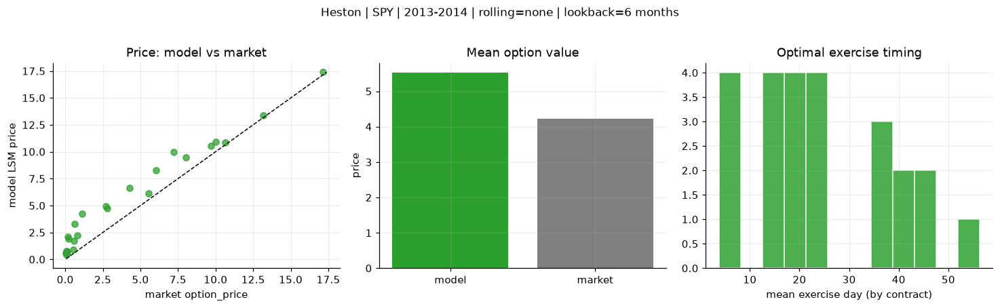
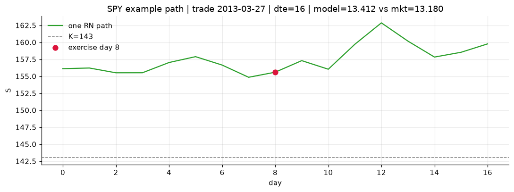
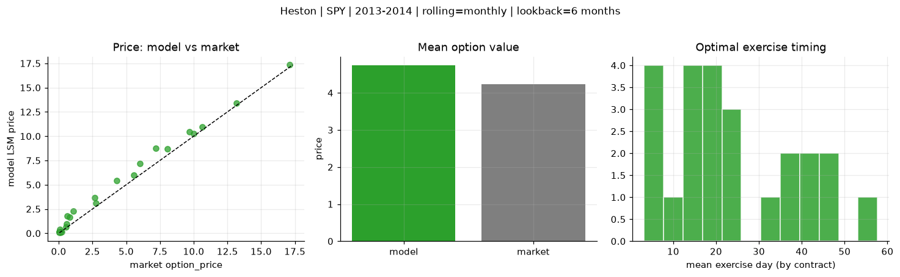
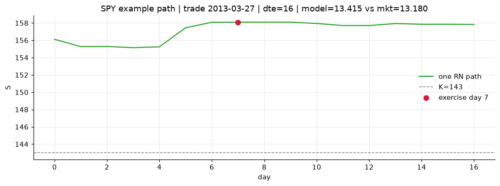
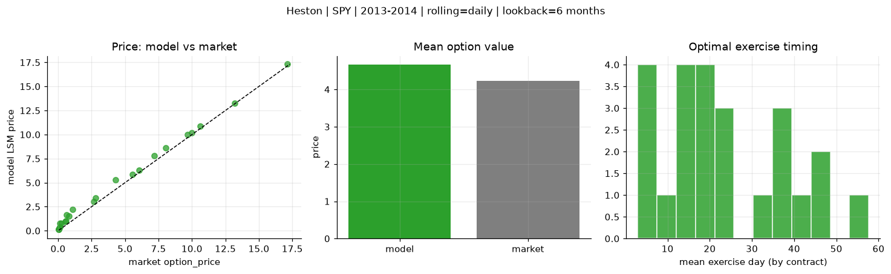
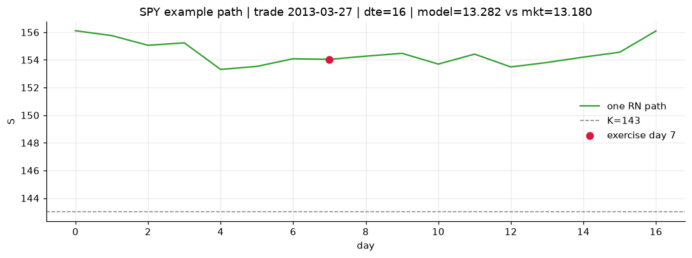

# Optimal stopping — Heston — 2013-2014 — SPY

**Model:** Heston  
**Underlying:** SPY  
**Regime / period:** 2013-2014  
**Lookback:** 6 months (fixed)  
**Rolling modes:** none, monthly, daily  
**Pricing:** LSM American calls on SPY | n_paths=2000 | seed=42 | contracts=24

## Comparison (same contracts, same lookback)

| Rolling | RMSE | MAE | Bias (model−mkt) | Mean early-ex frac | Cal updates | Cal s | LSM s |
|---------|-----:|----:|-----------------:|-------------------:|------------:|------:|------:|
| `none` | 1.5771 | 1.2939 | 1.2939 | 0.371 | 1 | 0.1 | 0.1 |
| `monthly` | 0.6875 | 0.5181 | 0.5094 | 0.385 | 25 | 4.0 | 0.3 |
| `daily` | 0.5244 | 0.4332 | 0.4332 | 0.392 | 505 | 22.1 | 0.2 |

**Lowest RMSE (this study):** `daily` = 0.5244

## Rolling = `none`

- **RMSE:** 1.5771  
- **MAE:** 1.2939  
- **Bias:** 1.2939  
- **Mean early-exercise fraction:** 0.371  
- **Calibration updates (SPY):** 1

Contract errors (compact)

| date | K | dte | market | model | error | early_ex |
|------|--:|----:|-------:|------:|------:|---------:|
| 2013-03-27 | 143 | 16 | 13.180 | 13.412 | 0.232 | 0.843 |
| 2014-08-29 | 183.5 | 7 | 17.120 | 17.385 | 0.265 | 0.891 |
| 2013-12-04 | 170 | 27 | 10.000 | 10.901 | 0.901 | 0.633 |
| 2013-11-26 | 173 | 25 | 8.040 | 9.448 | 1.408 | 0.606 |
| 2014-05-29 | 186 | 51 | 7.200 | 9.948 | 2.748 | 0.543 |
| 2013-03-06 | 149 | 45 | 6.040 | 8.256 | 2.216 | 0.480 |
| 2013-04-25 | 163 | 15 | 0.120 | 0.717 | 0.597 | 0.075 |
| 2014-04-01 | 183 | 10 | 5.560 | 6.138 | 0.578 | 0.570 |
| 2014-08-29 | 199 | 22 | 2.680 | 4.965 | 2.285 | 0.311 |
| 2014-09-15 | 204 | 25 | 0.210 | 1.886 | 1.676 | 0.172 |
| 2014-05-07 | 186 | 45 | 4.300 | 6.653 | 2.353 | 0.387 |
| 2014-08-15 | 199 | 46 | 1.100 | 4.250 | 3.150 | 0.278 |
| 2014-11-17 | 212 | 18 | 0.070 | 0.763 | 0.693 | 0.129 |
| 2014-02-03 | 180 | 19 | 0.530 | 0.883 | 0.353 | 0.113 |
| 2013-12-11 | 188 | 23 | 0.060 | 0.449 | 0.389 | 0.050 |
| 2013-07-08 | 169 | 40 | 0.810 | 2.256 | 1.446 | 0.244 |
| 2014-04-23 | 195 | 59 | 0.640 | 3.309 | 2.669 | 0.191 |
| 2014-09-15 | 208 | 46 | 0.150 | 2.096 | 1.946 | 0.152 |
| 2013-06-07 | 154 | 7 | 10.620 | 10.888 | 0.268 | 0.837 |
| 2014-09-08 | 198.5 | 18 | 2.780 | 4.736 | 1.956 | 0.401 |
| 2014-04-08 | 189.5 | 24 | 0.580 | 1.702 | 1.122 | 0.151 |
| 2013-02-20 | 157 | 16 | 0.060 | 0.445 | 0.385 | 0.066 |
| 2014-03-11 | 177.5 | 17 | 9.680 | 10.573 | 0.893 | 0.735 |
| 2013-08-26 | 177 | 35 | 0.050 | 0.576 | 0.526 | 0.060 |

## Rolling = `monthly`

- **RMSE:** 0.6875  
- **MAE:** 0.5181  
- **Bias:** 0.5094  
- **Mean early-exercise fraction:** 0.385  
- **Calibration updates (SPY):** 25

Contract errors (compact)

| date | K | dte | market | model | error | early_ex |
|------|--:|----:|-------:|------:|------:|---------:|
| 2013-03-27 | 143 | 16 | 13.180 | 13.415 | 0.235 | 0.853 |
| 2014-08-29 | 183.5 | 7 | 17.120 | 17.335 | 0.215 | 0.864 |
| 2013-12-04 | 170 | 27 | 10.000 | 10.234 | 0.234 | 0.788 |
| 2013-11-26 | 173 | 25 | 8.040 | 8.721 | 0.681 | 0.759 |
| 2014-05-29 | 186 | 51 | 7.200 | 8.766 | 1.566 | 0.605 |
| 2013-03-06 | 149 | 45 | 6.040 | 7.183 | 1.143 | 0.476 |
| 2013-04-25 | 163 | 15 | 0.120 | 0.160 | 0.040 | 0.043 |
| 2014-04-01 | 183 | 10 | 5.560 | 5.992 | 0.432 | 0.627 |
| 2014-08-29 | 199 | 22 | 2.680 | 3.658 | 0.978 | 0.388 |
| 2014-09-15 | 204 | 25 | 0.210 | 0.165 | -0.045 | 0.001 |
| 2014-05-07 | 186 | 45 | 4.300 | 5.396 | 1.096 | 0.440 |
| 2014-08-15 | 199 | 46 | 1.100 | 2.281 | 1.181 | 0.255 |
| 2014-11-17 | 212 | 18 | 0.070 | 0.383 | 0.313 | 0.098 |
| 2014-02-03 | 180 | 19 | 0.530 | 0.663 | 0.133 | 0.086 |
| 2013-12-11 | 188 | 23 | 0.060 | 0.129 | 0.069 | 0.019 |
| 2013-07-08 | 169 | 40 | 0.810 | 1.655 | 0.845 | 0.252 |
| 2014-04-23 | 195 | 59 | 0.640 | 1.811 | 1.171 | 0.163 |
| 2014-09-15 | 208 | 46 | 0.150 | 0.091 | -0.059 | 0.041 |
| 2013-06-07 | 154 | 7 | 10.620 | 10.935 | 0.315 | 0.854 |
| 2014-09-08 | 198.5 | 18 | 2.780 | 3.107 | 0.327 | 0.613 |
| 2014-04-08 | 189.5 | 24 | 0.580 | 0.981 | 0.401 | 0.082 |
| 2013-02-20 | 157 | 16 | 0.060 | 0.166 | 0.106 | 0.042 |
| 2014-03-11 | 177.5 | 17 | 9.680 | 10.475 | 0.795 | 0.883 |
| 2013-08-26 | 177 | 35 | 0.050 | 0.106 | 0.056 | 0.021 |

## Rolling = `daily`

- **RMSE:** 0.5244  
- **MAE:** 0.4332  
- **Bias:** 0.4332  
- **Mean early-exercise fraction:** 0.392  
- **Calibration updates (SPY):** 505

Contract errors (compact)

| date | K | dte | market | model | error | early_ex |
|------|--:|----:|-------:|------:|------:|---------:|
| 2013-03-27 | 143 | 16 | 13.180 | 13.282 | 0.102 | 0.920 |
| 2014-08-29 | 183.5 | 7 | 17.120 | 17.306 | 0.186 | 0.811 |
| 2013-12-04 | 170 | 27 | 10.000 | 10.203 | 0.203 | 0.843 |
| 2013-11-26 | 173 | 25 | 8.040 | 8.616 | 0.576 | 0.750 |
| 2014-05-29 | 186 | 51 | 7.200 | 7.791 | 0.591 | 0.576 |
| 2013-03-06 | 149 | 45 | 6.040 | 6.309 | 0.269 | 0.737 |
| 2013-04-25 | 163 | 15 | 0.120 | 0.429 | 0.309 | 0.042 |
| 2014-04-01 | 183 | 10 | 5.560 | 5.834 | 0.274 | 0.653 |
| 2014-08-29 | 199 | 22 | 2.680 | 3.015 | 0.335 | 0.466 |
| 2014-09-15 | 204 | 25 | 0.210 | 0.766 | 0.556 | 0.148 |
| 2014-05-07 | 186 | 45 | 4.300 | 5.296 | 0.996 | 0.429 |
| 2014-08-15 | 199 | 46 | 1.100 | 2.210 | 1.110 | 0.277 |
| 2014-11-17 | 212 | 18 | 0.070 | 0.303 | 0.233 | 0.040 |
| 2014-02-03 | 180 | 19 | 0.530 | 0.978 | 0.448 | 0.107 |
| 2013-12-11 | 188 | 23 | 0.060 | 0.136 | 0.076 | 0.017 |
| 2013-07-08 | 169 | 40 | 0.810 | 1.517 | 0.707 | 0.204 |
| 2014-04-23 | 195 | 59 | 0.640 | 1.627 | 0.987 | 0.163 |
| 2014-09-15 | 208 | 46 | 0.150 | 0.802 | 0.652 | 0.089 |
| 2013-06-07 | 154 | 7 | 10.620 | 10.849 | 0.229 | 0.891 |
| 2014-09-08 | 198.5 | 18 | 2.780 | 3.414 | 0.634 | 0.307 |
| 2014-04-08 | 189.5 | 24 | 0.580 | 1.028 | 0.448 | 0.065 |
| 2013-02-20 | 157 | 16 | 0.060 | 0.119 | 0.059 | 0.027 |
| 2014-03-11 | 177.5 | 17 | 9.680 | 10.027 | 0.347 | 0.823 |
| 2013-08-26 | 177 | 35 | 0.050 | 0.117 | 0.067 | 0.022 |

