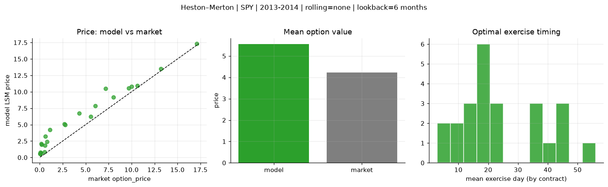
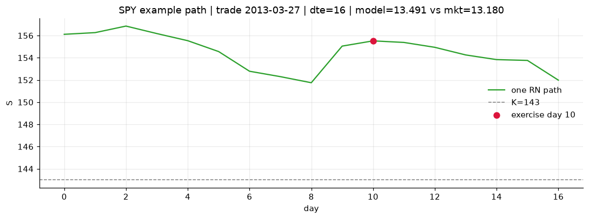
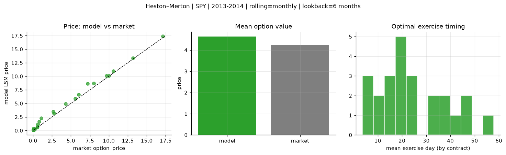
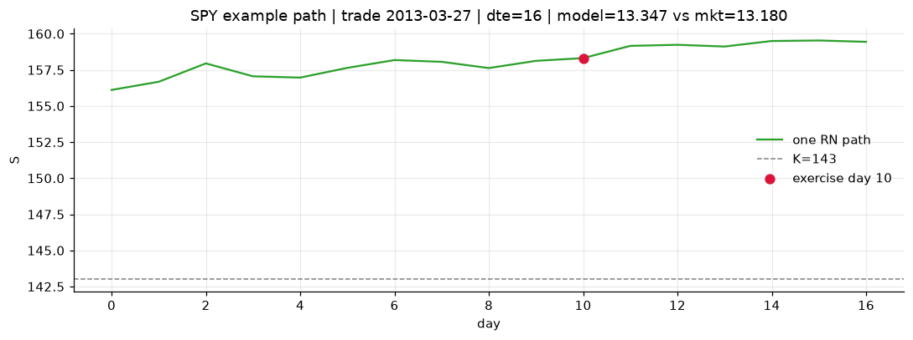
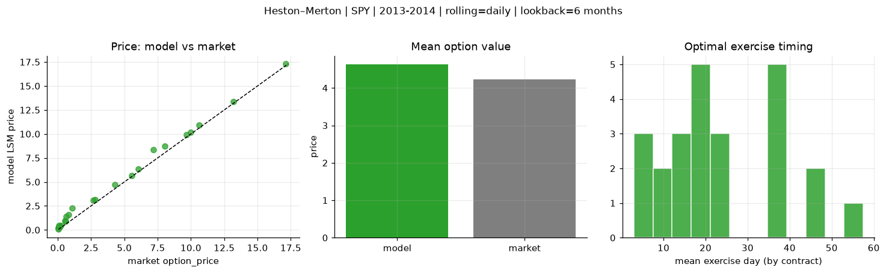
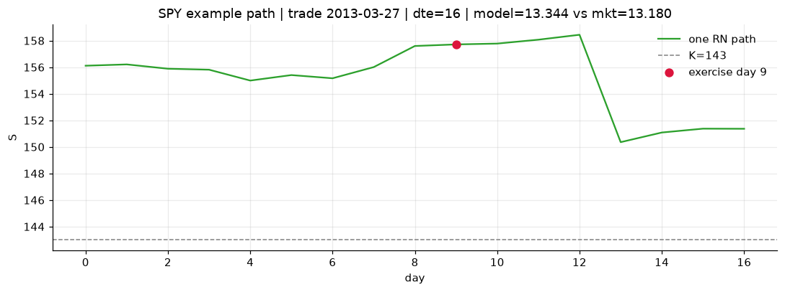

# Optimal stopping — Heston–Merton — 2013-2014 — SPY

**Model:** Heston–Merton  
**Underlying:** SPY  
**Regime / period:** 2013-2014  
**Lookback:** 6 months (fixed)  
**Rolling modes:** none, monthly, daily  
**Pricing:** LSM American calls on SPY | n_paths=2000 | seed=42 | contracts=24

## Comparison (same contracts, same lookback)

| Rolling | RMSE | MAE | Bias (model−mkt) | Mean early-ex frac | Cal updates | Cal s | LSM s |
|---------|-----:|----:|-----------------:|-------------------:|------------:|------:|------:|
| `none` | 1.6189 | 1.3237 | 1.3237 | 0.354 | 1 | 0.1 | 0.1 |
| `monthly` | 0.5461 | 0.4037 | 0.4014 | 0.346 | 25 | 4.3 | 0.1 |
| `daily` | 0.5010 | 0.3967 | 0.3967 | 0.370 | 505 | 21.6 | 0.2 |

**Lowest RMSE (this study):** `daily` = 0.5010

## Rolling = `none`

- **RMSE:** 1.6189  
- **MAE:** 1.3237  
- **Bias:** 1.3237  
- **Mean early-exercise fraction:** 0.354  
- **Calibration updates (SPY):** 1

Contract errors (compact)

| date | K | dte | market | model | error | early_ex |
|------|--:|----:|-------:|------:|------:|---------:|
| 2013-03-27 | 143 | 16 | 13.180 | 13.491 | 0.311 | 0.776 |
| 2014-08-29 | 183.5 | 7 | 17.120 | 17.303 | 0.183 | 0.982 |
| 2013-12-04 | 170 | 27 | 10.000 | 10.801 | 0.801 | 0.642 |
| 2013-11-26 | 173 | 25 | 8.040 | 9.150 | 1.110 | 0.625 |
| 2014-05-29 | 186 | 51 | 7.200 | 10.467 | 3.267 | 0.499 |
| 2013-03-06 | 149 | 45 | 6.040 | 7.866 | 1.826 | 0.528 |
| 2013-04-25 | 163 | 15 | 0.120 | 0.690 | 0.570 | 0.128 |
| 2014-04-01 | 183 | 10 | 5.560 | 6.203 | 0.643 | 0.537 |
| 2014-08-29 | 199 | 22 | 2.680 | 5.104 | 2.424 | 0.385 |
| 2014-09-15 | 204 | 25 | 0.210 | 1.970 | 1.760 | 0.080 |
| 2014-05-07 | 186 | 45 | 4.300 | 6.714 | 2.414 | 0.323 |
| 2014-08-15 | 199 | 46 | 1.100 | 4.237 | 3.137 | 0.214 |
| 2014-11-17 | 212 | 18 | 0.070 | 0.788 | 0.718 | 0.066 |
| 2014-02-03 | 180 | 19 | 0.530 | 0.859 | 0.329 | 0.026 |
| 2013-12-11 | 188 | 23 | 0.060 | 0.570 | 0.510 | 0.030 |
| 2013-07-08 | 169 | 40 | 0.810 | 2.398 | 1.588 | 0.185 |
| 2014-04-23 | 195 | 59 | 0.640 | 3.201 | 2.561 | 0.245 |
| 2014-09-15 | 208 | 46 | 0.150 | 2.085 | 1.935 | 0.147 |
| 2013-06-07 | 154 | 7 | 10.620 | 10.953 | 0.333 | 0.956 |
| 2014-09-08 | 198.5 | 18 | 2.780 | 4.956 | 2.176 | 0.215 |
| 2014-04-08 | 189.5 | 24 | 0.580 | 1.871 | 1.291 | 0.160 |
| 2013-02-20 | 157 | 16 | 0.060 | 0.496 | 0.436 | 0.048 |
| 2014-03-11 | 177.5 | 17 | 9.680 | 10.564 | 0.884 | 0.671 |
| 2013-08-26 | 177 | 35 | 0.050 | 0.610 | 0.560 | 0.036 |

## Rolling = `monthly`

- **RMSE:** 0.5461  
- **MAE:** 0.4037  
- **Bias:** 0.4014  
- **Mean early-exercise fraction:** 0.346  
- **Calibration updates (SPY):** 25

Contract errors (compact)

| date | K | dte | market | model | error | early_ex |
|------|--:|----:|-------:|------:|------:|---------:|
| 2013-03-27 | 143 | 16 | 13.180 | 13.347 | 0.167 | 0.795 |
| 2014-08-29 | 183.5 | 7 | 17.120 | 17.372 | 0.252 | 0.599 |
| 2013-12-04 | 170 | 27 | 10.000 | 10.123 | 0.123 | 0.616 |
| 2013-11-26 | 173 | 25 | 8.040 | 8.693 | 0.653 | 0.672 |
| 2014-05-29 | 186 | 51 | 7.200 | 8.629 | 1.429 | 0.569 |
| 2013-03-06 | 149 | 45 | 6.040 | 6.616 | 0.576 | 0.521 |
| 2013-04-25 | 163 | 15 | 0.120 | 0.286 | 0.166 | 0.049 |
| 2014-04-01 | 183 | 10 | 5.560 | 5.909 | 0.349 | 0.541 |
| 2014-08-29 | 199 | 22 | 2.680 | 3.505 | 0.825 | 0.467 |
| 2014-09-15 | 204 | 25 | 0.210 | 0.184 | -0.026 | 0.018 |
| 2014-05-07 | 186 | 45 | 4.300 | 4.945 | 0.645 | 0.487 |
| 2014-08-15 | 199 | 46 | 1.100 | 2.283 | 1.183 | 0.203 |
| 2014-11-17 | 212 | 18 | 0.070 | 0.404 | 0.334 | 0.046 |
| 2014-02-03 | 180 | 19 | 0.530 | 0.601 | 0.071 | 0.021 |
| 2013-12-11 | 188 | 23 | 0.060 | 0.103 | 0.043 | 0.011 |
| 2013-07-08 | 169 | 40 | 0.810 | 1.675 | 0.865 | 0.137 |
| 2014-04-23 | 195 | 59 | 0.640 | 1.147 | 0.507 | 0.110 |
| 2014-09-15 | 208 | 46 | 0.150 | 0.148 | -0.002 | 0.029 |
| 2013-06-07 | 154 | 7 | 10.620 | 10.961 | 0.341 | 0.816 |
| 2014-09-08 | 198.5 | 18 | 2.780 | 3.174 | 0.394 | 0.578 |
| 2014-04-08 | 189.5 | 24 | 0.580 | 0.688 | 0.108 | 0.051 |
| 2013-02-20 | 157 | 16 | 0.060 | 0.215 | 0.155 | 0.039 |
| 2014-03-11 | 177.5 | 17 | 9.680 | 10.095 | 0.415 | 0.899 |
| 2013-08-26 | 177 | 35 | 0.050 | 0.111 | 0.061 | 0.028 |

## Rolling = `daily`

- **RMSE:** 0.5010  
- **MAE:** 0.3967  
- **Bias:** 0.3967  
- **Mean early-exercise fraction:** 0.370  
- **Calibration updates (SPY):** 505

Contract errors (compact)

| date | K | dte | market | model | error | early_ex |
|------|--:|----:|-------:|------:|------:|---------:|
| 2013-03-27 | 143 | 16 | 13.180 | 13.344 | 0.164 | 0.772 |
| 2014-08-29 | 183.5 | 7 | 17.120 | 17.284 | 0.164 | 0.667 |
| 2013-12-04 | 170 | 27 | 10.000 | 10.180 | 0.180 | 0.658 |
| 2013-11-26 | 173 | 25 | 8.040 | 8.733 | 0.693 | 0.651 |
| 2014-05-29 | 186 | 51 | 7.200 | 8.358 | 1.158 | 0.684 |
| 2013-03-06 | 149 | 45 | 6.040 | 6.328 | 0.288 | 0.661 |
| 2013-04-25 | 163 | 15 | 0.120 | 0.296 | 0.176 | 0.029 |
| 2014-04-01 | 183 | 10 | 5.560 | 5.690 | 0.130 | 0.614 |
| 2014-08-29 | 199 | 22 | 2.680 | 3.065 | 0.385 | 0.360 |
| 2014-09-15 | 204 | 25 | 0.210 | 0.450 | 0.240 | 0.057 |
| 2014-05-07 | 186 | 45 | 4.300 | 4.735 | 0.435 | 0.476 |
| 2014-08-15 | 199 | 46 | 1.100 | 2.304 | 1.204 | 0.150 |
| 2014-11-17 | 212 | 18 | 0.070 | 0.455 | 0.385 | 0.032 |
| 2014-02-03 | 180 | 19 | 0.530 | 0.981 | 0.451 | 0.091 |
| 2013-12-11 | 188 | 23 | 0.060 | 0.111 | 0.051 | 0.018 |
| 2013-07-08 | 169 | 40 | 0.810 | 1.605 | 0.795 | 0.177 |
| 2014-04-23 | 195 | 59 | 0.640 | 1.430 | 0.790 | 0.145 |
| 2014-09-15 | 208 | 46 | 0.150 | 0.407 | 0.257 | 0.097 |
| 2013-06-07 | 154 | 7 | 10.620 | 10.919 | 0.299 | 0.994 |
| 2014-09-08 | 198.5 | 18 | 2.780 | 3.181 | 0.401 | 0.513 |
| 2014-04-08 | 189.5 | 24 | 0.580 | 0.908 | 0.328 | 0.154 |
| 2013-02-20 | 157 | 16 | 0.060 | 0.196 | 0.136 | 0.036 |
| 2014-03-11 | 177.5 | 17 | 9.680 | 9.941 | 0.261 | 0.819 |
| 2013-08-26 | 177 | 35 | 0.050 | 0.202 | 0.152 | 0.029 |

