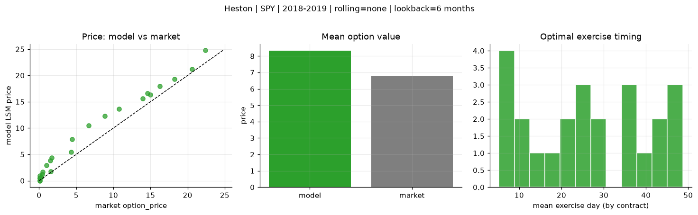
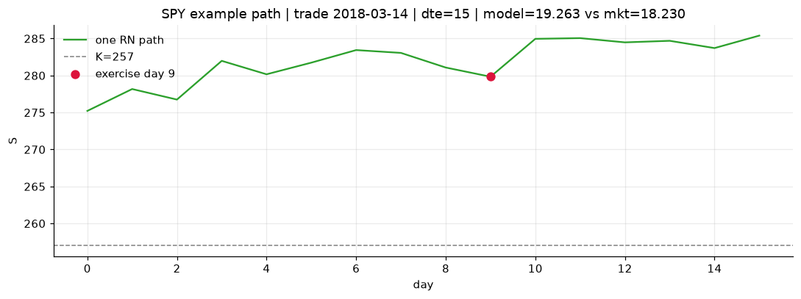
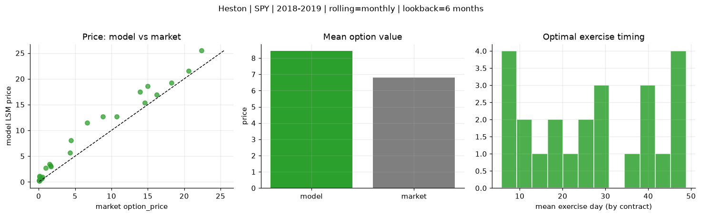
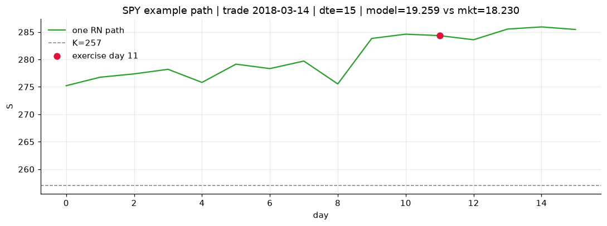
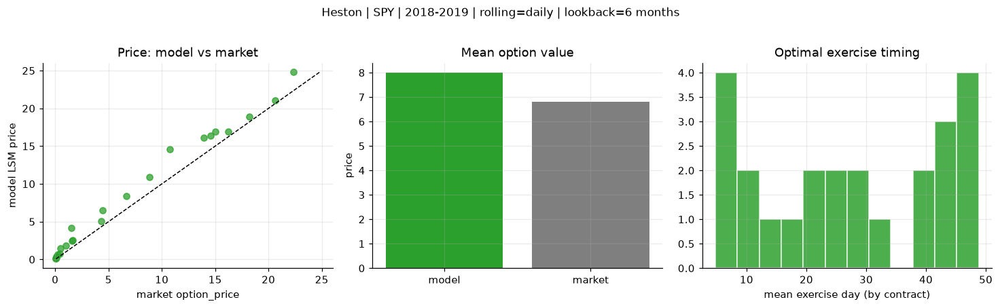
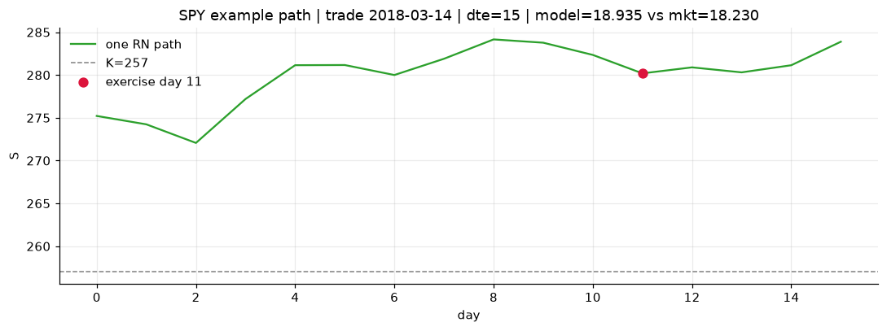

# Optimal stopping — Heston — 2018-2019 — SPY

**Model:** Heston  
**Underlying:** SPY  
**Regime / period:** 2018-2019  
**Lookback:** 6 months (fixed)  
**Rolling modes:** none, monthly, daily  
**Pricing:** LSM American calls on SPY | n_paths=2000 | seed=42 | contracts=24

## Comparison (same contracts, same lookback)

| Rolling | RMSE | MAE | Bias (model−mkt) | Mean early-ex frac | Cal updates | Cal s | LSM s |
|---------|-----:|----:|-----------------:|-------------------:|------------:|------:|------:|
| `none` | 1.8999 | 1.5289 | 1.5185 | 0.337 | 1 | 0.1 | 0.1 |
| `monthly` | 2.1207 | 1.6284 | 1.6284 | 0.296 | 25 | 3.5 | 0.1 |
| `daily` | 1.5392 | 1.1894 | 1.1894 | 0.293 | 503 | 22.0 | 0.1 |

**Lowest RMSE (this study):** `daily` = 1.5392

## Rolling = `none`

- **RMSE:** 1.8999  
- **MAE:** 1.5289  
- **Bias:** 1.5185  
- **Mean early-exercise fraction:** 0.337  
- **Calibration updates (SPY):** 1

Contract errors (compact)

| date | K | dte | market | model | error | early_ex |
|------|--:|----:|-------:|------:|------:|---------:|
| 2018-03-14 | 257 | 15 | 18.230 | 19.263 | 1.033 | 0.769 |
| 2019-09-05 | 277 | 8 | 20.620 | 21.191 | 0.571 | 0.911 |
| 2019-01-15 | 247 | 31 | 14.990 | 16.294 | 1.304 | 0.534 |
| 2019-01-15 | 247.5 | 24 | 13.960 | 15.596 | 1.636 | 0.691 |
| 2019-06-03 | 261 | 46 | 16.230 | 17.941 | 1.711 | 0.585 |
| 2018-02-28 | 260 | 51 | 14.600 | 16.604 | 2.004 | 0.540 |
| 2018-04-05 | 269 | 11 | 1.600 | 1.787 | 0.187 | 0.170 |
| 2019-02-06 | 269 | 7 | 4.290 | 5.449 | 1.159 | 0.277 |
| 2019-07-09 | 303 | 31 | 1.520 | 3.866 | 2.346 | 0.204 |
| 2019-07-30 | 307 | 27 | 0.990 | 2.972 | 1.982 | 0.252 |
| 2019-02-21 | 277.5 | 43 | 4.450 | 7.847 | 3.397 | 0.400 |
| 2019-09-05 | 293 | 50 | 8.840 | 12.308 | 3.468 | 0.322 |
| 2019-07-23 | 309 | 15 | 0.110 | 0.912 | 0.802 | 0.081 |
| 2018-11-29 | 291 | 8 | 0.080 | 0.001 | -0.079 | 0.000 |
| 2018-11-21 | 286 | 21 | 0.080 | 0.033 | -0.047 | 0.006 |
| 2018-05-10 | 287.5 | 29 | 0.110 | 0.466 | 0.356 | 0.044 |
| 2019-05-03 | 320 | 49 | 0.100 | 0.502 | 0.402 | 0.048 |
| 2019-08-13 | 308 | 48 | 0.510 | 1.690 | 1.180 | 0.139 |
| 2018-10-02 | 293 | 20 | 1.670 | 4.402 | 2.732 | 0.260 |
| 2018-11-07 | 261 | 54 | 22.370 | 24.749 | 2.379 | 0.826 |
| 2019-11-29 | 311 | 42 | 6.650 | 10.528 | 3.878 | 0.386 |
| 2019-03-07 | 279.5 | 8 | 0.410 | 1.195 | 0.785 | 0.111 |
| 2019-07-09 | 290 | 45 | 10.750 | 13.628 | 2.878 | 0.507 |
| 2019-06-24 | 307.5 | 25 | 0.270 | 0.648 | 0.378 | 0.028 |

## Rolling = `monthly`

- **RMSE:** 2.1207  
- **MAE:** 1.6284  
- **Bias:** 1.6284  
- **Mean early-exercise fraction:** 0.296  
- **Calibration updates (SPY):** 25

Contract errors (compact)

| date | K | dte | market | model | error | early_ex |
|------|--:|----:|-------:|------:|------:|---------:|
| 2018-03-14 | 257 | 15 | 18.230 | 19.259 | 1.029 | 0.719 |
| 2019-09-05 | 277 | 8 | 20.620 | 21.561 | 0.941 | 0.765 |
| 2019-01-15 | 247 | 31 | 14.990 | 18.584 | 3.594 | 0.383 |
| 2019-01-15 | 247.5 | 24 | 13.960 | 17.472 | 3.512 | 0.591 |
| 2019-06-03 | 261 | 46 | 16.230 | 16.913 | 0.683 | 0.617 |
| 2018-02-28 | 260 | 51 | 14.600 | 15.334 | 0.734 | 0.478 |
| 2018-04-05 | 269 | 11 | 1.600 | 3.159 | 1.559 | 0.168 |
| 2019-02-06 | 269 | 7 | 4.290 | 5.711 | 1.421 | 0.245 |
| 2019-07-09 | 303 | 31 | 1.520 | 3.452 | 1.932 | 0.167 |
| 2019-07-30 | 307 | 27 | 0.990 | 2.703 | 1.713 | 0.255 |
| 2019-02-21 | 277.5 | 43 | 4.450 | 8.080 | 3.630 | 0.393 |
| 2019-09-05 | 293 | 50 | 8.840 | 12.642 | 3.802 | 0.291 |
| 2019-07-23 | 309 | 15 | 0.110 | 0.935 | 0.825 | 0.090 |
| 2018-11-29 | 291 | 8 | 0.080 | 0.207 | 0.127 | 0.009 |
| 2018-11-21 | 286 | 21 | 0.080 | 0.327 | 0.247 | 0.028 |
| 2018-05-10 | 287.5 | 29 | 0.110 | 1.126 | 1.016 | 0.074 |
| 2019-05-03 | 320 | 49 | 0.100 | 0.222 | 0.122 | 0.021 |
| 2019-08-13 | 308 | 48 | 0.510 | 0.986 | 0.476 | 0.028 |
| 2018-10-02 | 293 | 20 | 1.670 | 2.991 | 1.321 | 0.084 |
| 2018-11-07 | 261 | 54 | 22.370 | 25.467 | 3.097 | 0.853 |
| 2019-11-29 | 311 | 42 | 6.650 | 11.528 | 4.878 | 0.327 |
| 2019-03-07 | 279.5 | 8 | 0.410 | 0.680 | 0.270 | 0.058 |
| 2019-07-09 | 290 | 45 | 10.750 | 12.676 | 1.926 | 0.416 |
| 2019-06-24 | 307.5 | 25 | 0.270 | 0.499 | 0.229 | 0.040 |

## Rolling = `daily`

- **RMSE:** 1.5392  
- **MAE:** 1.1894  
- **Bias:** 1.1894  
- **Mean early-exercise fraction:** 0.293  
- **Calibration updates (SPY):** 503

Contract errors (compact)

| date | K | dte | market | model | error | early_ex |
|------|--:|----:|-------:|------:|------:|---------:|
| 2018-03-14 | 257 | 15 | 18.230 | 18.935 | 0.705 | 0.763 |
| 2019-09-05 | 277 | 8 | 20.620 | 21.077 | 0.457 | 0.979 |
| 2019-01-15 | 247 | 31 | 14.990 | 16.943 | 1.953 | 0.386 |
| 2019-01-15 | 247.5 | 24 | 13.960 | 16.151 | 2.191 | 0.639 |
| 2019-06-03 | 261 | 46 | 16.230 | 16.969 | 0.739 | 0.583 |
| 2018-02-28 | 260 | 51 | 14.600 | 16.380 | 1.780 | 0.485 |
| 2018-04-05 | 269 | 11 | 1.600 | 2.461 | 0.861 | 0.099 |
| 2019-02-06 | 269 | 7 | 4.290 | 5.077 | 0.787 | 0.141 |
| 2019-07-09 | 303 | 31 | 1.520 | 4.178 | 2.658 | 0.097 |
| 2019-07-30 | 307 | 27 | 0.990 | 1.831 | 0.841 | 0.221 |
| 2019-02-21 | 277.5 | 43 | 4.450 | 6.507 | 2.057 | 0.309 |
| 2019-09-05 | 293 | 50 | 8.840 | 10.939 | 2.099 | 0.333 |
| 2019-07-23 | 309 | 15 | 0.110 | 0.249 | 0.139 | 0.018 |
| 2018-11-29 | 291 | 8 | 0.080 | 0.120 | 0.040 | 0.004 |
| 2018-11-21 | 286 | 21 | 0.080 | 0.136 | 0.056 | 0.019 |
| 2018-05-10 | 287.5 | 29 | 0.110 | 0.334 | 0.224 | 0.046 |
| 2019-05-03 | 320 | 49 | 0.100 | 0.385 | 0.285 | 0.036 |
| 2019-08-13 | 308 | 48 | 0.510 | 1.446 | 0.936 | 0.049 |
| 2018-10-02 | 293 | 20 | 1.670 | 2.548 | 0.878 | 0.177 |
| 2018-11-07 | 261 | 54 | 22.370 | 24.788 | 2.418 | 0.702 |
| 2019-11-29 | 311 | 42 | 6.650 | 8.428 | 1.778 | 0.425 |
| 2019-03-07 | 279.5 | 8 | 0.410 | 0.770 | 0.360 | 0.059 |
| 2019-07-09 | 290 | 45 | 10.750 | 14.613 | 3.863 | 0.408 |
| 2019-06-24 | 307.5 | 25 | 0.270 | 0.711 | 0.441 | 0.055 |

