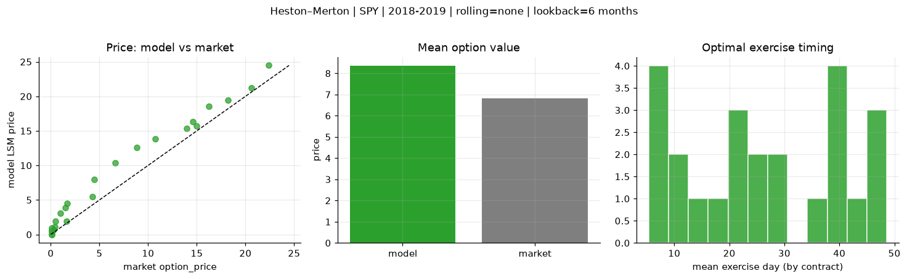
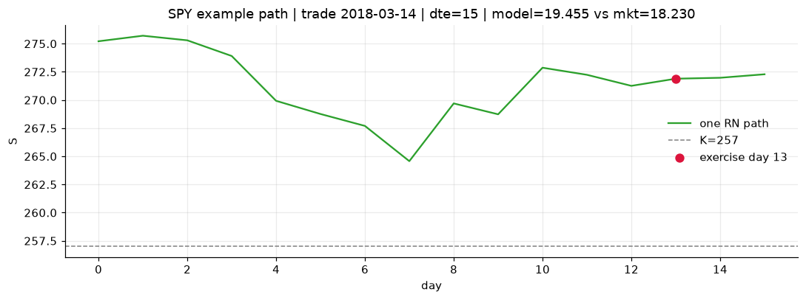
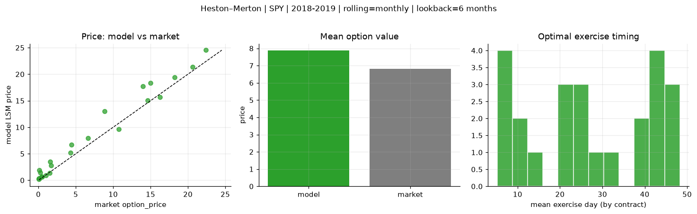
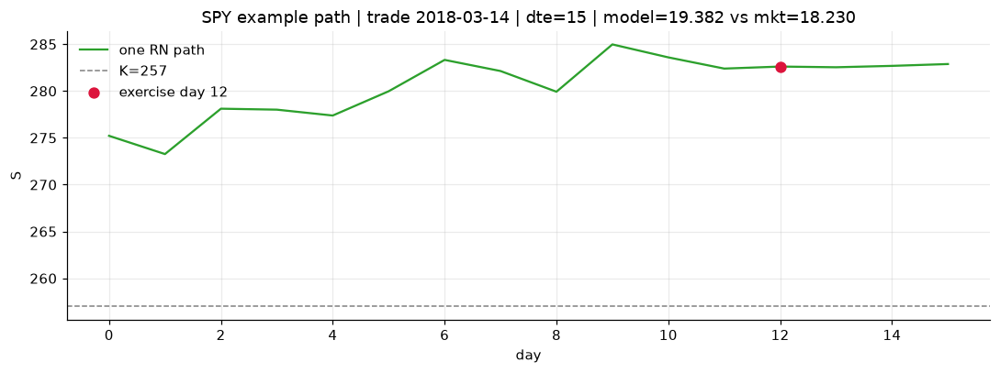
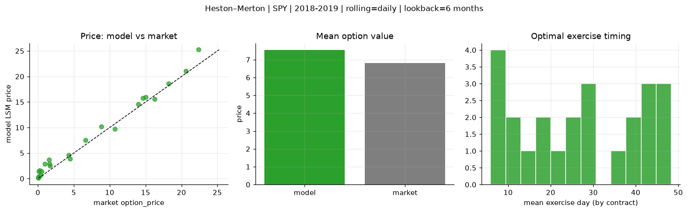
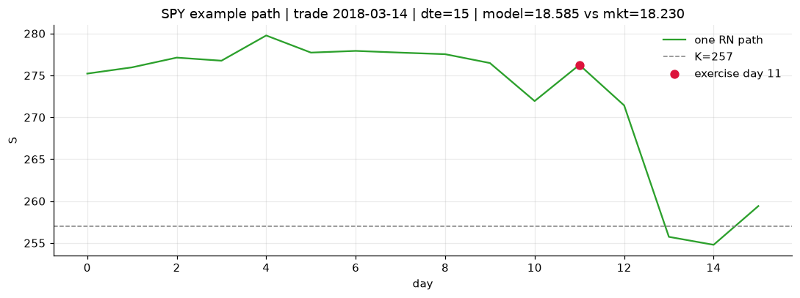

# Optimal stopping — Heston–Merton — 2018-2019 — SPY

**Model:** Heston–Merton  
**Underlying:** SPY  
**Regime / period:** 2018-2019  
**Lookback:** 6 months (fixed)  
**Rolling modes:** none, monthly, daily  
**Pricing:** LSM American calls on SPY | n_paths=2000 | seed=42 | contracts=24

## Comparison (same contracts, same lookback)

| Rolling | RMSE | MAE | Bias (model−mkt) | Mean early-ex frac | Cal updates | Cal s | LSM s |
|---------|-----:|----:|-----------------:|-------------------:|------------:|------:|------:|
| `none` | 1.9380 | 1.5526 | 1.5434 | 0.318 | 1 | 0.3 | 0.2 |
| `monthly` | 1.6964 | 1.2242 | 1.0677 | 0.256 | 25 | 4.2 | 0.1 |
| `daily` | 1.1321 | 0.9110 | 0.7288 | 0.324 | 503 | 24.4 | 0.1 |

**Lowest RMSE (this study):** `daily` = 1.1321

## Rolling = `none`

- **RMSE:** 1.9380  
- **MAE:** 1.5526  
- **Bias:** 1.5434  
- **Mean early-exercise fraction:** 0.318  
- **Calibration updates (SPY):** 1

Contract errors (compact)

| date | K | dte | market | model | error | early_ex |
|------|--:|----:|-------:|------:|------:|---------:|
| 2018-03-14 | 257 | 15 | 18.230 | 19.455 | 1.225 | 0.523 |
| 2019-09-05 | 277 | 8 | 20.620 | 21.185 | 0.565 | 0.756 |
| 2019-01-15 | 247 | 31 | 14.990 | 15.708 | 0.718 | 0.655 |
| 2019-01-15 | 247.5 | 24 | 13.960 | 15.386 | 1.426 | 0.598 |
| 2019-06-03 | 261 | 46 | 16.230 | 18.514 | 2.284 | 0.485 |
| 2018-02-28 | 260 | 51 | 14.600 | 16.330 | 1.730 | 0.671 |
| 2018-04-05 | 269 | 11 | 1.600 | 1.942 | 0.342 | 0.134 |
| 2019-02-06 | 269 | 7 | 4.290 | 5.523 | 1.233 | 0.199 |
| 2019-07-09 | 303 | 31 | 1.520 | 3.906 | 2.386 | 0.214 |
| 2019-07-30 | 307 | 27 | 0.990 | 3.035 | 2.045 | 0.162 |
| 2019-02-21 | 277.5 | 43 | 4.450 | 7.992 | 3.542 | 0.426 |
| 2019-09-05 | 293 | 50 | 8.840 | 12.573 | 3.733 | 0.374 |
| 2019-07-23 | 309 | 15 | 0.110 | 0.957 | 0.847 | 0.041 |
| 2018-11-29 | 291 | 8 | 0.080 | 0.004 | -0.076 | 0.000 |
| 2018-11-21 | 286 | 21 | 0.080 | 0.047 | -0.033 | 0.007 |
| 2018-05-10 | 287.5 | 29 | 0.110 | 0.599 | 0.489 | 0.049 |
| 2019-05-03 | 320 | 49 | 0.100 | 0.434 | 0.334 | 0.045 |
| 2019-08-13 | 308 | 48 | 0.510 | 1.923 | 1.413 | 0.102 |
| 2018-10-02 | 293 | 20 | 1.670 | 4.458 | 2.788 | 0.221 |
| 2018-11-07 | 261 | 54 | 22.370 | 24.474 | 2.104 | 0.732 |
| 2019-11-29 | 311 | 42 | 6.650 | 10.394 | 3.744 | 0.457 |
| 2019-03-07 | 279.5 | 8 | 0.410 | 1.108 | 0.698 | 0.097 |
| 2019-07-09 | 290 | 45 | 10.750 | 13.855 | 3.105 | 0.610 |
| 2019-06-24 | 307.5 | 25 | 0.270 | 0.671 | 0.401 | 0.086 |

## Rolling = `monthly`

- **RMSE:** 1.6964  
- **MAE:** 1.2242  
- **Bias:** 1.0677  
- **Mean early-exercise fraction:** 0.256  
- **Calibration updates (SPY):** 25

Contract errors (compact)

| date | K | dte | market | model | error | early_ex |
|------|--:|----:|-------:|------:|------:|---------:|
| 2018-03-14 | 257 | 15 | 18.230 | 19.382 | 1.152 | 0.649 |
| 2019-09-05 | 277 | 8 | 20.620 | 21.387 | 0.767 | 0.823 |
| 2019-01-15 | 247 | 31 | 14.990 | 18.372 | 3.382 | 0.523 |
| 2019-01-15 | 247.5 | 24 | 13.960 | 17.763 | 3.803 | 0.421 |
| 2019-06-03 | 261 | 46 | 16.230 | 15.638 | -0.592 | 0.578 |
| 2018-02-28 | 260 | 51 | 14.600 | 15.022 | 0.422 | 0.460 |
| 2018-04-05 | 269 | 11 | 1.600 | 3.533 | 1.933 | 0.029 |
| 2019-02-06 | 269 | 7 | 4.290 | 5.168 | 0.878 | 0.379 |
| 2019-07-09 | 303 | 31 | 1.520 | 1.408 | -0.112 | 0.042 |
| 2019-07-30 | 307 | 27 | 0.990 | 0.911 | -0.079 | 0.107 |
| 2019-02-21 | 277.5 | 43 | 4.450 | 6.675 | 2.225 | 0.205 |
| 2019-09-05 | 293 | 50 | 8.840 | 13.040 | 4.200 | 0.530 |
| 2019-07-23 | 309 | 15 | 0.110 | 0.290 | 0.180 | 0.020 |
| 2018-11-29 | 291 | 8 | 0.080 | 0.184 | 0.104 | 0.020 |
| 2018-11-21 | 286 | 21 | 0.080 | 0.331 | 0.251 | 0.031 |
| 2018-05-10 | 287.5 | 29 | 0.110 | 1.865 | 1.755 | 0.029 |
| 2019-05-03 | 320 | 49 | 0.100 | 0.408 | 0.308 | 0.044 |
| 2019-08-13 | 308 | 48 | 0.510 | 0.639 | 0.129 | 0.085 |
| 2018-10-02 | 293 | 20 | 1.670 | 2.762 | 1.092 | 0.053 |
| 2018-11-07 | 261 | 54 | 22.370 | 24.526 | 2.156 | 0.511 |
| 2019-11-29 | 311 | 42 | 6.650 | 7.979 | 1.329 | 0.312 |
| 2019-03-07 | 279.5 | 8 | 0.410 | 0.641 | 0.231 | 0.056 |
| 2019-07-09 | 290 | 45 | 10.750 | 9.655 | -1.095 | 0.122 |
| 2019-06-24 | 307.5 | 25 | 0.270 | 1.475 | 1.205 | 0.108 |

## Rolling = `daily`

- **RMSE:** 1.1321  
- **MAE:** 0.9110  
- **Bias:** 0.7288  
- **Mean early-exercise fraction:** 0.324  
- **Calibration updates (SPY):** 503

Contract errors (compact)

| date | K | dte | market | model | error | early_ex |
|------|--:|----:|-------:|------:|------:|---------:|
| 2018-03-14 | 257 | 15 | 18.230 | 18.585 | 0.355 | 0.789 |
| 2019-09-05 | 277 | 8 | 20.620 | 21.091 | 0.471 | 0.889 |
| 2019-01-15 | 247 | 31 | 14.990 | 15.917 | 0.927 | 0.555 |
| 2019-01-15 | 247.5 | 24 | 13.960 | 14.581 | 0.621 | 0.593 |
| 2019-06-03 | 261 | 46 | 16.230 | 15.589 | -0.641 | 0.767 |
| 2018-02-28 | 260 | 51 | 14.600 | 15.809 | 1.209 | 0.464 |
| 2018-04-05 | 269 | 11 | 1.600 | 2.855 | 1.255 | 0.026 |
| 2019-02-06 | 269 | 7 | 4.290 | 4.656 | 0.366 | 0.433 |
| 2019-07-09 | 303 | 31 | 1.520 | 3.687 | 2.167 | 0.107 |
| 2019-07-30 | 307 | 27 | 0.990 | 2.903 | 1.913 | 0.129 |
| 2019-02-21 | 277.5 | 43 | 4.450 | 3.908 | -0.542 | 0.309 |
| 2019-09-05 | 293 | 50 | 8.840 | 10.169 | 1.329 | 0.491 |
| 2019-07-23 | 309 | 15 | 0.110 | 1.377 | 1.267 | 0.060 |
| 2018-11-29 | 291 | 8 | 0.080 | 0.161 | 0.081 | 0.002 |
| 2018-11-21 | 286 | 21 | 0.080 | 0.187 | 0.107 | 0.017 |
| 2018-05-10 | 287.5 | 29 | 0.110 | 0.358 | 0.248 | 0.023 |
| 2019-05-03 | 320 | 49 | 0.100 | 0.373 | 0.273 | 0.044 |
| 2019-08-13 | 308 | 48 | 0.510 | 1.454 | 0.944 | 0.102 |
| 2018-10-02 | 293 | 20 | 1.670 | 2.502 | 0.832 | 0.197 |
| 2018-11-07 | 261 | 54 | 22.370 | 25.240 | 2.870 | 0.828 |
| 2019-11-29 | 311 | 42 | 6.650 | 7.554 | 0.904 | 0.359 |
| 2019-03-07 | 279.5 | 8 | 0.410 | 0.640 | 0.230 | 0.058 |
| 2019-07-09 | 290 | 45 | 10.750 | 9.747 | -1.003 | 0.489 |
| 2019-06-24 | 307.5 | 25 | 0.270 | 1.580 | 1.310 | 0.040 |

