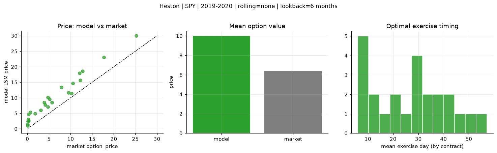
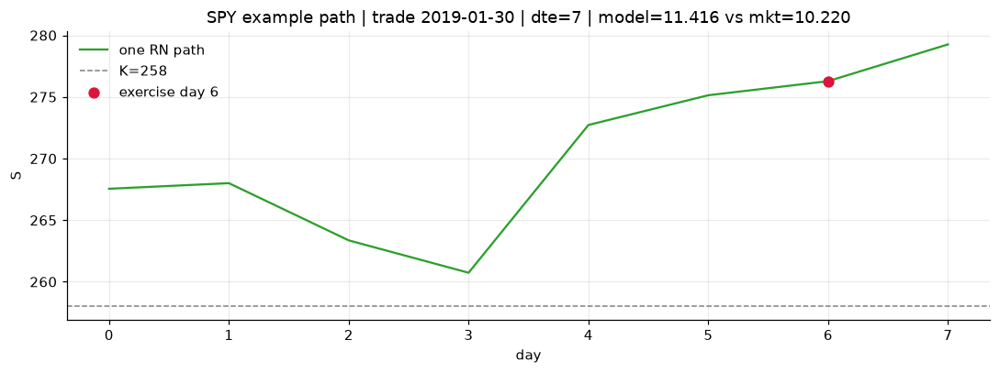
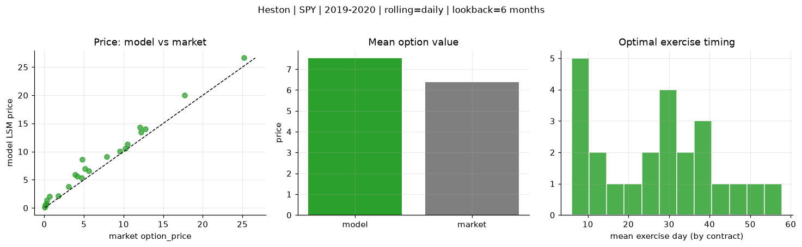
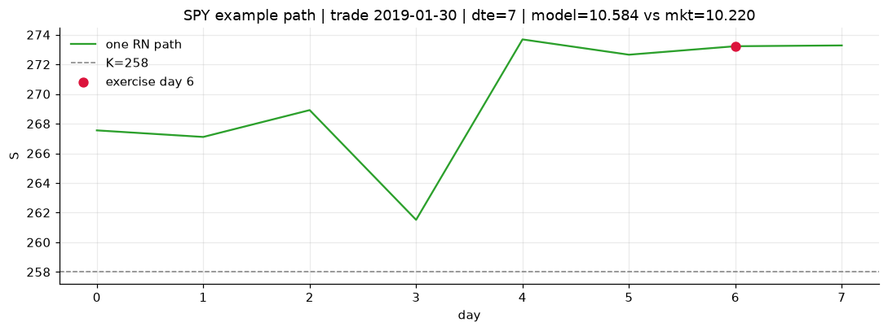

# Optimal stopping — Heston — 2019-2020 — SPY

**Model:** Heston  
**Underlying:** SPY  
**Regime / period:** 2019-2020  
**Lookback:** 6 months (fixed)  
**Rolling modes:** none, monthly, daily  
**Pricing:** LSM American calls on SPY | n_paths=2000 | seed=42 | contracts=24

## Comparison (same contracts, same lookback)

| Rolling | RMSE | MAE | Bias (model−mkt) | Mean early-ex frac | Cal updates | Cal s | LSM s |
|---------|-----:|----:|-----------------:|-------------------:|------------:|------:|------:|
| `none` | 3.8858 | 3.5975 | 3.5975 | 0.301 | 1 | 0.2 | 0.1 |
| `monthly` | 2.1399 | 1.7009 | 1.6076 | 0.316 | 25 | 2.1 | 0.1 |
| `daily` | 1.4268 | 1.1500 | 1.1500 | 0.315 | 505 | 16.6 | 0.1 |

**Lowest RMSE (this study):** `daily` = 1.4268

## Rolling = `none`

- **RMSE:** 3.8858  
- **MAE:** 3.5975  
- **Bias:** 3.5975  
- **Mean early-exercise fraction:** 0.301  
- **Calibration updates (SPY):** 1

Contract errors (compact)

| date | K | dte | market | model | error | early_ex |
|------|--:|----:|-------:|------:|------:|---------:|
| 2019-01-30 | 258 | 7 | 10.220 | 11.416 | 1.196 | 0.275 |
| 2019-10-17 | 290 | 8 | 9.520 | 11.599 | 2.079 | 0.463 |
| 2019-06-17 | 280 | 25 | 10.520 | 14.730 | 4.210 | 0.469 |
| 2019-06-10 | 278 | 39 | 12.790 | 18.572 | 5.782 | 0.474 |
| 2019-09-19 | 277 | 57 | 25.220 | 29.948 | 4.728 | 0.804 |
| 2019-02-06 | 257 | 51 | 17.690 | 23.035 | 5.345 | 0.480 |
| 2019-02-06 | 271 | 9 | 3.100 | 6.006 | 2.906 | 0.323 |
| 2019-07-09 | 295.5 | 17 | 3.910 | 8.480 | 4.570 | 0.273 |
| 2019-10-03 | 294 | 32 | 4.150 | 7.765 | 3.615 | 0.190 |
| 2019-10-17 | 297 | 22 | 5.130 | 9.598 | 4.468 | 0.338 |
| 2019-08-06 | 281 | 45 | 12.210 | 15.711 | 3.501 | 0.434 |
| 2019-11-07 | 299 | 43 | 12.070 | 17.904 | 5.834 | 0.387 |
| 2019-10-03 | 303 | 13 | 0.080 | 1.453 | 1.373 | 0.029 |
| 2019-06-10 | 303 | 11 | 0.070 | 1.034 | 0.964 | 0.045 |
| 2019-06-03 | 283 | 32 | 1.760 | 4.963 | 3.203 | 0.124 |
| 2019-03-14 | 292 | 34 | 0.260 | 4.676 | 4.416 | 0.173 |
| 2019-08-27 | 315 | 52 | 0.140 | 2.435 | 2.295 | 0.079 |
| 2019-10-10 | 313 | 43 | 0.210 | 3.043 | 2.833 | 0.091 |
| 2019-02-06 | 268.5 | 7 | 4.720 | 7.044 | 2.324 | 0.263 |
| 2019-02-13 | 270 | 9 | 5.640 | 8.454 | 2.814 | 0.404 |
| 2019-01-15 | 275 | 31 | 0.290 | 2.584 | 2.294 | 0.135 |
| 2019-09-12 | 295 | 27 | 7.870 | 13.391 | 5.521 | 0.435 |
| 2019-03-21 | 294 | 32 | 0.640 | 5.308 | 4.668 | 0.230 |
| 2019-01-15 | 264 | 59 | 4.770 | 10.171 | 5.401 | 0.306 |

## Rolling = `monthly`

- **RMSE:** 2.1399  
- **MAE:** 1.7009  
- **Bias:** 1.6076  
- **Mean early-exercise fraction:** 0.316  
- **Calibration updates (SPY):** 25

Contract errors (compact)

| date | K | dte | market | model | error | early_ex |
|------|--:|----:|-------:|------:|------:|---------:|
| 2019-01-30 | 258 | 7 | 10.220 | 11.416 | 1.196 | 0.275 |
| 2019-10-17 | 290 | 8 | 9.520 | 10.369 | 0.849 | 0.592 |
| 2019-06-17 | 280 | 25 | 10.520 | 12.452 | 1.932 | 0.523 |
| 2019-06-10 | 278 | 39 | 12.790 | 15.044 | 2.254 | 0.629 |
| 2019-09-19 | 277 | 57 | 25.220 | 27.851 | 2.631 | 0.781 |
| 2019-02-06 | 257 | 51 | 17.690 | 20.408 | 2.718 | 0.526 |
| 2019-02-06 | 271 | 9 | 3.100 | 4.654 | 1.554 | 0.345 |
| 2019-07-09 | 295.5 | 17 | 3.910 | 5.784 | 1.874 | 0.337 |
| 2019-10-03 | 294 | 32 | 4.150 | 5.445 | 1.295 | 0.200 |
| 2019-10-17 | 297 | 22 | 5.130 | 7.606 | 2.476 | 0.418 |
| 2019-08-06 | 281 | 45 | 12.210 | 11.118 | -1.092 | 0.501 |
| 2019-11-07 | 299 | 43 | 12.070 | 15.676 | 3.606 | 0.486 |
| 2019-10-03 | 303 | 13 | 0.080 | 0.173 | 0.093 | 0.018 |
| 2019-06-10 | 303 | 11 | 0.070 | 0.075 | 0.005 | 0.003 |
| 2019-06-03 | 283 | 32 | 1.760 | 1.870 | 0.110 | 0.153 |
| 2019-03-14 | 292 | 34 | 0.260 | 1.049 | 0.789 | 0.049 |
| 2019-08-27 | 315 | 52 | 0.140 | 0.112 | -0.028 | 0.013 |
| 2019-10-10 | 313 | 43 | 0.210 | 1.126 | 0.916 | 0.081 |
| 2019-02-06 | 268.5 | 7 | 4.720 | 6.017 | 1.297 | 0.244 |
| 2019-02-13 | 270 | 9 | 5.640 | 7.225 | 1.585 | 0.440 |
| 2019-01-15 | 275 | 31 | 0.290 | 2.584 | 2.294 | 0.135 |
| 2019-09-12 | 295 | 27 | 7.870 | 11.853 | 3.983 | 0.464 |
| 2019-03-21 | 294 | 32 | 0.640 | 1.483 | 0.843 | 0.074 |
| 2019-01-15 | 264 | 59 | 4.770 | 10.171 | 5.401 | 0.306 |

## Rolling = `daily`

- **RMSE:** 1.4268  
- **MAE:** 1.1500  
- **Bias:** 1.1500  
- **Mean early-exercise fraction:** 0.315  
- **Calibration updates (SPY):** 505

Contract errors (compact)

| date | K | dte | market | model | error | early_ex |
|------|--:|----:|-------:|------:|------:|---------:|
| 2019-01-30 | 258 | 7 | 10.220 | 10.584 | 0.364 | 0.306 |
| 2019-10-17 | 290 | 8 | 9.520 | 10.039 | 0.519 | 0.580 |
| 2019-06-17 | 280 | 25 | 10.520 | 11.350 | 0.830 | 0.464 |
| 2019-06-10 | 278 | 39 | 12.790 | 14.056 | 1.266 | 0.612 |
| 2019-09-19 | 277 | 57 | 25.220 | 26.629 | 1.409 | 0.886 |
| 2019-02-06 | 257 | 51 | 17.690 | 19.993 | 2.303 | 0.532 |
| 2019-02-06 | 271 | 9 | 3.100 | 3.812 | 0.712 | 0.393 |
| 2019-07-09 | 295.5 | 17 | 3.910 | 5.949 | 2.039 | 0.277 |
| 2019-10-03 | 294 | 32 | 4.150 | 5.651 | 1.501 | 0.352 |
| 2019-10-17 | 297 | 22 | 5.130 | 6.997 | 1.867 | 0.374 |
| 2019-08-06 | 281 | 45 | 12.210 | 13.479 | 1.269 | 0.513 |
| 2019-11-07 | 299 | 43 | 12.070 | 14.352 | 2.282 | 0.526 |
| 2019-10-03 | 303 | 13 | 0.080 | 0.327 | 0.247 | 0.021 |
| 2019-06-10 | 303 | 11 | 0.070 | 0.142 | 0.072 | 0.011 |
| 2019-06-03 | 283 | 32 | 1.760 | 2.170 | 0.410 | 0.187 |
| 2019-03-14 | 292 | 34 | 0.260 | 0.836 | 0.576 | 0.049 |
| 2019-08-27 | 315 | 52 | 0.140 | 0.464 | 0.324 | 0.029 |
| 2019-10-10 | 313 | 43 | 0.210 | 0.633 | 0.423 | 0.034 |
| 2019-02-06 | 268.5 | 7 | 4.720 | 5.385 | 0.665 | 0.147 |
| 2019-02-13 | 270 | 9 | 5.640 | 6.603 | 0.963 | 0.420 |
| 2019-01-15 | 275 | 31 | 0.290 | 1.370 | 1.080 | 0.118 |
| 2019-09-12 | 295 | 27 | 7.870 | 9.109 | 1.239 | 0.406 |
| 2019-03-21 | 294 | 32 | 0.640 | 2.034 | 1.394 | 0.099 |
| 2019-01-15 | 264 | 59 | 4.770 | 8.616 | 3.846 | 0.218 |

