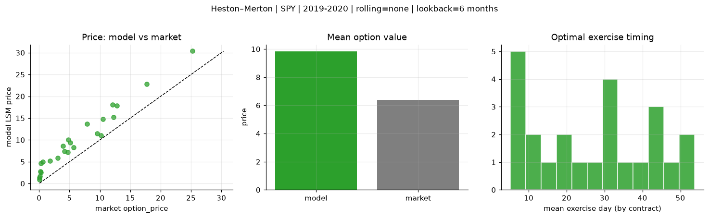
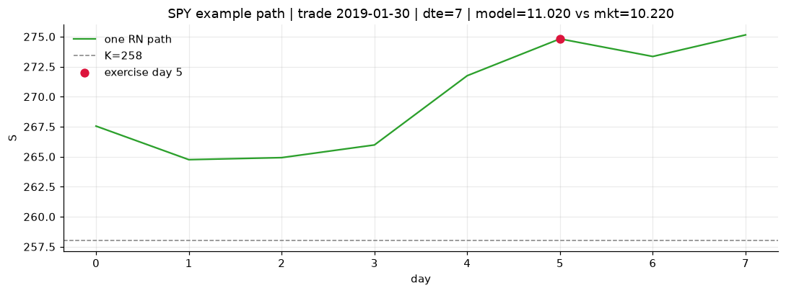
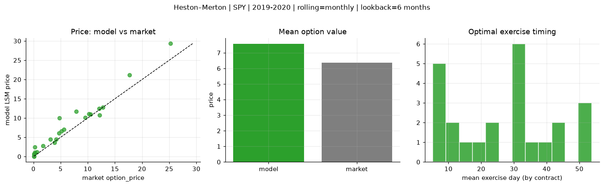
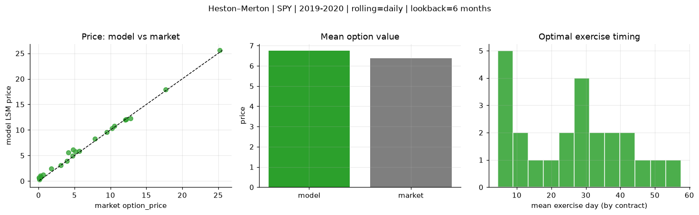
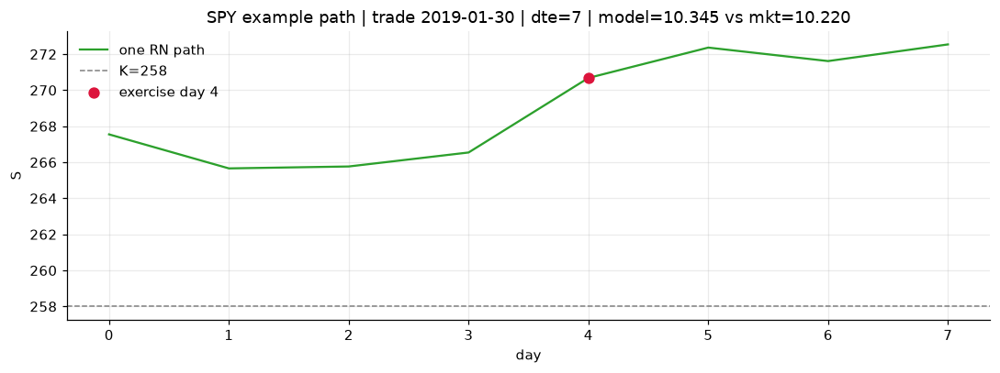

# Optimal stopping — Heston–Merton — 2019-2020 — SPY

**Model:** Heston–Merton  
**Underlying:** SPY  
**Regime / period:** 2019-2020  
**Lookback:** 6 months (fixed)  
**Rolling modes:** none, monthly, daily  
**Pricing:** LSM American calls on SPY | n_paths=2000 | seed=42 | contracts=24

## Comparison (same contracts, same lookback)

| Rolling | RMSE | MAE | Bias (model−mkt) | Mean early-ex frac | Cal updates | Cal s | LSM s |
|---------|-----:|----:|-----------------:|-------------------:|------------:|------:|------:|
| `none` | 3.7852 | 3.4568 | 3.4568 | 0.288 | 1 | 0.2 | 0.1 |
| `monthly` | 1.9434 | 1.3476 | 1.1976 | 0.263 | 25 | 2.4 | 0.1 |
| `daily` | 0.5782 | 0.4410 | 0.3718 | 0.310 | 505 | 17.1 | 0.2 |

**Lowest RMSE (this study):** `daily` = 0.5782

## Rolling = `none`

- **RMSE:** 3.7852  
- **MAE:** 3.4568  
- **Bias:** 3.4568  
- **Mean early-exercise fraction:** 0.288  
- **Calibration updates (SPY):** 1

Contract errors (compact)

| date | K | dte | market | model | error | early_ex |
|------|--:|----:|-------:|------:|------:|---------:|
| 2019-01-30 | 258 | 7 | 10.220 | 11.020 | 0.800 | 0.511 |
| 2019-10-17 | 290 | 8 | 9.520 | 11.454 | 1.934 | 0.383 |
| 2019-06-17 | 280 | 25 | 10.520 | 14.801 | 4.281 | 0.517 |
| 2019-06-10 | 278 | 39 | 12.790 | 17.834 | 5.044 | 0.646 |
| 2019-09-19 | 277 | 57 | 25.220 | 30.365 | 5.145 | 0.611 |
| 2019-02-06 | 257 | 51 | 17.690 | 22.777 | 5.087 | 0.201 |
| 2019-02-06 | 271 | 9 | 3.100 | 5.843 | 2.743 | 0.254 |
| 2019-07-09 | 295.5 | 17 | 3.910 | 8.654 | 4.744 | 0.298 |
| 2019-10-03 | 294 | 32 | 4.150 | 7.388 | 3.238 | 0.298 |
| 2019-10-17 | 297 | 22 | 5.130 | 9.413 | 4.283 | 0.346 |
| 2019-08-06 | 281 | 45 | 12.210 | 15.166 | 2.956 | 0.358 |
| 2019-11-07 | 299 | 43 | 12.070 | 18.071 | 6.001 | 0.295 |
| 2019-10-03 | 303 | 13 | 0.080 | 1.393 | 1.313 | 0.059 |
| 2019-06-10 | 303 | 11 | 0.070 | 0.877 | 0.807 | 0.041 |
| 2019-06-03 | 283 | 32 | 1.760 | 5.215 | 3.455 | 0.170 |
| 2019-03-14 | 292 | 34 | 0.260 | 4.604 | 4.344 | 0.185 |
| 2019-08-27 | 315 | 52 | 0.140 | 1.702 | 1.562 | 0.075 |
| 2019-10-10 | 313 | 43 | 0.210 | 2.722 | 2.512 | 0.099 |
| 2019-02-06 | 268.5 | 7 | 4.720 | 7.227 | 2.507 | 0.277 |
| 2019-02-13 | 270 | 9 | 5.640 | 8.273 | 2.633 | 0.342 |
| 2019-01-15 | 275 | 31 | 0.290 | 2.513 | 2.223 | 0.067 |
| 2019-09-12 | 295 | 27 | 7.870 | 13.635 | 5.765 | 0.275 |
| 2019-03-21 | 294 | 32 | 0.640 | 4.941 | 4.301 | 0.217 |
| 2019-01-15 | 264 | 59 | 4.770 | 10.055 | 5.285 | 0.375 |

## Rolling = `monthly`

- **RMSE:** 1.9434  
- **MAE:** 1.3476  
- **Bias:** 1.1976  
- **Mean early-exercise fraction:** 0.263  
- **Calibration updates (SPY):** 25

Contract errors (compact)

| date | K | dte | market | model | error | early_ex |
|------|--:|----:|-------:|------:|------:|---------:|
| 2019-01-30 | 258 | 7 | 10.220 | 11.020 | 0.800 | 0.511 |
| 2019-10-17 | 290 | 8 | 9.520 | 10.166 | 0.646 | 0.512 |
| 2019-06-17 | 280 | 25 | 10.520 | 10.915 | 0.395 | 0.257 |
| 2019-06-10 | 278 | 39 | 12.790 | 12.804 | 0.014 | 0.510 |
| 2019-09-19 | 277 | 57 | 25.220 | 29.308 | 4.088 | 0.681 |
| 2019-02-06 | 257 | 51 | 17.690 | 21.141 | 3.451 | 0.063 |
| 2019-02-06 | 271 | 9 | 3.100 | 4.469 | 1.369 | 0.157 |
| 2019-07-09 | 295.5 | 17 | 3.910 | 3.586 | -0.324 | 0.005 |
| 2019-10-03 | 294 | 32 | 4.150 | 4.429 | 0.279 | 0.289 |
| 2019-10-17 | 297 | 22 | 5.130 | 6.595 | 1.465 | 0.366 |
| 2019-08-06 | 281 | 45 | 12.210 | 10.749 | -1.461 | 0.505 |
| 2019-11-07 | 299 | 43 | 12.070 | 12.428 | 0.358 | 0.369 |
| 2019-10-03 | 303 | 13 | 0.080 | 0.065 | -0.015 | 0.004 |
| 2019-06-10 | 303 | 11 | 0.070 | 0.632 | 0.562 | 0.032 |
| 2019-06-03 | 283 | 32 | 1.760 | 2.776 | 1.016 | 0.111 |
| 2019-03-14 | 292 | 34 | 0.260 | 1.041 | 0.781 | 0.154 |
| 2019-08-27 | 315 | 52 | 0.140 | 0.164 | 0.024 | 0.022 |
| 2019-10-10 | 313 | 43 | 0.210 | 0.787 | 0.577 | 0.056 |
| 2019-02-06 | 268.5 | 7 | 4.720 | 6.094 | 1.374 | 0.339 |
| 2019-02-13 | 270 | 9 | 5.640 | 7.010 | 1.370 | 0.294 |
| 2019-01-15 | 275 | 31 | 0.290 | 2.513 | 2.223 | 0.067 |
| 2019-09-12 | 295 | 27 | 7.870 | 11.754 | 3.884 | 0.446 |
| 2019-03-21 | 294 | 32 | 0.640 | 1.221 | 0.581 | 0.189 |
| 2019-01-15 | 264 | 59 | 4.770 | 10.055 | 5.285 | 0.375 |

## Rolling = `daily`

- **RMSE:** 0.5782  
- **MAE:** 0.4410  
- **Bias:** 0.3718  
- **Mean early-exercise fraction:** 0.310  
- **Calibration updates (SPY):** 505

Contract errors (compact)

| date | K | dte | market | model | error | early_ex |
|------|--:|----:|-------:|------:|------:|---------:|
| 2019-01-30 | 258 | 7 | 10.220 | 10.345 | 0.125 | 0.578 |
| 2019-10-17 | 290 | 8 | 9.520 | 9.548 | 0.028 | 0.698 |
| 2019-06-17 | 280 | 25 | 10.520 | 10.771 | 0.251 | 0.482 |
| 2019-06-10 | 278 | 39 | 12.790 | 12.227 | -0.563 | 0.552 |
| 2019-09-19 | 277 | 57 | 25.220 | 25.569 | 0.349 | 0.940 |
| 2019-02-06 | 257 | 51 | 17.690 | 17.930 | 0.240 | 0.257 |
| 2019-02-06 | 271 | 9 | 3.100 | 3.122 | 0.022 | 0.099 |
| 2019-07-09 | 295.5 | 17 | 3.910 | 3.952 | 0.042 | 0.135 |
| 2019-10-03 | 294 | 32 | 4.150 | 5.610 | 1.460 | 0.274 |
| 2019-10-17 | 297 | 22 | 5.130 | 5.773 | 0.643 | 0.453 |
| 2019-08-06 | 281 | 45 | 12.210 | 12.043 | -0.167 | 0.471 |
| 2019-11-07 | 299 | 43 | 12.070 | 11.969 | -0.101 | 0.523 |
| 2019-10-03 | 303 | 13 | 0.080 | 0.341 | 0.261 | 0.004 |
| 2019-06-10 | 303 | 11 | 0.070 | 0.662 | 0.592 | 0.044 |
| 2019-06-03 | 283 | 32 | 1.760 | 2.472 | 0.712 | 0.094 |
| 2019-03-14 | 292 | 34 | 0.260 | 1.094 | 0.834 | 0.161 |
| 2019-08-27 | 315 | 52 | 0.140 | 0.487 | 0.347 | 0.018 |
| 2019-10-10 | 313 | 43 | 0.210 | 0.811 | 0.601 | 0.080 |
| 2019-02-06 | 268.5 | 7 | 4.720 | 4.972 | 0.252 | 0.283 |
| 2019-02-13 | 270 | 9 | 5.640 | 5.854 | 0.214 | 0.319 |
| 2019-01-15 | 275 | 31 | 0.290 | 0.731 | 0.441 | 0.120 |
| 2019-09-12 | 295 | 27 | 7.870 | 8.242 | 0.372 | 0.368 |
| 2019-03-21 | 294 | 32 | 0.640 | 1.189 | 0.549 | 0.191 |
| 2019-01-15 | 264 | 59 | 4.770 | 6.190 | 1.420 | 0.286 |

